# Phase 2 — Bài 2.10: Error Handling

> **Độ ưu tiên:** 🔴 Error types, custom error classes, global handlers, unhandled rejection. 🟡 `Error.cause`, stack trace manipulation. 🟢 Result type pattern, structured error logging. Topic này ngắn hơn các bài trước nhưng production impact cao — error handling kém là nguyên nhân hàng đầu của silent bugs.

---

## 1. Cơ chế thật

### Error object trong V8 — không chỉ là message

Khi bạn `throw new Error('msg')`, V8 làm nhiều hơn chỉ tạo object. V8 **capture stack trace** — walk ngược Call Stack, lưu lại từng frame vào Error object. Đây là operation tốn kém, và là lý do không nên dùng Error cho control flow thông thường.

```javascript
const err = new Error('something failed');

// Error object có các properties:
err.message; // "something failed"
err.name; // "Error" — tên constructor
err.stack; // multiline string chứa stack trace

// stack format (V8):
// "Error: something failed\n
//     at functionName (file.js:10:5)\n
//     at callerFunction (file.js:20:3)\n
//     at ..."

// V8 capture stack tại thời điểm Error được TẠO (new Error())
// không phải lúc throw — quan trọng vì hai thời điểm này có thể khác nhau
const capturedEarly = new Error('captured here'); // stack từ đây
setTimeout(() => {
  throw capturedEarly; // stack KHÔNG từ đây
}, 100);
```

---

### 6 built-in Error types — tại sao tồn tại

V8 dùng các Error subclass để phân loại lỗi theo nguồn gốc. Biết loại error giúp debug nhanh hơn:

```javascript
// TypeError — sai kiểu dữ liệu / operation không hợp lệ với type
null.property;                 // TypeError: Cannot read properties of null
undefined();                   // TypeError: undefined is not a function
new 42();                      // TypeError: 42 is not a constructor
const x = 1; x = 2;           // TypeError: Assignment to constant variable
arr[Symbol.iterator] = 'x';   // TypeError: property is not iterable

// ReferenceError — access variable không tồn tại
undeclaredVariable;            // ReferenceError: undeclaredVariable is not defined
// TDZ:
console.log(x); let x = 1;    // ReferenceError: Cannot access 'x' before initialization

// SyntaxError — code không parse được — throw lúc PARSE, không phải lúc run
eval('function (');            // SyntaxError: Unexpected token
import x from;                 // SyntaxError: caught at parse time

// RangeError — value ngoài allowed range
new Array(-1);                 // RangeError: Invalid array length
(1234).toFixed(200);           // RangeError: toFixed() digits argument must be...
function f() { f(); }; f();   // RangeError: Maximum call stack size exceeded

// URIError — malformed URI
decodeURIComponent('%');       // URIError: URI malformed

// EvalError — legacy, không còn dùng trong modern V8
// Tồn tại vì backward compat
```

**Tại sao phân biệt quan trọng trong production:**

```javascript
// Catch có thể filter theo type:
try {
  riskyOperation();
} catch (err) {
  if (err instanceof TypeError) {
    // Lỗi lập trình — không phải runtime condition
    // Log và re-throw — đây là bug cần fix
    logger.error('Programming error:', err);
    throw err;
  }
  if (err instanceof RangeError) {
    // Input validation failed — recoverable
    return defaultValue;
  }
  // Unknown error — re-throw để global handler xử lý
  throw err;
}
```

---

### Custom Error classes — cơ chế và pitfalls

```javascript
// Chuẩn: extend Error
class AppError extends Error {
  constructor(message, options = {}) {
    super(message);

    // FIX 1: name phải set thủ công
    // this.name mặc định = 'Error' — V8 không tự set từ class name
    this.name = this.constructor.name; // 'AppError', 'ValidationError', v.v.

    // FIX 2: stack trace cleanup — V8-specific API
    // Loại bỏ AppError constructor khỏi stack
    // → stack trace bắt đầu từ nơi error được throw, không phải từ constructor
    if (Error.captureStackTrace) {
      Error.captureStackTrace(this, this.constructor);
    }

    // Custom properties
    this.code = options.code ?? 'UNKNOWN_ERROR';
    this.statusCode = options.statusCode ?? 500;

    // ES2022: Error.cause — link đến original error
    // super() đã handle cause nếu pass vào options
    // nhưng cần explicit nếu muốn type-safe access
    if (options.cause) {
      this.cause = options.cause;
    }
  }
}

class ValidationError extends AppError {
  constructor(message, fields) {
    super(message, { code: 'VALIDATION_ERROR', statusCode: 400 });
    this.fields = fields; // { fieldName: ['error msg'] }
  }
}

class NotFoundError extends AppError {
  constructor(resource, id) {
    super(`${resource} ${id} not found`, {
      code: 'NOT_FOUND',
      statusCode: 404,
    });
    this.resource = resource;
    this.resourceId = id;
  }
}

class NetworkError extends AppError {
  constructor(message, originalError) {
    super(message, {
      code: 'NETWORK_ERROR',
      statusCode: 503,
      cause: originalError, // ES2022 cause chain
    });
    this.retryable = true;
  }
}
```

**Pitfall quan trọng — `instanceof` bị break khi transpile:**

```javascript
// Babel/TypeScript transpile class extends Error
// thành ES5 function — prototype chain bị broken
// instanceof check fail!

// BUG (transpiled):
class CustomError extends Error {}
const err = new CustomError('test');
err instanceof CustomError; // false trong một số transpiler configs!

// FIX: explicit prototype assignment (nếu cần support IE/old env)
class CustomError extends Error {
  constructor(message) {
    super(message);
    Object.setPrototypeOf(this, CustomError.prototype); // fix transpiler bug
  }
}

// Modern environments (V8 native class): không cần fix
// Chỉ cần nếu target ES5 với Babel
```

---

### `Error.cause` — ES2022 error chaining

```javascript
// Trước ES2022: thông tin về original error bị mất
async function fetchUserData(userId) {
  try {
    const res = await fetch(`/api/users/${userId}`);
    return res.json();
  } catch (err) {
    // BUG: original network error bị wrap mà mất context
    throw new Error(`Failed to fetch user ${userId}`);
    // Stack trace của err biến mất — khó debug
  }
}

// ES2022: Error.cause giữ nguyên error chain
async function fetchUserData(userId) {
  try {
    const res = await fetch(`/api/users/${userId}`);
    if (!res.ok) throw new Error(`HTTP ${res.status}`);
    return res.json();
  } catch (err) {
    // cause giữ original error — đầy đủ stack trace và context
    throw new NetworkError(
      `Failed to fetch user ${userId}`,
      err, // truyền như cause
    );
  }
}

// Hoặc dùng built-in options:
throw new Error('Operation failed', { cause: originalError });

// Access cause:
try {
  await fetchUserData(1);
} catch (err) {
  console.error(err.message); // "Failed to fetch user 1"
  console.error(err.cause?.message); // "HTTP 404" — original error
  console.error(err.cause?.cause); // deeper chain nếu có
}

// Walk toàn bộ cause chain:
function getCauseChain(err) {
  const chain = [];
  let current = err;
  while (current) {
    chain.push({
      name: current.name,
      message: current.message,
      stack: current.stack,
    });
    current = current.cause;
  }
  return chain;
}
```

---

### Stack trace — cơ chế và manipulation

```javascript
// V8 giới hạn stack trace depth mặc định = 10 frames
// Có thể thay đổi:
Error.stackTraceLimit = 50; // capture nhiều frames hơn
Error.stackTraceLimit = 0; // không capture (performance)
Error.stackTraceLimit = Infinity; // toàn bộ stack (chậm)

// Error.captureStackTrace — V8-specific API
// Cho phép tạo stack trace tùy chỉnh

class ApiError extends Error {
  constructor(message, statusCode) {
    super(message);
    this.name = 'ApiError';
    this.statusCode = statusCode;

    // Argument thứ 2: function bị loại khỏi stack trace
    // Stack trace bắt đầu từ caller của ApiError constructor
    // Không phải từ bên trong ApiError constructor
    Error.captureStackTrace(this, ApiError);
  }
}

// prepareStackTrace — customize stack trace format
const originalPrepare = Error.prepareStackTrace;
Error.prepareStackTrace = (error, structuredStackTrace) => {
  // structuredStackTrace: array of CallSite objects
  // Mỗi CallSite có: getFileName(), getLineNumber(), getFunctionName(), v.v.

  const frames = structuredStackTrace.map((frame) => ({
    file: frame.getFileName(),
    line: frame.getLineNumber(),
    column: frame.getColumnNumber(),
    function: frame.getFunctionName() || '<anonymous>',
    isNative: frame.isNative(),
  }));

  // Filter noise — loại bỏ node_modules frames
  const appFrames = frames.filter(
    (f) => f.file && !f.file.includes('node_modules'),
  );

  return (
    `${error.name}: ${error.message}\n` +
    appFrames
      .map((f) => `    at ${f.function} (${f.file}:${f.line}:${f.column})`)
      .join('\n')
  );
};
```

---

### Global error handlers — không bỏ sót error nào

```javascript
// ── BROWSER ──

// window.onerror — synchronous errors
// Argument: message, source, lineno, colno, error
window.onerror = function (message, source, lineno, colno, error) {
  // `error` là Error object (nếu có)
  // Trả về true để ngăn default browser behavior (console.error)
  logToService({ message, source, lineno, colno, stack: error?.stack });
  return false; // không suppress — vẫn show trong console
};

// addEventListener('error') — cả synchronous errors lẫn resource load failures
window.addEventListener('error', (event) => {
  if (event.error) {
    // JavaScript error
    logToService({
      message: event.error.message,
      stack: event.error.stack,
      type: 'uncaught_error',
    });
  } else {
    // Resource load failure (img, script, link)
    logToService({
      message: `Resource failed: ${event.target.src || event.target.href}`,
      type: 'resource_error',
    });
  }
});

// unhandledrejection — Promise rejection không có handler
window.addEventListener('unhandledrejection', (event) => {
  logToService({
    message: event.reason?.message ?? String(event.reason),
    stack: event.reason?.stack,
    type: 'unhandled_rejection',
  });
  event.preventDefault(); // ngăn default console warning
});

// rejectionhandled — khi handler được add SAU KHI rejection xảy ra
// Dùng để cancel "unhandledrejection" false alarm
window.addEventListener('rejectionhandled', (event) => {
  cancelPendingReport(event.promise);
});

// ── NODE.JS ──

process.on('uncaughtException', (err, origin) => {
  // origin: 'uncaughtException' hoặc 'unhandledRejection'
  logger.error({ err, origin }, 'Uncaught exception');

  // QUAN TRỌNG: sau uncaughtException, process ở trạng thái không xác định
  // Chỉ nên cleanup rồi exit — không tiếp tục serve requests
  gracefulShutdown().finally(() => process.exit(1));
});

process.on('unhandledRejection', (reason, promise) => {
  logger.error({ reason, promise }, 'Unhandled rejection');
  // Node.js 15+: tự động crash nếu không có handler
  // Node.js <15: warning nhưng tiếp tục chạy — nguy hiểm
});

process.on('SIGTERM', () => {
  logger.info('SIGTERM received — graceful shutdown');
  gracefulShutdown().finally(() => process.exit(0));
});
```

---

### 🟡 Stack trace manipulation — `Error.captureStackTrace`

```javascript
// Pattern: async context tracking
// Vấn đề: khi error xảy ra trong async callback,
// stack trace không có context của "ai schedule async operation này"

class AsyncContext {
  #contextStack;

  constructor(name) {
    this.name = name;
    // Capture stack trace tại điểm tạo context
    this.#contextStack = new Error(`[AsyncContext: ${name}]`).stack;
  }

  async run(fn) {
    try {
      return await fn();
    } catch (err) {
      // Augment error với context stack
      err.asyncContext = this.#contextStack;
      throw err;
    }
  }
}

// Usage:
const ctx = new AsyncContext('handleUserLogin');
await ctx.run(async () => {
  await processLogin(userId);
  // Nếu processLogin fail sau nhiều await,
  // err.asyncContext chứa stack từ lúc ctx được tạo
  // → biết được "ai trigger async chain này"
});
```

---

### 🟢 Result type pattern — tránh exception-as-control-flow

```javascript
// Exception cho UNEXPECTED errors — programming bugs, system failures
// Result type cho EXPECTED failures — validation, not found, permission denied

// Result type implementation
class Result {
  #ok;
  #value;
  #error;

  constructor(ok, value, error) {
    this.#ok = ok;
    this.#value = value;
    this.#error = error;
  }

  static ok(value) {
    return new Result(true, value, null);
  }

  static err(error) {
    return new Result(false, null, error);
  }

  isOk() {
    return this.#ok;
  }
  isErr() {
    return !this.#ok;
  }

  // Unwrap với default
  unwrapOr(defaultValue) {
    return this.#ok ? this.#value : defaultValue;
  }

  // Map trên success value
  map(fn) {
    if (!this.#ok) return this;
    try {
      return Result.ok(fn(this.#value));
    } catch (err) {
      return Result.err(err);
    }
  }

  // FlatMap cho chaining
  andThen(fn) {
    if (!this.#ok) return this;
    return fn(this.#value);
  }

  // Match — exhaustive handling
  match({ ok, err }) {
    return this.#ok ? ok(this.#value) : err(this.#error);
  }

  // Access value/error (use after isOk() check)
  get value() {
    if (!this.#ok) throw new Error('Cannot access value of Err result');
    return this.#value;
  }

  get error() {
    if (this.#ok) throw new Error('Cannot access error of Ok result');
    return this.#error;
  }
}

// Usage — không cần try/catch ở call site
async function findUser(id) {
  const user = await db.users.findById(id);
  if (!user) return Result.err(new NotFoundError('User', id));
  return Result.ok(user);
}

async function validateUserUpdate(id, data) {
  const userResult = await findUser(id);
  if (userResult.isErr()) return userResult; // propagate error

  return userResult
    .map((user) => ({ ...user, ...data, updatedAt: new Date() }))
    .andThen((updated) => {
      const errors = validateSchema(updated);
      if (errors.length)
        return Result.err(new ValidationError('Invalid data', errors));
      return Result.ok(updated);
    });
}

// Call site — rõ ràng, không surprise
async function handleUpdateRequest(req, res) {
  const result = await validateUserUpdate(req.params.id, req.body);

  result.match({
    ok: (user) => res.json(user),
    err: (err) => {
      if (err instanceof NotFoundError) return res.status(404).json(err);
      if (err instanceof ValidationError) return res.status(400).json(err);
      throw err; // unexpected — let global handler catch
    },
  });
}
```

---

## 2. Visualize



---

## 3. Ví dụ code

### Express error handling middleware

```javascript
// errors/index.js — centralized error definitions
export class AppError extends Error {
  constructor(message, { code, statusCode = 500, cause } = {}) {
    super(message, { cause }); // ES2022: native cause support
    this.name = this.constructor.name;
    this.code = code ?? 'INTERNAL_ERROR';
    this.statusCode = statusCode;
    if (Error.captureStackTrace) {
      Error.captureStackTrace(this, this.constructor);
    }
  }

  // Serialize cho HTTP response — không leak internal details
  toResponse() {
    return {
      error: {
        code: this.code,
        message: this.message,
        // fields chỉ có trên ValidationError
        ...(this.fields && { fields: this.fields }),
      },
    };
  }
}

export class ValidationError extends AppError {
  constructor(fields) {
    const fieldCount = Object.keys(fields).length;
    super(`Validation failed: ${fieldCount} field(s) invalid`, {
      code: 'VALIDATION_ERROR',
      statusCode: 400,
    });
    this.fields = fields;
  }
}

export class AuthError extends AppError {
  constructor(message = 'Authentication required') {
    super(message, { code: 'AUTH_ERROR', statusCode: 401 });
  }
}

export class ForbiddenError extends AppError {
  constructor(action, resource) {
    super(`Cannot ${action} ${resource}`, {
      code: 'FORBIDDEN',
      statusCode: 403,
    });
  }
}

export class NotFoundError extends AppError {
  constructor(resource, id) {
    super(`${resource} not found${id ? `: ${id}` : ''}`, {
      code: 'NOT_FOUND',
      statusCode: 404,
    });
  }
}

// middleware/errorHandler.js
export function errorHandler(err, req, res, next) {
  // AppError: known, safe to expose to client
  if (err instanceof AppError) {
    return res.status(err.statusCode).json(err.toResponse());
  }

  // Unknown error: log full details, return generic response
  // Không leak stack trace hay internal details ra client
  logger.error(
    {
      err, // full error với stack
      cause: err.cause, // cause chain
      req: {
        method: req.method,
        url: req.url,
        userId: req.user?.id,
      },
    },
    'Unhandled error in request',
  );

  res.status(500).json({
    error: {
      code: 'INTERNAL_ERROR',
      message: 'An unexpected error occurred',
    },
  });
}

// routes/users.js
router.put('/:id', authenticate, async (req, res, next) => {
  try {
    const { id } = req.params;

    // Validation
    const errors = validateUserUpdate(req.body);
    if (Object.keys(errors).length) {
      throw new ValidationError(errors);
    }

    // Authorization
    if (req.user.id !== id && !req.user.isAdmin) {
      throw new ForbiddenError('update', `user ${id}`);
    }

    const user = await userService.update(id, req.body);
    if (!user) throw new NotFoundError('User', id);

    res.json(user);
  } catch (err) {
    next(err); // delegate đến errorHandler middleware
  }
});
```

### React Error Boundaries

```javascript
// ErrorBoundary.jsx — class component (hooks không support error boundaries)
class ErrorBoundary extends React.Component {
  constructor(props) {
    super(props);
    this.state = { hasError: false, error: null };
  }

  // Gọi khi con throw trong render/lifecycle
  static getDerivedStateFromError(error) {
    // Update state để render fallback UI
    return { hasError: true, error };
  }

  // Gọi sau khi error được caught — dùng để log
  componentDidCatch(error, errorInfo) {
    // errorInfo.componentStack: stack trace qua React component tree
    logger.error({
      error,
      componentStack: errorInfo.componentStack,
      userId: this.props.userId,
    });
  }

  handleReset = () => {
    this.setState({ hasError: false, error: null });
  };

  render() {
    if (this.state.hasError) {
      if (this.props.fallback) {
        return this.props.fallback({
          error: this.state.error,
          reset: this.handleReset,
        });
      }
      return (
        <div role='alert'>
          <h2>Something went wrong</h2>
          <button onClick={this.handleReset}>Try again</button>
        </div>
      );
    }
    return this.props.children;
  }
}

// Usage với granular boundaries
function App() {
  return (
    <ErrorBoundary fallback={({ reset }) => <AppCrashPage onRetry={reset} />}>
      <Header />
      {/* Isolated boundary — Header crash không affect Dashboard */}
      <ErrorBoundary fallback={({ error }) => <WidgetError error={error} />}>
        <Dashboard />
      </ErrorBoundary>
      <Footer />
    </ErrorBoundary>
  );
}
```

### Structured error logging

```javascript
// logger.js — production error logging pattern
import pino from 'pino'; // fast JSON logger

const logger = pino({
  level: process.env.LOG_LEVEL ?? 'info',
  // Serialize Error objects đúng cách
  serializers: {
    err: (err) => ({
      type: err.constructor.name,
      message: err.message,
      code: err.code,
      statusCode: err.statusCode,
      stack: err.stack,
      // Serialize cause chain đệ quy
      cause: err.cause ? serializeError(err.cause) : undefined,
      // Custom fields từ AppError subclasses
      ...(err.fields && { fields: err.fields }),
      ...(err.resource && {
        resource: err.resource,
        resourceId: err.resourceId,
      }),
    }),
  },
});

function serializeError(err, depth = 0) {
  if (depth > 5) return { message: '[cause chain truncated]' };
  return {
    type: err.constructor.name,
    message: err.message,
    stack: err.stack,
    cause: err.cause ? serializeError(err.cause, depth + 1) : undefined,
  };
}

// Usage — structured log dễ query trong Datadog/Splunk/etc:
logger.error({ err, userId, requestId }, 'Failed to update user');
// Output JSON:
// {
//   "level": "error",
//   "msg": "Failed to update user",
//   "userId": "123",
//   "requestId": "req-abc",
//   "err": {
//     "type": "NetworkError",
//     "message": "Failed to fetch user 1",
//     "cause": { "type": "Error", "message": "HTTP 503" }
//   }
// }
```

---

## 4. Ứng dụng thực tế

### Sentry / error tracking integration

```javascript
// errorTracking.js — wrapper cho Sentry
import * as Sentry from '@sentry/node';

export function initErrorTracking() {
  Sentry.init({
    dsn: process.env.SENTRY_DSN,
    environment: process.env.NODE_ENV,

    beforeSend(event, hint) {
      const err = hint.originalException;

      // Không gửi expected errors lên Sentry
      if (err instanceof AppError && err.statusCode < 500) {
        return null; // drop event
      }

      // Enrich với cause chain
      if (err?.cause) {
        event.extra = {
          ...event.extra,
          causeChain: getCauseChain(err),
        };
      }

      return event;
    },
  });
}

// Express middleware: tự động capture unexpected errors
export function sentryErrorHandler() {
  return Sentry.Handlers.errorHandler({
    shouldHandleError(err) {
      // Chỉ capture 5xx errors
      if (err instanceof AppError) return err.statusCode >= 500;
      return true; // unknown errors luôn capture
    },
  });
}
```

### DevTools — debug errors hiệu quả

```
Chrome DevTools → Sources:

1. "Pause on caught exceptions":
   Settings → Debugger → "Pause on caught exceptions"
   → Break ngay tại dòng throw, kể cả khi có try/catch bắt
   → Thấy full context tại thời điểm error

2. "Pause on uncaught exceptions":
   Luôn enable trong debugging
   → Break trước khi error bubble lên global handler

3. Stack trace navigation:
   Click từng frame trong Call Stack panel
   → Jump đến source tại frame đó
   → Xem local variables tại mỗi frame

4. Console: Xem full error object:
   console.dir(err) — xem tất cả properties kể cả non-enumerable
   err.stack — multiline stack trace
   err.cause — ES2022 cause chain

5. Network tab — HTTP errors:
   Click response → Preview tab
   Xem error code và message từ server
   So sánh với error hierarchy để biết loại lỗi

Node.js:
   node --inspect server.js
   → Chrome DevTools attach qua chrome://inspect
   → Giống browser debugging, có thêm Node.js internals
```

---

## Câu hỏi kiểm tra cơ chế

**Câu 1: Tại sao `Error.captureStackTrace(this, this.constructor)` cần thiết trong custom error class? Stack trace thay đổi như thế nào nếu không có dòng này?**

**Câu 2: Đoạn code sau có bug gì trong error handling? Tìm ít nhất 3 vấn đề.**

```javascript
async function processOrder(orderId) {
  try {
    const order = await db.orders.findById(orderId);
    const payment = await processPayment(order.total);
    await db.orders.update(orderId, { paid: true });
    return payment;
  } catch (e) {
    console.log(e);
    return null;
  }
}
```

**Câu 3: `Error.cause` chain giải quyết vấn đề gì? Không có nó, thông tin nào bị mất khi wrap error?**

**Câu 4: Tại sao `throw` không nên dùng cho expected failures (như "user not found")? Result type pattern giải quyết điều này như thế nào?**

**Câu 5: Trong production Node.js app, `uncaughtException` event có nên tiếp tục serve requests sau khi handle không? Tại sao?**

---

## Câu hỏi ôn tập

_(3 câu có đáp án — dành cho NotebookLM)_

---

**Câu 1: Custom Error class cần làm gì ngoài `extends Error`? Tại sao `this.name` và `Error.captureStackTrace` phải set thủ công?**

**Đáp án:**

Khi `extend Error`, V8 tạo instance đúng nhưng 2 thứ cần fix thủ công:

**`this.name`:** Mặc định `Error.prototype.name = 'Error'` — tất cả subclass kế thừa giá trị này. `instanceof` hoạt động đúng nhưng khi print error hoặc log, `err.name` vẫn là `'Error'` thay vì `'ValidationError'`. Fix: `this.name = this.constructor.name` trong constructor — V8 không tự làm điều này vì spec không yêu cầu.

**`Error.captureStackTrace`:** Khi tạo Error, V8 capture stack trace bao gồm tất cả frames — kể cả constructor của custom error class. Kết quả: stack trace bắt đầu bằng `at new ValidationError (errors.js:5:5)` — noise không hữu ích. `Error.captureStackTrace(this, this.constructor)` chỉ định V8 loại bỏ frames từ `this.constructor` trở xuống. Stack trace bắt đầu từ nơi `new ValidationError(...)` được gọi — là thông tin thật sự cần thiết để debug. API này là V8-specific — không có trong spec, nhưng có trong tất cả V8 environments (Node.js, Chrome).

Ngoài hai fix trên, custom error class thường thêm: `code` (machine-readable identifier cho programmatic handling), `statusCode` (HTTP response code), và ES2022 `cause` để chain errors.

---

**Câu 2: Tại sao global error handler (`unhandledrejection`, `uncaughtException`) không phải replacement cho proper error handling, mà chỉ là safety net?**

**Đáp án:**

Global handlers là **last resort** — chúng catch những gì đã slip qua tất cả local handlers. Dùng như primary error handling strategy gây ra nhiều vấn đề:

**Mất context:** Khi error bubble lên global handler, execution context gốc đã bị unwound. Không còn biết: request nào đang xử lý, user nào trigger, state của application lúc đó là gì. Local handler có đầy đủ context — request object, user session, local variables.

**Không recovery được:** Global handler không có cơ chế respond cho client. Với HTTP server, nếu error trong request handler bubble lên global — response chưa được gửi, client hang indefinitely. Local handler có thể send `500` response. Global handler chỉ có thể log và crash.

**Process state không xác định:** Đặc biệt với `uncaughtException` trong Node.js — khi exception escape khỏi tất cả handlers, application có thể ở trạng thái corrupted (partial state updates, open database connections, incomplete operations). Tiếp tục serve requests sau `uncaughtException` là undefined behavior — spec Node.js khuyến cáo graceful shutdown sau event này.

**Không phân loại được:** Global handler nhận mọi error — programming bugs lẫn expected failures. Không có cách tự động phân biệt và respond khác nhau. Local handler biết context nên có thể classify đúng.

Role đúng của global handler: log error để có signal, trigger graceful shutdown (Node.js), và có thể send generic error response cho request đang pending — không phải để recover và tiếp tục.

---

**Câu 3: Result type pattern là gì và khi nào nên dùng thay vì `throw`? Liên hệ với cơ chế exception trong V8.**

**Đáp án:**

Result type là pattern encode success/failure vào return value thay vì dùng exception mechanism. Function trả về `Result.ok(value)` hoặc `Result.err(error)` — caller phải explicitly check và handle cả hai case.

**Khi nên dùng Result thay vì throw:**

Với **expected failures** — những failure là một phần của normal business logic, không phải exceptional condition: user not found (valid query, no data), validation failed (user input sai), permission denied (valid auth, insufficient rights), rate limit exceeded. Những case này **có thể dự đoán** và caller cần handle explicitly.

**Khi nên throw:**

Với **unexpected failures** — programming bugs (null dereference, wrong type), system failures (disk full, OOM), violations của invariants (database corruption). Những case này **không thể recover** tại call site — bubble lên cho global handler là đúng.

**Liên hệ V8 mechanics:** `throw` trigger **stack unwinding** — V8 walk ngược Call Stack, exit từng execution context, chạy `finally` blocks, cho đến khi tìm được matching `catch`. Đây là operation tốn kém về CPU — không chỉ vì stack unwinding mà còn vì `new Error()` capture stack trace. Với high-frequency expected failures (validation trong hot path), Result type tránh được overhead này hoàn toàn vì không có exception mechanism — chỉ là function return value thông thường.

Ngoài performance, Result type có lợi thế: compiler/TypeScript có thể enforce caller phải handle error case (exhaustive checking), error không thể silently bubble lên nơi không expect, và code flow rõ ràng hơn.

---

> Tiếp theo: **2.11 — Data Structures & Collections** — bài cuối của Phase 2. Map vs Object, Set operations, WeakMap/WeakSet, Typed Arrays, ArrayBuffer — và tổng kết toàn bộ Phase 2.
