# Phase 2 — Bài 2.11: Data Structures & Collections

> **Độ ưu tiên:**

> 🔴 Array methods đầy đủ, Map vs Object, Set, WeakMap, WeakSet.

> 🟡 Typed Arrays, ArrayBuffer, DataView.

> 🟢 SharedArrayBuffer, Atomics.

Đây là bài cuối của Phase 2 — sau bài này là tổng kết toàn bộ roadmap.

---

## 1. Cơ chế thật

### Array — V8 internal representations

Array trong JS không phải array thật theo nghĩa C/C++. V8 có nhiều internal representations tùy theo content:

```
V8 Array Element Kinds (từ nhanh đến chậm):

PACKED_SMI_ELEMENTS      — [1, 2, 3]           chỉ small integers, không hole
PACKED_DOUBLE_ELEMENTS   — [1.1, 2.2, 3.3]     chỉ floats, không hole
PACKED_ELEMENTS          — [1, 'a', {}]         mixed types, không hole
HOLEY_SMI_ELEMENTS       — [1, , 3]             integers với holes
HOLEY_DOUBLE_ELEMENTS    — [1.1, , 3.3]         floats với holes
HOLEY_ELEMENTS           — [1, , 'a']           mixed với holes
DICTIONARY_ELEMENTS      — arr[999999] = 1      sparse → hashmap
```

V8 chỉ upgrade element kind, không downgrade. Một khi array đã mixed, không quay lại SMI:

```javascript
const arr = [1, 2, 3]; // PACKED_SMI_ELEMENTS — fast path
arr.push(4.5); // → PACKED_DOUBLE_ELEMENTS — chậm hơn
arr.push('hello'); // → PACKED_ELEMENTS — chậm hơn nữa
// Không bao giờ quay lại SMI dù xóa 4.5 và 'hello'

// Holes làm chậm hơn:
const holey = [1, , 3]; // HOLEY — prototype chain check cho mỗi hole
// V8 phải check: arr[1] có tồn tại không? → không → check Array.prototype[1]?

// Performance implication:
// Tránh tạo holes — dùng arr.fill(0) thay vì new Array(n)
const fast = new Array(100).fill(0); // PACKED_SMI — fast
const slow = new Array(100); // HOLEY — slow (100 holes)
```

---

### Array methods — cơ chế và khi nào dùng cái nào

```javascript
// ── TRANSFORMATION ──
const items = [1, 2, 3, 4, 5];

// map: tạo array mới cùng length, transform từng element
// V8: allocate array mới trước, fill bằng callback results
items.map((x) => x * 2); // [2, 4, 6, 8, 10]

// filter: tạo array mới chỉ với elements pass predicate
// V8: không biết trước size → resizable buffer → copy khi done
items.filter((x) => x % 2 === 0); // [2, 4]

// reduce: accumulate một giá trị từ toàn bộ array
// Không có array mới — chỉ có accumulator
items.reduce((acc, x) => acc + x, 0); // 15

// flat: flatten nested arrays
[
  [1, 2],
  [3, [4, 5]],
].flat(); // [1, 2, 3, [4, 5]] — depth 1
[
  [1, 2],
  [3, [4, 5]],
].flat(2); // [1, 2, 3, 4, 5]   — depth 2
[
  [1, 2],
  [3, [4, 5]],
].flat(Infinity); // bất kỳ depth nào

// flatMap: map rồi flat depth 1 — nhưng hiệu quả hơn map().flat()
// V8: single pass thay vì 2 passes
items.flatMap((x) => [x, x * 2]); // [1, 2, 2, 4, 3, 6, 4, 8, 5, 10]

// ── SEARCH ──
items.find((x) => x > 3); // 4 — phần tử đầu tiên thỏa điều kiện
items.findIndex((x) => x > 3); // 3 — index của phần tử đó
items.findLast((x) => x % 2 === 0); // 4 — tìm từ cuối (ES2023)
items.findLastIndex((x) => x % 2 === 0); // 3

items.includes(3); // true — dùng SameValueZero (NaN-aware)
items.indexOf(3); // 2 — dùng strict equality, không tìm NaN
[NaN].includes(NaN); // true ← includes dùng SameValueZero
[NaN].indexOf(NaN); // -1 ← indexOf dùng ===, NaN !== NaN

// ── ACCESS ──
items.at(0); // 1  — positive index
items.at(-1); // 5  — negative: tính từ cuối (ES2022)
items.at(-2); // 4
// items[items.length - 2] — verbose alternative

// ── IMMUTABLE VERSIONS (ES2023) ──
// Không mutate original — trả về array mới
items.toSorted((a, b) => b - a); // [5, 4, 3, 2, 1] — items unchanged
items.toReversed(); // [5, 4, 3, 2, 1] — items unchanged
items.toSpliced(1, 2, 99); // [1, 99, 4, 5] — remove 2 at index 1, insert 99
items.with(2, 99); // [1, 2, 99, 4, 5] — replace index 2 with 99
// items vẫn là [1, 2, 3, 4, 5]
```

---

### Map vs Object — khi nào dùng cái nào

`Map` và `Object` đều là key-value stores nhưng khác nhau về cơ chế:

```
                    Map                     Object
─────────────────────────────────────────────────────────
Key types           Bất kỳ value nào        String hoặc Symbol
Key ordering        Insertion order         Insertion order*
                                            (*nhưng integer keys sorted first)
Prototype           Không có prototype      Có Object.prototype
                    pollution risk          → 'constructor', 'toString' là keys
Size                map.size                Object.keys(obj).length (O(n))
Performance         Tốt hơn cho            Tốt hơn cho
                    frequent add/delete     small, fixed-key objects
Iterable            Có — for...of directly  Không — phải dùng Object.entries()
JSON                Không                   Có
```

```javascript
// Map — khi key không phải string hoặc cần any-type key
const nodeMap = new Map();

// DOM node làm key — không thể với plain object
const button = document.getElementById('btn');
nodeMap.set(button, { clickCount: 0, lastClick: null });

// Object làm key
const keyObj = { id: 1 };
nodeMap.set(keyObj, 'metadata');
nodeMap.get(keyObj); // 'metadata' — reference equality

// Map iteration — insertion order, không cần convert
for (const [key, value] of nodeMap) { ... }
nodeMap.forEach((value, key) => { ... });

// Object — khi key selalu string, structure known, cần JSON
const config = {
  timeout: 5000,
  retries: 3,
  baseUrl: 'https://api.example.com',
};

// NGUY HIỂM với plain object:
const userInput = 'constructor';
if (config[userInput]) {        // truthy! Object.prototype.constructor tồn tại
  // Security issue
}

// FIX: dùng Object.create(null) hoặc Map
const safeStore = new Map();
// Map không có prototype → không có pollution risk
```

**Object property ordering — subtle bug:**

```javascript
const obj = {};
obj['2'] = 'two';
obj['1'] = 'one';
obj['3'] = 'three';
obj['name'] = 'test';

Object.keys(obj); // ['1', '2', '3', 'name'] — integers sorted first!
// Map không có vấn đề này:
const map = new Map();
map.set('2', 'two');
map.set('1', 'one');
map.set('3', 'three');
[...map.keys()]; // ['2', '1', '3'] — insertion order preserved
```

---

### Set — deduplication và set operations

```javascript
// Set: collection of unique values (SameValueZero equality)
const set = new Set([1, 2, 2, 3, 3, 3]);
set.size; // 3 — duplicates removed
set.has(2); // true — O(1) lookup
set.add(4); // add new value
set.delete(1); // remove

// Convert:
[...set]; // [2, 3, 4] — spread to array
Array.from(set); // same

// Deduplication pattern:
const arr = [1, 2, 2, 3, 3, 4];
const unique = [...new Set(arr)]; // [1, 2, 3, 4]

// Set operations — không có native methods, implement thủ công:
const a = new Set([1, 2, 3, 4]);
const b = new Set([3, 4, 5, 6]);

// Union — tất cả từ cả hai
const union = new Set([...a, ...b]); // {1, 2, 3, 4, 5, 6}

// Intersection — chỉ có trong cả hai
const intersection = new Set([...a].filter((x) => b.has(x))); // {3, 4}

// Difference — có trong a nhưng không có trong b
const difference = new Set([...a].filter((x) => !b.has(x))); // {1, 2}

// Symmetric difference — có trong một nhưng không có trong cả hai
const symDiff = new Set([...a, ...b].filter((x) => !(a.has(x) && b.has(x)))); // {1, 2, 5, 6}

// ES2024: Set methods chính thức (đang được add vào spec)
// a.union(b), a.intersection(b), a.difference(b) — nếu môi trường hỗ trợ
```

---

### WeakMap — private data và memory management

`WeakMap` khác `Map` ở một điểm cốt lõi: nó giữ **weak references** đến keys. Nếu key object không còn reference nào khác, GC có thể collect key đó — và entry tương ứng trong WeakMap tự động bị remove.

```javascript
// WeakMap chỉ chấp nhận object làm key (không phải primitive)
// Không iterable — không có .keys(), .values(), .forEach()
// Không có .size — vì GC có thể collect entries bất cứ lúc nào

// Use case 1: private data cho objects (trước class private fields)
const _privateData = new WeakMap();

class SecureConnection {
  constructor(host, credentials) {
    // Lưu sensitive data trong WeakMap thay vì trực tiếp trên this
    _privateData.set(this, {
      credentials,
      sessionToken: null,
      connectionTime: Date.now(),
    });
    this.host = host; // non-sensitive — public
  }

  connect() {
    const data = _privateData.get(this);
    return fetch(`${this.host}/connect`, {
      headers: { Authorization: data.credentials },
    }).then((res) => {
      data.sessionToken = res.headers.get('X-Session-Token');
    });
  }
}

const conn = new SecureConnection('https://api.com', 'secret-key');
conn.credentials; // undefined — không accessible
_privateData.get(conn); // có thể nếu có reference đến _privateData

// Khi conn bị GC → entry trong _privateData tự động bị xóa
// Không cần cleanup thủ công → không memory leak

// Use case 2: attach metadata đến objects mà không ngăn GC
const domMetadata = new WeakMap();

function attachTooltip(element, text) {
  domMetadata.set(element, { tooltip: text, shown: false });
  element.addEventListener('mouseenter', () => {
    const meta = domMetadata.get(element);
    showTooltip(meta.tooltip);
    meta.shown = true;
  });
}

// Khi element bị remove khỏi DOM và dereferenced
// → domMetadata entry tự động bị GC
// Không cần: domMetadata.delete(element) trong cleanup code
```

---

### WeakSet — track objects mà không ngăn GC

```javascript
// WeakSet: Set của objects với weak references
// Không iterable, không .size

// Use case: mark objects mà không ownership

// Pattern: track processed items (chống double-process)
const processedOrders = new WeakSet();

async function processOrder(order) {
  if (processedOrders.has(order)) {
    console.log('Already processed, skipping');
    return;
  }

  await doProcessing(order);
  processedOrders.add(order);
  // Khi order object không còn reference → tự động removed từ WeakSet
}

// Pattern: circular reference detection
function deepClone(obj, seen = new WeakSet()) {
  if (typeof obj !== 'object' || obj === null) return obj;

  if (seen.has(obj)) {
    throw new TypeError('Circular reference detected');
  }
  seen.add(obj);

  const clone = Array.isArray(obj) ? [] : {};
  for (const key of Object.keys(obj)) {
    clone[key] = deepClone(obj[key], seen);
  }
  // `seen` WeakSet — khi deepClone returns, obj references có thể bị GC
  return clone;
}
```

---

### 🟡 Typed Arrays — binary data

Typed Arrays không phải "Array với type" — chúng là **views vào raw binary buffer**. Được dùng trong WebGL, audio processing, file I/O, network protocols — bất cứ đâu cần binary data.

```javascript
// ArrayBuffer: raw binary memory — chỉ là block of bytes, không có type
const buffer = new ArrayBuffer(16); // 16 bytes
// Không đọc/ghi trực tiếp được — cần view

// Typed Array views — interpret bytes theo type
const int8 = new Int8Array(buffer); // 16 × 1-byte signed ints
const uint8 = new Uint8Array(buffer); // 16 × 1-byte unsigned ints
const int16 = new Int16Array(buffer); // 8 × 2-byte signed ints
const int32 = new Int32Array(buffer); // 4 × 4-byte signed ints
const float32 = new Float32Array(buffer); // 4 × 4-byte floats
const float64 = new Float64Array(buffer); // 2 × 8-byte doubles

// Cùng buffer, interpret khác nhau:
const buf = new ArrayBuffer(4);
const bytes = new Uint8Array(buf);
const ints = new Int32Array(buf);

bytes[0] = 0x01;
bytes[1] = 0x00;
bytes[2] = 0x00;
bytes[3] = 0x00;

ints[0]; // 1 — little-endian: bytes [01, 00, 00, 00] = int32 1

// DataView — đọc/ghi với explicit endianness control
const view = new DataView(buf);
view.getInt32(0, true); // true = little-endian
view.getInt32(0, false); // false = big-endian (network byte order)
view.setFloat32(0, 3.14, true);

// Real use case: parsing binary file format
async function parseWAVFile(arrayBuffer) {
  const view = new DataView(arrayBuffer);

  // WAV header structure:
  const chunkId = String.fromCharCode(
    view.getUint8(0),
    view.getUint8(1),
    view.getUint8(2),
    view.getUint8(3),
  ); // "RIFF"

  const fileSize = view.getUint32(4, true); // little-endian
  const format = String.fromCharCode(
    view.getUint8(8),
    view.getUint8(9),
    view.getUint8(10),
    view.getUint8(11),
  ); // "WAVE"

  const sampleRate = view.getUint32(24, true);
  const bitsPerSample = view.getUint16(34, true);

  return { chunkId, fileSize, format, sampleRate, bitsPerSample };
}
```

---

### 🟡 Object methods — đầy đủ

```javascript
const user = { name: 'Alice', age: 30, role: 'admin' };

// Iterate
Object.keys(user); // ['name', 'age', 'role'] — own enumerable string keys
Object.values(user); // ['Alice', 30, 'admin']
Object.entries(user); // [['name','Alice'], ['age',30], ['role','admin']]

// Reverse: Object.fromEntries — Map hoặc array of pairs → object
Object.fromEntries(
  Object.entries(user).map(([k, v]) => [
    k,
    typeof v === 'string' ? v.toUpperCase() : v,
  ]),
); // { name: 'ALICE', age: 30, role: 'ADMIN' }

// Map → object
const map = new Map([
  ['a', 1],
  ['b', 2],
]);
Object.fromEntries(map); // { a: 1, b: 2 }

// Merge / clone
const defaults = { timeout: 5000, retries: 3 };
const overrides = { timeout: 1000 };

// Object.assign — shallow merge, mutates target
const merged = Object.assign({}, defaults, overrides);
// { timeout: 1000, retries: 3 }

// Spread — prefer này vì không mutate
const merged2 = { ...defaults, ...overrides };

// Object.hasOwn — safe alternative to hasOwnProperty (ES2022)
Object.hasOwn(user, 'name'); // true
Object.hasOwn(user, 'toString'); // false — inherited, không phải own

// Metadata
Object.getOwnPropertyDescriptors(user); // tất cả descriptors
Object.getOwnPropertyNames(user); // kể cả non-enumerable
Object.getOwnPropertySymbols(user); // Symbol keys

// Deep clone với structuredClone (ES2022)
const deep = structuredClone(user); // true deep clone
// Hỗ trợ: Date, Map, Set, ArrayBuffer, RegExp, Error
// Không hỗ trợ: Function, DOM nodes, class instances (mất methods)
```

---

### 🟢 SharedArrayBuffer và Atomics

```javascript
// SharedArrayBuffer — memory shared giữa main thread và Workers
// Cả hai thread đọc/ghi vào cùng một vùng memory

// main.js
const sharedBuffer = new SharedArrayBuffer(4); // 4 bytes
const sharedArray = new Int32Array(sharedBuffer);
sharedArray[0] = 0; // initial value

const worker = new Worker('./worker.js');
worker.postMessage({ buffer: sharedBuffer }); // share buffer (không copy)

// Đọc value từ shared memory
// NGUY HIỂM nếu không dùng Atomics: data race condition
console.log(sharedArray[0]); // race condition: worker có thể đang ghi

// worker.js
self.onmessage = ({ data: { buffer } }) => {
  const arr = new Int32Array(buffer);
  // Race condition: main thread có thể đọc trong lúc này
  arr[0] = 42;
};

// ── Atomics — safe operations trên SharedArrayBuffer ──
// Atomics.add, .sub, .and, .or, .xor — atomic read-modify-write
// Atomics.load, .store — atomic read/write
// Atomics.wait, .notify — synchronization (mutex/semaphore)

// main.js — safe version
const shared = new Int32Array(new SharedArrayBuffer(4));

// Atomic increment — no race condition
Atomics.add(shared, 0, 1); // shared[0]++ atomically
Atomics.load(shared, 0); // atomic read

// Worker coordination:
// Atomics.wait(array, index, expectedValue) — block Worker cho đến khi notify
// Atomics.notify(array, index, count) — wake up N waiting workers

// Không phổ biến trong ứng dụng thông thường — dùng trong:
// WebAssembly multi-threading, high-performance computing,
// game engines cần shared state giữa workers
```

---

## 2. Visualize

**Diagram 1: Map vs Object vs WeakMap memory model**



**Diagram 2: ArrayBuffer views + V8 Array element kinds**



---

## 3. Ví dụ code

### Map cho caching và lookup tables

```javascript
// LRU Cache dùng Map — insertion order guaranteed
class LRUCache {
  #capacity;
  #cache = new Map();

  constructor(capacity) {
    this.#capacity = capacity;
  }

  get(key) {
    if (!this.#cache.has(key)) return -1;

    // Move to end = mark as recently used
    const value = this.#cache.get(key);
    this.#cache.delete(key);
    this.#cache.set(key, value); // re-insert at end
    return value;
  }

  put(key, value) {
    if (this.#cache.has(key)) {
      this.#cache.delete(key); // remove để re-insert ở cuối
    } else if (this.#cache.size >= this.#capacity) {
      // Evict LRU — first entry trong Map là oldest
      const firstKey = this.#cache.keys().next().value;
      this.#cache.delete(firstKey);
    }
    this.#cache.set(key, value);
  }

  get size() {
    return this.#cache.size;
  }
}

const cache = new LRUCache(3);
cache.put('a', 1);
cache.put('b', 2);
cache.put('c', 3);
cache.get('a'); // 'a' moved to end: map order = b, c, a
cache.put('d', 4); // evict 'b' (oldest): map order = c, a, d
```

### WeakMap cho React-like reactivity

```javascript
// React Fiber-like: attach component state đến DOM nodes
// mà không ngăn DOM nodes bị GC khi unmount

const componentState = new WeakMap();
const effectCleanups = new WeakMap();

function useState(element, initialValue) {
  if (!componentState.has(element)) {
    componentState.set(element, { value: initialValue, listeners: new Set() });
  }

  const state = componentState.get(element);

  function getState() {
    return state.value;
  }

  function setState(newValue) {
    state.value =
      typeof newValue === 'function' ? newValue(state.value) : newValue;
    // Notify listeners
    state.listeners.forEach((listener) => listener(state.value));
  }

  return [getState, setState];
}

function useEffect(element, effect, deps) {
  const prevDeps = effectCleanups.get(element)?.deps;

  // Check if deps changed
  const hasChanged = !prevDeps || deps.some((dep, i) => dep !== prevDeps[i]);

  if (hasChanged) {
    // Cleanup previous effect
    effectCleanups.get(element)?.cleanup?.();

    const cleanup = effect();
    effectCleanups.set(element, { cleanup, deps });
  }
}

// Khi element bị remove từ DOM và không còn reference:
// componentState entry → tự động GC
// effectCleanups entry → tự động GC
// Không cần unmount lifecycle để cleanup WeakMap
```

### Typed Arrays trong practice — image processing

```javascript
// Image pixel manipulation với Uint8ClampedArray
// ImageData.data là Uint8ClampedArray — [R,G,B,A, R,G,B,A, ...]

function grayscale(imageData) {
  const data = imageData.data; // Uint8ClampedArray
  // Mỗi 4 bytes = 1 pixel: [R, G, B, Alpha]

  for (let i = 0; i < data.length; i += 4) {
    const r = data[i];
    const g = data[i + 1];
    const b = data[i + 2];
    // Alpha channel (data[i+3]) không thay đổi

    // Luminosity formula:
    const gray = Math.round(0.299 * r + 0.587 * g + 0.114 * b);

    data[i] = gray; // R
    data[i + 1] = gray; // G
    data[i + 2] = gray; // B
    // Giá trị tự clamp về [0, 255] vì Uint8ClampedArray
  }
  return imageData;
}

// Binary protocol parsing — WebSocket binary messages
function parseGamePacket(buffer) {
  const view = new DataView(buffer);
  let offset = 0;

  // Header: [packetType: uint8][playerId: uint16][timestamp: uint32]
  const packetType = view.getUint8(offset);
  offset += 1;
  const playerId = view.getUint16(offset, true);
  offset += 2;
  const timestamp = view.getUint32(offset, true);
  offset += 4;

  // Body depends on packet type
  switch (packetType) {
    case 0x01: {
      // PLAYER_MOVE
      const x = view.getFloat32(offset, true);
      offset += 4;
      const y = view.getFloat32(offset, true);
      offset += 4;
      return { type: 'PLAYER_MOVE', playerId, timestamp, x, y };
    }
    case 0x02: {
      // PLAYER_ACTION
      const actionId = view.getUint8(offset);
      offset += 1;
      return { type: 'PLAYER_ACTION', playerId, timestamp, actionId };
    }
    default:
      throw new Error(`Unknown packet type: ${packetType}`);
  }
}
```

### Object methods pipeline

```javascript
// Functional transformation pipeline dùng Object methods
function transformApiResponse(rawUsers) {
  return (
    rawUsers
      // Array of entries → filter → reconstruct
      .map((user) => Object.entries(user))
      .map((entries) =>
        // Chỉ giữ whitelisted fields
        entries.filter(([key]) =>
          ['id', 'name', 'email', 'role', 'createdAt'].includes(key),
        ),
      )
      .map((entries) => Object.fromEntries(entries))
      // Group by role
      .reduce((groups, user) => {
        const role = user.role ?? 'unknown';
        if (!groups[role]) groups[role] = [];
        groups[role].push(user);
        return groups;
      }, Object.create(null))
  ); // null prototype — no pollution risk

  // Result: { admin: [...], user: [...], unknown: [...] }
}

// structuredClone deep clone với complex types
const original = {
  date: new Date(),
  map: new Map([['key', 'value']]),
  set: new Set([1, 2, 3]),
  nested: { arr: [1, 2, { deep: true }] },
  buffer: new ArrayBuffer(8),
};

const clone = structuredClone(original);
clone.nested.arr[2].deep = false;
original.nested.arr[2].deep; // true — true deep clone

clone.date === original.date; // false — new Date object
clone.map === original.map; // false — new Map object
clone.map.get('key'); // 'value' — data copied
```

---

## 4. Ứng dụng thực tế

### Performance — chọn đúng collection

```javascript
// Benchmark mental model:

// 1. Lookup bằng string key, không dynamic:
//    Object > Map (V8 optimize object property access với hidden classes)
const config = { timeout: 5000 }; // Object — better

// 2. Frequent add/delete:
//    Map > Object (Map không cần rebuild hidden class)
const cache = new Map(); // Map — better

// 3. Deduplication:
//    Set > Array.filter với includes (O(n²) vs O(n))
const ids = new Set(); // Set — O(1) lookup
ids.add(userId);       // thay vì if (!arr.includes(userId)) arr.push(userId)

// 4. Private data / metadata on objects:
//    WeakMap = no memory leak risk
//    Class private fields = better performance (no extra Map lookup)

// 5. Large numeric datasets:
//    Typed Arrays > regular Array (contiguous memory, no boxing overhead)
const positions = new Float32Array(10000 * 3); // WebGL vertex data

// 6. Check membership trong hot path:
//    Set.has() = O(1)
//    Array.includes() = O(n) — tránh với large arrays
const validRoles = new Set(['admin', 'user', 'moderator']);
if (validRoles.has(userRole)) { ... } // O(1) thay vì O(n)
```

### Node.js — streams và Buffer

```javascript
// Node.js Buffer extends Uint8Array
// Buffer và TypedArray share cùng memory model

import { Readable } from 'stream';

async function* processLargeFile(filePath) {
  const stream = createReadStream(filePath);

  for await (const chunk of stream) {
    // chunk là Buffer (Uint8Array subclass)
    // Process binary data directly:
    const view = new DataView(
      chunk.buffer, // underlying ArrayBuffer
      chunk.byteOffset, // Buffer có thể share ArrayBuffer với offset
      chunk.byteLength,
    );

    // Parse binary records của 8 bytes mỗi cái
    for (let i = 0; i < chunk.byteLength; i += 8) {
      if (i + 8 > chunk.byteLength) break; // incomplete record
      yield {
        id: view.getUint32(i, true),
        value: view.getFloat32(i + 4, true),
      };
    }
  }
}

// Zero-copy slicing:
const buf = Buffer.alloc(100);
const slice = buf.slice(10, 20);
// slice share cùng underlying ArrayBuffer — không copy
// Modify slice → modify buf tại offset 10-20
```

### DevTools — debug collections

```
Chrome DevTools → Console:

1. Map inspection:
   map                    → Map(3) {key1 → val1, key2 → val2, ...}
   [...map.entries()]     → expand all entries
   map.get(keyObject)     → lookup bằng reference

2. Set inspection:
   set                    → Set(3) {1, 2, 3}
   [...set]               → convert to array để filter/map

3. WeakMap/WeakSet:
   KHÔNG thể inspect entries trong DevTools
   Đây là feature, không phải bug — entries không enumerable
   → Dùng để debug: tạm thời đổi sang Map trong development

4. Typed Array:
   typedArr               → Int32Array(4) [1, 2, 3, 4]
   typedArr.buffer        → ArrayBuffer(16)
   new Uint8Array(typedArr.buffer) → xem raw bytes

5. Memory profiling:
   Memory tab → Take Heap Snapshot
   Filter "Map" → thấy tất cả Map instances và size
   WeakMap entries không được count vì GC có thể collect
   → Useful để detect Map/Set memory leaks

6. Performance — detect slow array operations:
   Performance tab → record
   Filter "Array" trong flame chart
   Chậm bất thường → likely HOLEY_ELEMENTS hoặc DICTIONARY_ELEMENTS
```

---

## Câu hỏi kiểm tra cơ chế

**Câu 1: Tại sao `[NaN].includes(NaN)` trả về `true` nhưng `[NaN].indexOf(NaN)` trả về `-1`? Đây là bug hay design?**

**Câu 2: Đoạn code sau có vấn đề hiệu năng gì? V8 element kind thay đổi như thế nào?**

```javascript
function processScores(n) {
  const scores = new Array(n); // (A)
  for (let i = 0; i < n; i++) {
    scores[i] = Math.random() * 100; // (B)
  }
  scores.push('invalid'); // (C)
  return scores.filter((x) => typeof x === 'number'); // (D)
}
```

**Câu 3: Khi nào nên dùng `Map` thay vì `Object`? Cho ví dụ một use case mà `Object` tạo ra bug nhưng `Map` thì không.**

**Câu 4: WeakMap entry tự động bị remove khi nào? Điều đó giải quyết vấn đề gì so với Map thông thường?**

**Câu 5: `structuredClone` khác `JSON.parse(JSON.stringify())` ở những điểm nào? Khi nào một cái tốt hơn cái kia?**

---

## Câu hỏi ôn tập

_(3 câu có đáp án — dành cho NotebookLM)_

---

**Câu 1: Map vs Object — cơ chế khác nhau như thế nào về key ordering, key types, và prototype pollution?**

**Đáp án:**

**Key types:** Object chỉ chấp nhận string và Symbol làm keys — mọi giá trị khác bị convert thành string qua `.toString()`. Map chấp nhận bất kỳ value nào làm key — object, function, number, NaN — dùng SameValueZero equality. Điều này cho phép Map dùng DOM nodes, class instances, hoặc bất kỳ object nào làm key, điều không thể làm với Object.

**Key ordering:** Cả hai giữ insertion order — nhưng Object có ngoại lệ quan trọng: integer-like keys (keys có thể parse thành số nguyên không âm) luôn được sắp xếp theo thứ tự số học và đứng trước các keys khác. `Object.keys({2:'b', 1:'a', name:'c'})` trả về `['1', '2', 'name']`. Map không có ngoại lệ này — insertion order tuyệt đối.

**Prototype pollution:** Object kế thừa từ `Object.prototype` — keys như `'constructor'`, `'toString'`, `'hasOwnProperty'`, `'__proto__'` đã tồn tại sẵn trong prototype chain. Nếu dùng Object làm lookup table với user input làm keys, có thể vô tình access prototype properties. `obj['toString']` trả về function, không phải `undefined`. Map không có prototype — `map.get('toString')` luôn trả về `undefined` trừ khi bạn tự set. `Object.create(null)` tạo object không có prototype, an toàn như Map nhưng không có API tiện lợi.

---

**Câu 2: WeakMap weak reference hoạt động như thế nào? Tại sao WeakMap không có `.size` và không iterable?**

**Đáp án:**

WeakMap giữ **weak reference** đến keys — không giống Map giữ strong reference. Về mặt GC: khi V8's GC mark phase traverse object graph để tìm reachable objects, weak references không được count. Nếu một object chỉ còn được reference bởi WeakMap keys (và không có strong reference nào khác), GC có thể collect object đó. Khi object bị collected, entry tương ứng trong WeakMap tự động bị xóa.

Điều này solve memory leak trong pattern "attach metadata đến objects". Với Map thông thường: `map.set(domNode, metadata)` — kể cả sau khi domNode bị remove khỏi DOM, Map vẫn giữ strong reference đến domNode, ngăn GC collect nó. Với WeakMap: khi không còn reference nào đến domNode từ code của bạn, cả domNode lẫn metadata entry đều được GC collect.

**Tại sao không có `.size` và không iterable:** Đây là hệ quả tất yếu của weak references. GC có thể collect entries bất kỳ lúc nào — giữa hai calls của bạn. Nếu WeakMap có `.size`, giá trị có thể thay đổi không deterministic. Nếu iterable, một vòng `for...of` qua WeakMap có thể skip entries đã bị GC giữa chừng. Cả hai scenario đều lead đến unpredictable behavior. Bằng cách không expose `.size` và không cho phép iteration, spec đảm bảo WeakMap chỉ có thể dùng đúng purpose của nó: lookup by reference khi bạn đang giữ reference đó.

---

**Câu 3: ArrayBuffer và Typed Arrays có cơ chế gì? Tại sao chúng nhanh hơn regular Array cho numeric data?**

**Đáp án:**

**ArrayBuffer** là raw binary memory — một contiguous block of bytes trong heap, không có type hay structure. Không thể đọc hoặc ghi trực tiếp — cần một "view" để interpret bytes.

**Typed Arrays** (Int8Array, Float32Array, v.v.) là views vào ArrayBuffer. Chúng define: bao nhiêu bytes mỗi element, cách interpret bytes (signed/unsigned int, float), và endianness mặc định (native). Nhiều Typed Array views có thể cùng trỏ vào một ArrayBuffer — thay đổi qua một view ảnh hưởng đến tất cả views vào cùng buffer.

**Tại sao nhanh hơn regular Array cho numeric data:**

Regular Array trong V8 là array of JavaScript values — mỗi number phải được "boxed" (wrapped trong HeapNumber object nếu là double, hoặc Smi nếu small integer). Truy cập element yêu cầu unbox. Array có thể chứa mixed types nên V8 phải check type mỗi lần.

Typed Array là contiguous block of typed data — không có boxing. `Float32Array[i]` đọc trực tiếp 4 bytes từ memory và interpret là float32. Không có object overhead, không có type checking, memory layout hoàn toàn predictable. V8 có thể generate SIMD instructions cho operations trên Typed Arrays — xử lý nhiều elements song song trên CPU.

Kết quả: Typed Arrays gần với performance của native C array — đây là lý do WebGL, Web Audio API, và WebAssembly đều dùng Typed Arrays là boundary giữa JS và native code.

---

# Tổng kết Phase 2 — JavaScript Core Language

Bạn đã hoàn thành toàn bộ 11 topics của Phase 2:

```
2.1  Types & Type System          — coercion, NaN, Symbol, typeof
2.2  Variables & Scoping          — hoisting, TDZ, lexical scope, scope chain
2.3  Closures                     — [[Environment]], lifecycle, 3 loại bug
2.4  Functions                    — this binding, arrow fn, generators
2.5  Prototype & Object System    — prototype chain, descriptors, Proxy
2.6  Classes                      — sugar trên prototype, private fields, extends
2.7  Asynchronous JavaScript      — Promise internals, async/await, combinators
2.8  Iterators & Generators       — protocols, lazy evaluation, async generators
2.9  Modules                      — 3-phase loading, live bindings, circular deps
2.10 Error Handling               — custom errors, cause chain, Result pattern
2.11 Data Structures & Collections — Map/Set/WeakMap, Typed Arrays, Array internals
```

> **Bước tiếp theo** theo roadmap: bạn có thể tiếp tục lên **Browser APIs**, **TypeScript**, **React internals**, hoặc **Node.js architecture**
