# Phase 2 — Bài 2.5: Prototype & Object System

> **Độ ưu tiên:** 🔴 prototype chain, property descriptors, Object.create, hasOwnProperty — nền tảng của mọi inheritance pattern trong JS. 🟡 Proxy/Reflect — dùng trong Vue 3 reactivity, validation libs. 🟢 Proxy performance cost.

---

## 1. Cơ chế thật

### Object trong V8 không phải "dictionary" — nó là Hidden Class

Trước khi nói về prototype chain, cần hiểu V8 lưu object như thế nào — vì đây ảnh hưởng trực tiếp đến performance.

Khi bạn tạo `{}`, V8 không tạo một hashmap tùy tiện. V8 gán cho object một **Hidden Class** (hay **Shape** trong V8's internal terminology) — một cấu trúc mô tả **layout** của object: property nào ở offset bao nhiêu trong memory.

```javascript
// V8 tạo Hidden Class C0: {} (no properties)
const user = {};

// V8 tạo Hidden Class C1: { name at offset 0 }
// và transition: C0 --add "name"--> C1
user.name = 'Alice';

// V8 tạo Hidden Class C2: { name at offset 0, age at offset 1 }
// và transition: C1 --add "age"--> C2
user.age = 30;
```

Tại sao điều này quan trọng? Vì nếu hai object có cùng Hidden Class, V8 có thể dùng **Inline Cache** — bộ nhớ đệm cho phép lookup property trong O(1) thay vì tra cứu hashmap. Đây là lý do tốc độ của V8 tiệm cận C++ trong nhiều benchmark.

**Implication:** Thứ tự add property quan trọng với performance:

```javascript
// TỐT: cùng Hidden Class → V8 dùng Inline Cache
function makePoint(x, y) {
  return { x, y }; // luôn tạo theo thứ tự x trước y
}
const p1 = makePoint(1, 2); // Hidden Class: { x:0, y:1 }
const p2 = makePoint(3, 4); // Cùng Hidden Class → fast path

// XẤU: khác Hidden Class → V8 không thể cache
const p3 = { x: 1, y: 2 };
const p4 = { y: 2, x: 1 }; // thứ tự khác → Hidden Class khác → slow path
```

---

### Prototype chain — cơ chế lookup thật sự

Mỗi object trong V8 có một internal slot tên `[[Prototype]]` — một **pointer** đến object cha. Khi bạn access property trên object, V8 thực hiện **prototype chain lookup**:

1. Tìm property trong object chính (own properties)
2. Nếu không thấy → theo `[[Prototype]]` lên object cha
3. Lặp lại cho đến khi tìm thấy hoặc `[[Prototype]] === null`

```
user object
┌────────────────────────────────────┐
│  [[Prototype]] ──────────────────────────►  Object.prototype
│  name: "Alice"                     │         ┌────────────────────────────┐
│  age: 30                           │         │  [[Prototype]]: null       │
└────────────────────────────────────┘         │  toString: [Function]      │
                                               │  hasOwnProperty: [Function]│
                                               │  valueOf: [Function]       │
                                               └────────────────────────────┘
```

**`prototype` vs `__proto__` vs `Object.getPrototypeOf` — ba thứ khác nhau hoàn toàn:**

```javascript
function Animal(name) {
  this.name = name;
}
Animal.prototype.speak = function () {
  return `${this.name} makes a sound`;
};

const dog = new Animal('Rex');

// 1. Animal.prototype — property trên Function object Animal
//    Là object sẽ được dùng làm [[Prototype]] cho instances
Animal.prototype === Object.getPrototypeOf(dog); // true

// 2. dog.__proto__ — accessor property (getter/setter) trên Object.prototype
//    Trả về [[Prototype]] của dog
//    DEPRECATED — đừng dùng trong production
dog.__proto__ === Animal.prototype; // true

// 3. Object.getPrototypeOf(dog) — cách chuẩn để đọc [[Prototype]]
//    Đây là cách V8 recommend
Object.getPrototypeOf(dog) === Animal.prototype; // true

// 4. dog.[[Prototype]] — internal slot, không access được trực tiếp từ JS
//    Chỉ có engine mới đọc được trực tiếp
```

**Tại sao `__proto__` bị deprecated?** Vì nó là accessor property trên `Object.prototype` — nếu ai đó ghi `__proto__` vào object, họ đang trigger setter trên `Object.prototype`, có thể thay đổi prototype chain theo cách không kiểm soát được. `Object.getPrototypeOf` và `Object.setPrototypeOf` an toàn hơn vì là explicit API.

---

### `Object.create` — prototypal inheritance rõ ràng

```javascript
// Object.create(proto) tạo object mới với [[Prototype]] = proto
const animalMethods = {
  speak() {
    return `${this.name} makes a sound`;
  },
  eat(food) {
    return `${this.name} eats ${food}`;
  },
};

// dog.[[Prototype]] = animalMethods
const dog = Object.create(animalMethods);
dog.name = 'Rex';
dog.breed = 'Labrador';

dog.speak(); // "Rex makes a sound" — lookup qua [[Prototype]]
dog.eat('bone'); // "Rex eats bone"

// Object.create(null) — object không có prototype gì cả
// Dùng làm "pure dictionary" — không có toString, hasOwnProperty, etc.
const lookup = Object.create(null);
lookup['key'] = 'value';
lookup.toString; // undefined — không có Object.prototype methods
// Hiệu quả hơn plain object cho lookup tables vì không có prototype overhead
```

---

### Property Descriptors — cơ chế thật sự của property

Mỗi property trong JS không chỉ là "key: value" — nó là một **Property Descriptor** với 6 attributes:

```
Data Property Descriptor:
┌─────────────┬────────────────────────────────────────────────────────┐
│ value       │ Giá trị của property                                    │
│ writable    │ Có thể gán giá trị mới không (= operator)              │
│ enumerable  │ Có xuất hiện trong for...in, Object.keys() không        │
│ configurable│ Có thể delete hoặc thay đổi descriptor không            │
└─────────────┴────────────────────────────────────────────────────────┘

Accessor Property Descriptor (getter/setter):
┌─────────────┬────────────────────────────────────────────────────────┐
│ get         │ Function gọi khi đọc property                          │
│ set         │ Function gọi khi ghi property                          │
│ enumerable  │ Như trên                                                │
│ configurable│ Như trên                                                │
└─────────────┴────────────────────────────────────────────────────────┘
```

Khi bạn viết `obj.x = 5`, V8 thực ra đang tạo Data Descriptor với `value: 5, writable: true, enumerable: true, configurable: true`. Đây là default cho property literals.

```javascript
const config = {};

// Tạo property với descriptor tùy chỉnh
Object.defineProperty(config, 'API_KEY', {
  value: 'sk-1234567890',
  writable: false, // không thể ghi lại
  enumerable: false, // không xuất hiện trong logs/JSON.stringify
  configurable: false, // không thể delete hoặc thay đổi descriptor
});

config.API_KEY; // "sk-1234567890"
config.API_KEY = 'other'; // silent fail (hoặc TypeError trong strict mode)
Object.keys(config); // [] — không xuất hiện
JSON.stringify(config); // {} — không xuất hiện
delete config.API_KEY; // false — không xóa được

// Xem descriptor của property
Object.getOwnPropertyDescriptor(config, 'API_KEY');
// { value: 'sk-1234567890', writable: false, enumerable: false, configurable: false }
```

---

### `Object.freeze`, `Object.seal`, `Object.preventExtensions`

Ba levels của immutability — hay bị nhầm lẫn:

```
preventExtensions: Không thêm property mới được
       ↓ (bao gồm)
seal:  Không thêm property mới + không delete được
       ↓ (bao gồm)
freeze: Không thêm + không delete + không ghi được (shallow)
```

```javascript
const settings = {
  theme: 'dark',
  nested: { fontSize: 14 },
};

Object.freeze(settings);

settings.theme = 'light'; // silent fail / TypeError strict
settings.newProp = 'x'; // silent fail / TypeError strict
delete settings.theme; // false

// QUAN TRỌNG: freeze là SHALLOW
settings.nested.fontSize = 16; // THÀNH CÔNG — nested object không bị freeze!
// Object.freeze chỉ freeze property descriptors của object trực tiếp
// Không đệ quy vào nested objects

// Deep freeze cần implement thủ công:
function deepFreeze(obj) {
  Object.getOwnPropertyNames(obj).forEach((name) => {
    const value = obj[name];
    if (typeof value === 'object' && value !== null) {
      deepFreeze(value); // đệ quy
    }
  });
  return Object.freeze(obj);
}
```

---

### `hasOwnProperty` vs `in` vs `Object.hasOwn`

```javascript
const parent = { inherited: true };
const child = Object.create(parent);
child.own = true;

// `in` — check cả own lẫn prototype chain
'own' in child; // true
'inherited' in child; // true — tìm thấy trong prototype chain

// hasOwnProperty — chỉ check own properties
child.hasOwnProperty('own'); // true
child.hasOwnProperty('inherited'); // false

// BUG: hasOwnProperty có thể bị override
const evil = Object.create(null);
evil.hasOwnProperty = function () {
  return true;
}; // override!
evil.hasOwnProperty('anything'); // true — không còn tin được

// Object.hasOwn (ES2022) — không thể bị override, recommended
Object.hasOwn(child, 'own'); // true
Object.hasOwn(child, 'inherited'); // false
Object.hasOwn(evil, 'anything'); // false — không bị ảnh hưởng bởi override
```

---

### Getter/Setter — accessor properties

```javascript
class Temperature {
  #celsius; // private field

  constructor(celsius) {
    this.#celsius = celsius;
  }

  // Getter: định nghĩa accessor property "fahrenheit"
  // Khi đọc temp.fahrenheit, V8 gọi function này
  get fahrenheit() {
    return (this.#celsius * 9) / 5 + 32;
  }

  // Setter: khi gán temp.fahrenheit = x, V8 gọi function này
  set fahrenheit(value) {
    this.#celsius = ((value - 32) * 5) / 9;
  }

  get celsius() {
    return this.#celsius;
  }
  set celsius(value) {
    if (value < -273.15) {
      throw new RangeError('Temperature below absolute zero');
    }
    this.#celsius = value;
  }
}

const temp = new Temperature(100);
temp.fahrenheit; // 212 — gọi getter, tính và trả về
temp.fahrenheit = 32; // gọi setter, convert và lưu vào #celsius
temp.celsius; // 0 — getter
temp.celsius = -300; // RangeError — setter validate
```

**Khi nào KHÔNG dùng getter/setter:**

- Khi tính toán expensive — getter được gọi mỗi lần access, không có cache mặc định
- Khi có side effects không rõ ràng — người dùng API không expect `obj.name` lại trigger network call
- Khi cần performance cao trong hot paths — getter/setter chậm hơn plain property access vì V8 phải gọi function

---

### 🟡 Proxy — intercept mọi operation trên object

`Proxy` cho phép wrap một object và intercept **tất cả** operations: get, set, delete, `in`, `new`, function call, v.v.

```javascript
// Proxy(target, handler)
// target: object cần wrap
// handler: object chứa "traps" — functions intercept từng operation

function createValidatedUser(data) {
  const validators = {
    name: (v) => typeof v === 'string' && v.length > 0,
    age: (v) => Number.isInteger(v) && v >= 0 && v <= 150,
    email: (v) => /^[^\s@]+@[^\s@]+\.[^\s@]+$/.test(v),
  };

  return new Proxy(data, {
    // Trap cho assignment: obj.prop = value
    set(target, prop, value) {
      if (prop in validators) {
        if (!validators[prop](value)) {
          throw new TypeError(`Invalid ${prop}: ${value}`);
        }
      }
      // Reflect.set thực hiện assignment gốc — không tự thực hiện
      // Luôn dùng Reflect để tránh thay đổi behavior mặc định
      return Reflect.set(target, prop, value);
    },

    // Trap cho property access: obj.prop
    get(target, prop) {
      const value = Reflect.get(target, prop);
      // Log tất cả property access trong development
      if (process.env.NODE_ENV === 'development') {
        console.log(`[UserProxy] Reading ${prop}: ${value}`);
      }
      return value;
    },

    // Trap cho delete: delete obj.prop
    deleteProperty(target, prop) {
      if (prop === 'id') {
        throw new Error('Cannot delete user ID');
      }
      return Reflect.deleteProperty(target, prop);
    },
  });
}

const user = createValidatedUser({ id: 1, name: 'Alice', age: 30 });
user.name = 'Bob'; // OK
user.age = -5; // TypeError: Invalid age: -5
user.email = 'invalid'; // TypeError: Invalid email
delete user.id; // Error: Cannot delete user ID
```

**Đây là cách Vue 3 implement reactivity:** Mỗi reactive object là một Proxy. Khi component đọc `state.count` trong render function, Vue's proxy `get` trap ghi nhận "component này đang depend vào `count`". Khi `state.count = newValue`, proxy `set` trap notify tất cả components đang depend vào `count` để re-render.

---

### 🟡 Reflect — API đối xứng với Proxy

`Reflect` là object chứa tất cả default behaviors mà Proxy có thể intercept. Mỗi Proxy trap nên gọi Reflect counterpart để thực hiện behavior gốc:

```javascript
// Reflect methods mirror Proxy traps 1-1:
Reflect.get(obj, prop); // obj[prop]
Reflect.set(obj, prop, value); // obj[prop] = value
Reflect.has(obj, prop); // prop in obj
Reflect.deleteProperty(obj, prop); // delete obj[prop]
Reflect.construct(Fn, args); // new Fn(...args)
Reflect.apply(fn, thisArg, args); // fn.apply(thisArg, args)

// Tại sao dùng Reflect thay vì thực hiện trực tiếp?
// Vì Reflect.set trả về boolean thành công/thất bại
// Còn assignment operator throw TypeError khi thất bại trong strict mode
// Proxy handler cần return boolean, không throw
```

---

### 🟢 Proxy performance cost

Proxy thêm overhead vào mỗi property operation. Trong hot paths:

```javascript
// Benchmark thô (số tương đối, thay đổi theo V8 version):
// Direct property access:    1x
// Proxy get trap:            3-5x chậm hơn
// Proxy set trap:            3-5x chậm hơn

// Vue 3 chấp nhận overhead này vì reactivity benefits > cost
// Nhưng không dùng Proxy cho:
// - Tight loops xử lý hàng triệu operations
// - Real-time data (game physics, audio processing)
// - Deep trong render hot path

// Pattern: unwrap Proxy trước khi vào hot path
const rawData = toRaw(reactiveData); // Vue 3's toRaw()
// Xử lý trên rawData (không có proxy overhead)
// Rồi mới cập nhật lại reactive state
```

---

## 2. Visualize

Prototype chain của một class hierarchy:Prototype chain lookup theo thứ tự từ instance → prototype → Object.prototype → null. Mỗi mắt xích là một `[[Prototype]]` pointer.



---

## 3. Ví dụ code

### Inheritance với `Object.create` — không dùng `class`

```javascript
// Tạo "base" object chứa shared methods
const Repository = {
  // `this` sẽ là instance khi gọi qua prototype chain
  async findById(id) {
    const data = await this.db.query(
      `SELECT * FROM ${this.tableName} WHERE id = ?`,
      [id],
    );
    return data[0] ?? null;
  },

  async findAll(conditions = {}) {
    const where = Object.entries(conditions)
      .map(([k, v]) => `${k} = ?`)
      .join(' AND ');
    const values = Object.values(conditions);
    const sql = where
      ? `SELECT * FROM ${this.tableName} WHERE ${where}`
      : `SELECT * FROM ${this.tableName}`;
    return this.db.query(sql, values);
  },

  async save(data) {
    if (data.id) {
      return this.update(data);
    }
    return this.create(data);
  },
};

// UserRepository inherits từ Repository qua prototype chain
function createUserRepository(db) {
  // Object.create: userRepo.[[Prototype]] = Repository
  const userRepo = Object.create(Repository);

  // Own properties của userRepo
  userRepo.db = db;
  userRepo.tableName = 'users';

  // Method override — shadow prototype method
  userRepo.findById = async function (id) {
    // Gọi prototype method qua explicit call
    const user = await Repository.findById.call(this, id);
    if (user) {
      // Extend với user-specific logic
      user.permissions = await db.query(
        'SELECT * FROM permissions WHERE user_id = ?',
        [id],
      );
    }
    return user;
  };

  return userRepo;
}

const userRepo = createUserRepository(db);
userRepo.findById(1); // gọi override trên userRepo
userRepo.findAll(); // lookup qua prototype chain → Repository.findAll
```

### `Object.defineProperty` trong practice

```javascript
// Tạo config object mà values không bị ghi đè accidental
function createAppConfig(rawConfig) {
  const config = {};

  Object.entries(rawConfig).forEach(([key, value]) => {
    Object.defineProperty(config, key, {
      value,
      writable: false, // không thể reassign
      enumerable: true, // vẫn xuất hiện khi log/iterate
      configurable: false, // không thể delete hoặc thay đổi descriptor
    });
  });

  return config;
}

const appConfig = createAppConfig({
  API_BASE: 'https://api.example.com',
  MAX_RETRIES: 3,
  TIMEOUT_MS: 5000,
});

appConfig.API_BASE = 'http://evil.com'; // TypeError (strict) hoặc silent fail
delete appConfig.MAX_RETRIES; // false — không xóa được

// Pattern phổ biến trong libraries: lazily computed property
// Property chỉ được compute khi lần đầu được access, sau đó cache lại
function defineLazy(obj, name, compute) {
  Object.defineProperty(obj, name, {
    get() {
      // Lần đầu access: compute rồi replace getter bằng plain value
      const value = compute();
      Object.defineProperty(obj, name, {
        value,
        writable: false,
        enumerable: true,
        configurable: false,
      });
      return value;
    },
    configurable: true, // Phải true để có thể replace getter ở trên
    enumerable: true,
  });
}

const metrics = {};
defineLazy(metrics, 'systemInfo', () => {
  // Expensive computation — chỉ chạy khi cần
  return { cpus: os.cpus(), memory: os.totalmem() };
});

metrics.systemInfo; // compute lần đầu
metrics.systemInfo; // cache — không compute lại
```

### Proxy cho reactive validation

```javascript
// Đây là simplified version của Vue 3 reactivity
function reactive(target) {
  const subscribers = new Map(); // prop → Set<callback>

  function track(prop) {
    if (!subscribers.has(prop)) {
      subscribers.set(prop, new Set());
    }
    if (currentEffect) {
      // global tracking variable (như Vue's activeEffect)
      subscribers.get(prop).add(currentEffect);
    }
  }

  function trigger(prop) {
    const effects = subscribers.get(prop);
    if (effects) {
      effects.forEach((effect) => effect());
    }
  }

  return new Proxy(target, {
    get(target, prop, receiver) {
      track(prop); // ghi nhận ai đang read prop này
      // Reflect.get đảm bảo `this` trong getter được bind đúng
      return Reflect.get(target, prop, receiver);
    },

    set(target, prop, value, receiver) {
      const oldValue = target[prop];
      const result = Reflect.set(target, prop, value, receiver);

      if (oldValue !== value) {
        trigger(prop); // notify subscribers của prop này
      }

      return result; // Proxy set trap PHẢI return boolean
    },
  });
}

const state = reactive({ count: 0, name: 'Alice' });

// Simulate effect tracking
let currentEffect = () => console.log('count changed to', state.count);
state.count; // track: effect subscribe vào 'count'
currentEffect = null;

state.count = 5; // trigger: chạy effect → log "count changed to 5"
state.name = 'Bob'; // không có subscriber → không có gì xảy ra
```

---

## 4. Ứng dụng thực tế

### Performance — prototype methods vs instance methods

```javascript
// CHẬM: mỗi instance tạo function object mới
class SlowPoint {
  constructor(x, y) {
    this.x = x;
    this.y = y;
    // BUG: function này được tạo mới cho mỗi instance
    this.distanceTo = function (other) {
      return Math.sqrt((this.x - other.x) ** 2 + (this.y - other.y) ** 2);
    };
  }
}

// 1 triệu instances = 1 triệu distanceTo function objects trong heap

// NHANH: methods shared qua prototype — chỉ có 1 function object
class FastPoint {
  constructor(x, y) {
    this.x = x;
    this.y = y;
  }
  // Method nằm trên FastPoint.prototype — shared bởi tất cả instances
  distanceTo(other) {
    return Math.sqrt((this.x - other.x) ** 2 + (this.y - other.y) ** 2);
  }
}

// 1 triệu instances = 1 distanceTo function object — vì prototype sharing
```

### DevTools — debug prototype chain

```
Chrome DevTools → Console:

1. Inspect prototype chain:
   Object.getPrototypeOf(obj)            // 1 level lên
   Object.getPrototypeOf(Object.getPrototypeOf(obj)) // 2 levels

2. Xem tất cả property descriptors:
   Object.getOwnPropertyDescriptors(obj)
   // Trả về object với tất cả descriptors — hữu ích khi debug frozen/sealed objects

3. Check property ownership:
   Object.hasOwn(obj, 'prop')  // own property không?
   'prop' in obj               // own hoặc inherited?

4. Trong DevTools Elements panel:
   Click vào element → Properties tab
   Thấy hierarchy: element → HTMLElement.prototype → Element.prototype → ...

5. Khi debug Vue/React state không update:
   Check nếu property được thêm vào object KHÔNG qua reactive()
   → Property mới trên plain object không có Proxy trap
   → Vue không track được → không re-render
```

### Node.js — `Object.create(null)` cho lookup tables

```javascript
// Pattern phổ biến trong Express, Node.js internals
// khi cần lookup table không bị ảnh hưởng bởi prototype

// NGUY HIỂM: plain object lookup
const routeHandlers = {};
routeHandlers['GET /users'] = handleGetUsers;

// User input có thể override prototype properties
const userInput = 'toString';
if (routeHandlers[userInput]) {
  // truthy vì Object.prototype.toString tồn tại!
  // Security bug: xử lý 'toString' như valid route handler
}

// AN TOÀN: null prototype
const safeRouteHandlers = Object.create(null);
safeRouteHandlers['GET /users'] = handleGetUsers;

if (safeRouteHandlers[userInput]) {
  // 'toString' === undefined — không có prototype pollution
}
```

---

## Câu hỏi kiểm tra cơ chế

**Câu 1: Điều gì xảy ra bên trong V8 khi bạn gọi `dog.toString()`? Mô tả từng bước lookup khi `toString` không phải own property của `dog`.**

**Câu 2: Đoạn code sau có vấn đề gì không? Output của `Object.keys(config)` và `JSON.stringify(config)` là gì?**

```javascript
const config = {};
Object.defineProperty(config, 'DB_URL', {
  value: 'postgres://localhost/mydb',
  writable: false,
  enumerable: false,
  configurable: false,
});
config.DB_URL = 'mysql://evil.com/hack';

console.log(config.DB_URL);
console.log(Object.keys(config));
console.log(JSON.stringify(config));
```

**Câu 3: Tại sao đoạn code này tạo ra kết quả bất ngờ? `Object.freeze` đã bị "bypass" chưa?**

```javascript
const state = Object.freeze({
  user: { name: 'Alice', role: 'admin' },
  settings: { theme: 'dark' },
});

state.user = { name: 'Evil' }; // (A) — kết quả?
state.user.name = 'Bob'; // (B) — kết quả?
state.user.role = 'superadmin'; // (C) — kết quả?
console.log(state.user.name); // (D) — output?
```

**Câu 4: Tại sao `Object.create(null)` được dùng thay vì `{}` khi tạo lookup tables trong security-sensitive code?**

**Câu 5: Vue 3 dùng Proxy để implement reactivity. Khi bạn thêm property mới vào reactive object như sau, tại sao Vue không detect được thay đổi?**

```javascript
const state = reactive({ count: 0 });
state.newProp = 'hello'; // Vue không re-render
// Tại sao? Và Vue 3 giải quyết bằng cách nào khác với Vue 2?
```

---

## Câu hỏi ôn tập

_(3 câu có đáp án — dành cho NotebookLM)_

---

**Câu 1: Phân biệt `prototype`, `__proto__`, và `Object.getPrototypeOf`. Cái nào dùng khi nào?**

**Đáp án:**

Ba thứ này refer đến các khái niệm khác nhau và hay bị nhầm lẫn:

**`Constructor.prototype`** là property trên Function object — không phải trên instances. Đây là object sẽ được gán làm `[[Prototype]]` của các instances khi gọi `new Constructor()`. Ví dụ: `Animal.prototype` là object chứa shared methods, và `dog.[[Prototype]] === Animal.prototype`. Đây là thứ bạn dùng để **thêm shared methods** cho tất cả instances.

**`obj.__proto__`** là accessor property (getter/setter) được định nghĩa trên `Object.prototype`. Khi đọc, nó trả về `[[Prototype]]` của object. Khi ghi, nó thay đổi `[[Prototype]]`. Bị deprecated vì (1) thay đổi `[[Prototype]]` runtime rất chậm — V8 phải invalidate tất cả Inline Caches liên quan, (2) có thể bị override tạo security issues.

**`Object.getPrototypeOf(obj)`** là cách chuẩn được recommend bởi spec để đọc `[[Prototype]]`. Không thể bị override, không có side effects, hoạt động với mọi object kể cả `Object.create(null)` objects. Cặp đôi với `Object.setPrototypeOf(obj, proto)` để thay đổi prototype — dùng cực kỳ hạn chế vì performance penalty.

**Rule of thumb:** Dùng `Constructor.prototype` để setup inheritance. Dùng `Object.getPrototypeOf()` để inspect. Không bao giờ dùng `__proto__` trong production code.

---

**Câu 2: Property descriptor là gì và tại sao `writable: false` khác với `Object.freeze`?**

**Đáp án:**

Property descriptor là metadata đi kèm với mỗi property, định nghĩa behavior của property đó. Mỗi property có 4 attributes: `value` (giá trị), `writable` (có ghi được không), `enumerable` (có xuất hiện khi iterate không), `configurable` (có thể thay đổi descriptor hoặc delete không).

`writable: false` trên một property cụ thể chỉ ngăn **assignment** vào property đó. Các property khác trên cùng object vẫn có thể thay đổi bình thường. Ví dụ: `Object.defineProperty(obj, 'id', { value: 1, writable: false })` — chỉ `id` không ghi được, các property khác của `obj` vẫn mutable.

`Object.freeze(obj)` là "batch operation" — nó iterate tất cả own properties của object và set `writable: false, configurable: false` cho tất cả, đồng thời gọi `Object.preventExtensions` để không thêm property mới được. Nhưng **quan trọng nhất**: `freeze` là **shallow** — nó chỉ freeze property descriptors của object trực tiếp. Nếu property value là một object (reference type), object đó trong heap không bị freeze. Muốn deep freeze phải implement đệ quy.

`Object.seal` là mức trung gian — không cho thêm/xóa property, nhưng không set `writable: false` nên values vẫn có thể thay đổi.

---

**Câu 3: Tại sao Proxy luôn nên dùng `Reflect` trong trap implementations thay vì thực hiện operation trực tiếp?**

**Đáp án:**

Có 3 lý do kỹ thuật:

**1. Return value semantics:** Proxy `set` trap phải return `boolean` — `true` nếu thành công, `false` nếu thất bại. Nếu return `false` trong strict mode, JS throw `TypeError`. Nếu bạn dùng `target[prop] = value` trực tiếp trong trap, nó trả về `value` (không phải boolean), và trong strict mode nó sẽ throw nếu property là non-writable thay vì return `false` như Proxy spec yêu cầu. `Reflect.set()` luôn return boolean đúng theo spec.

**2. `receiver` argument:** Khi object có getter/setter trên prototype, và bạn access property qua Proxy, `receiver` là Proxy object — không phải `target`. `Reflect.get(target, prop, receiver)` truyền `receiver` vào getter function như `this`, đảm bảo getter nhận đúng context. Nếu bạn dùng `target[prop]` trực tiếp, getter nhận `target` làm `this` thay vì Proxy — sai trong các inheritance scenarios.

**3. Maintain invariants:** Một số operations có "invariants" trong JS spec — ví dụ `delete` trên non-configurable property phải throw. `Reflect.deleteProperty` tự động enforce những invariants này. Nếu bạn implement thủ công, dễ vi phạm các edge cases trong spec.

Pattern chuẩn trong mọi Proxy trap: thực hiện custom logic của bạn, rồi delegate về `Reflect` counterpart để thực hiện default behavior một cách đúng theo spec.

---

> Tiếp theo: **2.6 — Classes** — class syntax là sugar trên prototype chain, constructor, private fields `#`, inheritance với `extends`/`super`, class decorators.
