# Phase 2 — Bài 2.6: Classes

> **Độ ưu tiên:** 🔴 class syntax, constructor, private fields `#`, inheritance với `extends`/`super`, class fields — đây là cách 99% code hiện đại viết OOP trong JS. 🟡 abstract class pattern, mixin. 🟢 class decorators (Stage 3).

---

## 1. Cơ chế thật

### Class không phải "tính năng mới" — nó là syntax sugar

Đây là điểm quan trọng nhất của toàn bài: **`class` trong JS không thêm bất kỳ capability mới nào vào ngôn ngữ**. Nó là syntactic sugar được V8 desugar thành prototype-based code trước khi execute. Hiểu điều này là hiểu tại sao nhiều behavior của class trông "kỳ lạ" nếu không biết prototype chain bên dưới.

```javascript
// Bạn viết:
class Animal {
  constructor(name) {
    this.name = name;
  }
  speak() {
    return `${this.name} makes a sound`;
  }
  static create(name) {
    return new Animal(name);
  }
}

// V8 thực sự làm (xấp xỉ):
function Animal(name) {
  this.name = name;
}
Animal.prototype.speak = function () {
  return `${this.name} makes a sound`;
};
Animal.create = function (name) {
  return new Animal(name);
};
// + đặt Animal.prototype trong strict mode
// + block calling Animal() without new
```

Nhưng có 3 điểm class KHÔNG chỉ là sugar — chúng có behavior khác với function constructor:

1. **Class body luôn strict mode** — không thể opt-out
2. **Không thể gọi class như function thường** — không có `new` → `TypeError` ngay lập tức
3. **Class declaration không hoisted** — có TDZ giống `let`/`const`

---

### Constructor — V8 làm gì khi gặp `new`

```javascript
class User {
  constructor(name, role) {
    // Tại thời điểm này, V8 đã:
    // 1. Tạo object mới trong heap: {}
    // 2. Set [[Prototype]] của object đó = User.prototype
    // 3. Truyền object đó vào đây làm `this`
    this.name = name; // ghi vào object mới
    this.role = role;
    // 4. Implicit: return this (nếu không explicit return object)
  }
}

const alice = new User('Alice', 'admin');
// alice = { name: "Alice", role: "admin" }
// Object.getPrototypeOf(alice) === User.prototype → true
```

**Nếu constructor return một primitive:** V8 ignore nó, return `this` như bình thường.
**Nếu constructor return một object:** V8 return object đó thay vì `this` — đây là escape hatch hiếm khi dùng nhưng hữu ích cho singleton pattern.

```javascript
class Singleton {
  static #instance = null;

  constructor() {
    if (Singleton.#instance) {
      return Singleton.#instance; // return object → new trả về instance cũ
    }
    Singleton.#instance = this;
  }
}

const a = new Singleton();
const b = new Singleton();
a === b; // true — cùng một instance
```

---

### Class fields — initialization order là cơ chế quan trọng

Class fields (public và private) được khởi tạo theo thứ tự khai báo, **trước khi constructor body chạy** — với một ngoại lệ quan trọng là `extends`.

```javascript
class Counter {
  // Class field: được khởi tạo trước constructor body
  count = 0; // giá trị literal
  label = this.generateLabel(); // method call — this đã available
  history = []; // mỗi instance có array riêng

  constructor(initialCount) {
    // Tại đây: count=0, label=đã có, history=[]
    // Sau đó constructor chạy:
    this.count = initialCount;
  }

  generateLabel() {
    return `counter-${Date.now()}`;
  }
}
```

**Tại sao class fields quan trọng hơn constructor assignment:**

```javascript
// Trước class fields (ES2022), pattern phổ biến:
class OldComponent extends React.Component {
  constructor(props) {
    super(props); // PHẢI gọi trước
    this.state = { count: 0 }; // mới được gán
    this.handleClick = this.handleClick.bind(this); // bind thủ công
  }
}

// Với class fields:
class NewComponent extends React.Component {
  state = { count: 0 }; // không cần constructor
  handleClick = () => {
    // arrow function → this luôn là instance
    this.setState({ count: this.state.count + 1 });
  };
  // Không cần constructor nếu không có logic khởi tạo đặc biệt
}
```

---

### Private fields `#` — thật sự private ở engine level

Trước ES2022, "private" trong JS là convention (`_privateField`) — không có gì ngăn access từ bên ngoài. Private fields `#` là **hard privacy** được enforce bởi V8 engine, không phải convention.

```javascript
class BankAccount {
  #balance; // private field — phải declare trước khi dùng
  #transactionLog = [];

  constructor(initialBalance) {
    // Validate trước khi gán vào private field
    if (initialBalance < 0) {
      throw new RangeError('Initial balance cannot be negative');
    }
    this.#balance = initialBalance;
  }

  deposit(amount) {
    if (amount <= 0) throw new RangeError('Deposit must be positive');
    this.#balance += amount;
    this.#transactionLog.push({ type: 'deposit', amount, time: Date.now() });
    return this; // fluent interface
  }

  withdraw(amount) {
    if (amount > this.#balance) throw new Error('Insufficient funds');
    this.#balance -= amount;
    this.#transactionLog.push({ type: 'withdraw', amount, time: Date.now() });
    return this;
  }

  get balance() {
    return this.#balance;
  } // public getter

  // Static private method
  static #validateAmount(amount) {
    return typeof amount === 'number' && amount > 0;
  }
}

const account = new BankAccount(1000);
account.#balance; // SyntaxError — không phải runtime, ngay lúc parse
account['#balance']; // undefined — # syntax là đặc biệt, không phải string key
Object.keys(account); // [] — private fields không xuất hiện
JSON.stringify(account); // {} — không xuất hiện

// V8 cơ chế: private fields được lưu trong một PrivateFieldTable
// riêng biệt cho mỗi class — không accessible qua property lookup bình thường
```

**Cơ chế bên trong V8:** Private fields không phải property trên object — chúng được lưu trong một internal slot riêng gắn với class definition. V8 dùng một "brand check" khi access private field: kiểm tra object có phải instance của class đó không. Đây là lý do private fields có thể dùng để implement type checking:

```javascript
class Point {
  #x;
  #y;

  constructor(x, y) {
    this.#x = x;
    this.#y = y;
  }

  // Brand check: kiểm tra obj có phải Point không
  static isPoint(obj) {
    try {
      obj.#x; // nếu obj không phải Point → throw TypeError
      return true;
    } catch {
      return false;
    }
  }

  // Cách ngắn hơn: `in` operator với private field (ES2022)
  static isPoint2(obj) {
    return #x in obj; // true nếu obj có private field #x từ class Point
  }
}
```

---

### `extends` và `super` — cơ chế thật

```javascript
class Animal {
  constructor(name) {
    this.name = name;
  }
  speak() {
    return `${this.name} makes a sound`;
  }
}

class Dog extends Animal {
  constructor(name, breed) {
    // PHẢI gọi super() trước khi access `this` trong derived class
    // Lý do: `this` chưa tồn tại cho đến khi super() chạy
    // V8 không tạo `this` object ở đây — Animal constructor tạo nó
    super(name); // gọi Animal constructor, tạo `this`, set [[Prototype]]

    // Bây giờ `this` mới available:
    this.breed = breed;
  }

  speak() {
    // super.speak() — gọi method trên PROTOTYPE của class hiện tại
    // không phải "gọi Animal constructor"
    const baseSound = super.speak();
    return `${baseSound} — specifically, barks`;
  }
}
```

**Tại sao `super()` phải gọi trước `this`?**

Khi `extends` được dùng, V8 thay đổi cơ chế tạo object. Trong base class, V8 tạo object ngay khi `new` được gọi. Trong derived class, V8 **delegate việc tạo object cho base class constructor** — `this` chưa tồn tại cho đến khi chain gọi đến class không có `extends`. Đây gọi là **"derived class constructor"** model:

```
new Dog("Rex", "Lab")
    ↓
Dog constructor bắt đầu
    ↓ this = UNINITIALIZED
super(name)
    ↓
Animal constructor chạy
    ↓ this = {} được tạo ở đây
    ↓ [[Prototype]] của this được set = Dog.prototype (không phải Animal.prototype!)
    ↓ this.name = name
Animal constructor return this
    ↓
Dog constructor resume
    ↓ this = { name: "Rex" } với [[Prototype]] = Dog.prototype
this.breed = "Lab"
Dog constructor return this
    ↓
alice = { name: "Rex", breed: "Lab" }
```

Điểm tinh tế: `[[Prototype]]` của instance được set = **innermost derived class's prototype** (`Dog.prototype`), không phải base class prototype. Đây là lý do `instanceof Dog` trả về `true`.

---

### Prototype chain của `extends` — 2 chains song song

`extends` tạo ra 2 prototype chains — một cho instances, một cho class objects:

```
Instance chain:
dog  →  Dog.prototype  →  Animal.prototype  →  Object.prototype  →  null

Class chain (static methods):
Dog  →  Animal  →  Function.prototype  →  Object.prototype  →  null
```

```javascript
// Static method inheritance qua class chain:
class Animal {
  static kingdom() {
    return 'Animalia';
  }
}

class Dog extends Animal {
  static species() {
    return 'Canis lupus familiaris';
  }
}

Dog.kingdom(); // "Animalia" — lookup qua class chain: Dog → Animal
Dog.species(); // "Canis lupus familiaris" — found on Dog
```

---

### `super` trong method — không phải gọi constructor

```javascript
class Animal {
  constructor(name) {
    this.name = name;
  }

  toString() {
    return `Animal(${this.name})`;
  }

  describe() {
    return `I am ${this.name}`;
  }
}

class Dog extends Animal {
  constructor(name, breed) {
    super(name);
    this.breed = breed;
  }

  describe() {
    // super.describe() tìm describe trên Animal.prototype
    // KHÔNG phải tạo Animal instance
    // KHÔNG phải gọi Animal constructor
    // `this` trong super.describe() vẫn là Dog instance
    const base = super.describe();
    return `${base}, breed: ${this.breed}`;
  }

  toString() {
    return `Dog(${this.name}, ${this.breed})`;
  }
}

const rex = new Dog('Rex', 'Lab');
rex.describe();
// → Animal.prototype.describe gọi với this = rex
// → "I am Rex"
// → "I am Rex, breed: Lab"
```

---

### 🟡 Abstract class pattern

JS không có `abstract` keyword, nhưng có thể simulate:

```javascript
class Shape {
  constructor() {
    // Ngăn instantiate trực tiếp
    if (new.target === Shape) {
      throw new TypeError('Shape is abstract — cannot instantiate directly');
    }
    // new.target là class được gọi với `new`
    // new Shape() → new.target = Shape → throw
    // new Circle() → new.target = Circle → không throw
  }

  // "Abstract method" — subclass phải override
  area() {
    throw new Error(`${this.constructor.name} must implement area()`);
  }

  // Concrete method dùng chung — gọi abstract method
  describe() {
    return `${this.constructor.name} with area ${this.area().toFixed(2)}`;
  }
}

class Circle extends Shape {
  constructor(radius) {
    super(); // gọi Shape constructor — không throw vì new.target = Circle
    this.radius = radius;
  }

  area() {
    return Math.PI * this.radius ** 2;
  } // implement abstract method
}

class Rectangle extends Shape {
  constructor(w, h) {
    super();
    this.width = w;
    this.height = h;
  }
  area() {
    return this.width * this.height;
  }
}

new Shape(); // TypeError: Shape is abstract
new Circle(5); // OK
new Circle(5).describe(); // "Circle with area 78.54"
```

---

### 🟡 Mixin pattern — multiple inheritance

JS không có multiple inheritance. Prototype chain là single-parent. Mixins là workaround:

```javascript
// Mixin: function nhận base class, return augmented class
const Serializable = (Base) =>
  class extends Base {
    serialize() {
      return JSON.stringify(this);
    }

    static deserialize(json) {
      return Object.assign(new this(), JSON.parse(json));
    }
  };

const Validatable = (Base) =>
  class extends Base {
    validate() {
      const errors = [];
      for (const [field, rule] of Object.entries(
        this.constructor.validationRules ?? {},
      )) {
        if (!rule(this[field])) {
          errors.push(`Invalid ${field}: ${this[field]}`);
        }
      }
      return errors;
    }
  };

const Timestamped = (Base) =>
  class extends Base {
    constructor(...args) {
      super(...args);
      this.createdAt = new Date();
      this.updatedAt = new Date();
    }

    touch() {
      this.updatedAt = new Date();
      return this;
    }
  };

// Áp dụng nhiều mixins:
class User extends Serializable(Validatable(Timestamped(class {}))) {
  static validationRules = {
    name: (v) => typeof v === 'string' && v.length > 0,
    email: (v) => v?.includes('@'),
  };

  constructor(name, email) {
    super();
    this.name = name;
    this.email = email;
  }
}

const user = new User('Alice', 'alice@example.com');
user.validate(); // [] — no errors
user.serialize(); // JSON string
user.createdAt; // Date object
user.touch(); // update updatedAt
```

**Trade-off của mixin:** Prototype chain dài hơn → lookup chậm hơn. Debugging khó hơn vì method đến từ nhiều nơi. Naming collision không được detect. Nhưng cho phép compose behavior linh hoạt hơn inheritance đơn.

---

### 🟢 Class Decorators (TC39 Stage 3)

Decorators là syntax để annotate và modify class/method declarations. Đã implement trong TypeScript và Babel, đang vào spec chính thức:

```javascript
// Decorator là function nhận target và context
function logged(target, context) {
  // context.kind = "class" | "method" | "field" | "accessor"
  if (context.kind === 'method') {
    return function (...args) {
      console.log(`Calling ${context.name} with`, args);
      const result = target.apply(this, args);
      console.log(`${context.name} returned`, result);
      return result;
    };
  }
}

function memoized(target, context) {
  const cache = new Map();
  return function (...args) {
    const key = JSON.stringify(args);
    if (cache.has(key)) return cache.get(key);
    const result = target.apply(this, args);
    cache.set(key, result);
    return result;
  };
}

class Calculator {
  @logged
  @memoized
  fibonacci(n) {
    if (n <= 1) return n;
    return this.fibonacci(n - 1) + this.fibonacci(n - 2);
  }
}

// V8 desugars thành (xấp xỉ):
// Calculator.prototype.fibonacci = logged(memoized(fibonacci), context)
```

---

## 2. Visualize

Hai chains song song: instance chain dùng cho method lookup, class chain dùng cho static method lookup. `Dog.prototype` là giao điểm — nằm trong instance chain và được trỏ đến từ class chain qua `.prototype` property.



---

## 3. Ví dụ code

### Class fields và initialization order — bug thực tế

```javascript
class BaseComponent {
  // Class field khởi tạo TRƯỚC constructor body
  instanceId = crypto.randomUUID(); // mỗi instance có UUID riêng
  children = []; // QUAN TRỌNG: mỗi instance có array riêng

  constructor(name) {
    this.name = name;
    // instanceId và children đã tồn tại tại đây
  }
}

// BUG KINH ĐIỂN trước class fields — shared mutable state
class BuggyComponent {
  constructor(name) {
    this.name = name;
  }
}
// Không có vấn đề ở đây vì không có shared state trên prototype

// Nhưng pattern cũ hay làm thế này — vô tình share:
BuggyComponent.prototype.children = []; // SHARED bởi tất cả instances!

const a = new BuggyComponent('A');
const b = new BuggyComponent('B');
a.children.push('child1');
console.log(b.children); // ["child1"] — BUG: b.children bị affect!
// Cả a và b đều đang đọc cùng array trên BuggyComponent.prototype

// Class fields FIX này hoàn toàn:
class FixedComponent {
  children = []; // Mỗi instance tạo array MỚI — không share
  constructor(name) {
    this.name = name;
  }
}
```

### Private fields — encapsulation thật sự

```javascript
class EventBus {
  // Private state — không ai bên ngoài có thể mess với đây
  #listeners = new Map();
  #eventHistory = [];
  #maxHistorySize;

  constructor(maxHistorySize = 100) {
    this.#maxHistorySize = maxHistorySize;
  }

  on(event, callback) {
    if (!this.#listeners.has(event)) {
      this.#listeners.set(event, new Set());
    }
    this.#listeners.get(event).add(callback);

    // Return unsubscribe function — closure capture private state
    return () => this.#listeners.get(event)?.delete(callback);
  }

  emit(event, data) {
    // Ghi vào private history trước khi dispatch
    this.#recordEvent(event, data);

    const callbacks = this.#listeners.get(event);
    if (!callbacks) return;

    // Iterate copy — prevent modification during dispatch
    for (const cb of [...callbacks]) {
      try {
        cb(data);
      } catch (err) {
        console.error(`Error in ${event} handler:`, err);
      }
    }
  }

  // Private method — chỉ dùng nội bộ
  #recordEvent(event, data) {
    this.#eventHistory.push({ event, data, time: Date.now() });
    if (this.#eventHistory.length > this.#maxHistorySize) {
      this.#eventHistory.shift(); // giữ history trong giới hạn
    }
  }

  // Public read-only access qua getter
  get recentEvents() {
    return [...this.#eventHistory]; // return copy — không expose internal array
  }
}

const bus = new EventBus(50);
const unsub = bus.on('user:login', (user) => console.log('Login:', user));
bus.emit('user:login', { id: 1, name: 'Alice' });
unsub(); // cleanup
bus.#listeners; // SyntaxError — không access được
```

### `super` — subtleties

```javascript
class HttpClient {
  constructor(baseUrl) {
    this.baseUrl = baseUrl;
    this.defaultHeaders = {
      'Content-Type': 'application/json',
    };
  }

  async request(method, path, options = {}) {
    const url = `${this.baseUrl}${path}`;
    const response = await fetch(url, {
      method,
      headers: { ...this.defaultHeaders, ...options.headers },
      body: options.body ? JSON.stringify(options.body) : undefined,
    });

    if (!response.ok) {
      throw new Error(`HTTP ${response.status}: ${url}`);
    }
    return response.json();
  }
}

class AuthenticatedClient extends HttpClient {
  #token;

  constructor(baseUrl, token) {
    super(baseUrl); // gọi HttpClient constructor trước khi assign #token
    this.#token = token;
  }

  // Override request để inject auth header
  async request(method, path, options = {}) {
    // Merge auth header vào options trước khi delegate lên super
    const authOptions = {
      ...options,
      headers: {
        ...options.headers,
        Authorization: `Bearer ${this.#token}`,
      },
    };

    // super.request — gọi HttpClient.prototype.request với this = instance này
    // `this.baseUrl` và `this.defaultHeaders` vẫn là của instance — không phải HttpClient copy
    return super.request(method, path, authOptions);
  }

  async refreshToken(newToken) {
    this.#token = newToken; // update private field
  }
}

class RateLimitedClient extends AuthenticatedClient {
  #requestCount = 0;
  #resetTime = Date.now() + 60000;
  #maxRequests;

  constructor(baseUrl, token, maxRequestsPerMinute = 60) {
    super(baseUrl, token); // gọi AuthenticatedClient constructor
    this.#maxRequests = maxRequestsPerMinute;
  }

  async request(method, path, options = {}) {
    // Rate limit check
    if (Date.now() > this.#resetTime) {
      this.#requestCount = 0;
      this.#resetTime = Date.now() + 60000;
    }

    if (this.#requestCount >= this.#maxRequests) {
      const waitMs = this.#resetTime - Date.now();
      throw new Error(`Rate limit exceeded. Reset in ${waitMs}ms`);
    }

    this.#requestCount++;
    // Delegate qua toàn bộ chain: super.request → AuthenticatedClient → HttpClient
    return super.request(method, path, options);
  }
}
```

---

## 4. Ứng dụng thực tế

### React — tại sao chuyển từ class sang function component

```javascript
// Class component: phải hiểu this, lifecycle, bind
class UserCard extends React.Component {
  constructor(props) {
    super(props);
    this.state = { expanded: false };
    // Bind vì method bị pass như callback — this bị mất
    this.toggle = this.toggle.bind(this);
  }

  toggle() {
    this.setState((prev) => ({ expanded: !prev.expanded }));
  }

  componentDidMount() {
    analytics.track('UserCard mounted', { userId: this.props.user.id });
  }

  render() {
    const { user } = this.props;
    const { expanded } = this.state;
    return (
      <div onClick={this.toggle}>
        {user.name}
        {expanded && <div>{user.bio}</div>}
      </div>
    );
  }
}

// Function component + hooks: không có this, không có bind, ngắn hơn
function UserCard({ user }) {
  const [expanded, setExpanded] = useState(false);

  useEffect(() => {
    analytics.track('UserCard mounted', { userId: user.id });
  }, [user.id]);

  return (
    <div onClick={() => setExpanded((e) => !e)}>
      {user.name}
      {expanded && <div>{user.bio}</div>}
    </div>
  );
}

// Function component vẫn compile xuống prototype-based code —
// nhưng React quản lý state externally, không dựa vào `this`
```

### DevTools — debug class hierarchy

```
Chrome DevTools → Console:

1. Xem class hierarchy của một instance:
   Object.getPrototypeOf(instance)         // immediate prototype
   instance.constructor.name               // "Dog"
   instance instanceof Dog                 // true
   instance instanceof Animal              // true

2. Liệt kê tất cả methods (bao gồm inherited):
   // Walk prototype chain thủ công:
   let proto = Object.getPrototypeOf(instance);
   while (proto) {
     console.log(proto.constructor.name, Object.getOwnPropertyNames(proto));
     proto = Object.getPrototypeOf(proto);
   }

3. Private fields không thấy trong DevTools mặc định
   Nhưng trong Chrome 90+: expand instance trong console
   → thấy [[Scopes]] hoặc private fields dưới label "internal"

4. Khi super() bị quên:
   ReferenceError: Must call super constructor before accessing 'this'
   → Tìm constructor của derived class, kiểm tra super() call
   → Kiểm tra super() ở trước bất kỳ `this.x` nào
```

### Node.js — class-based error hierarchy

```javascript
// Pattern chuẩn cho error handling trong large codebases
class AppError extends Error {
  constructor(message, code, statusCode = 500) {
    super(message);
    // Error.captureStackTrace loại bỏ AppError constructor khỏi stack trace
    // Stack trace bắt đầu từ chỗ error được throw — sạch hơn khi debug
    if (Error.captureStackTrace) {
      Error.captureStackTrace(this, this.constructor);
    }
    this.name = this.constructor.name; // "ValidationError", "NotFoundError", etc.
    this.code = code;
    this.statusCode = statusCode;
  }

  toJSON() {
    return {
      name: this.name,
      message: this.message,
      code: this.code,
    };
  }
}

class ValidationError extends AppError {
  constructor(message, fields) {
    super(message, 'VALIDATION_ERROR', 400);
    this.fields = fields; // { fieldName: "error message" }
  }
}

class NotFoundError extends AppError {
  constructor(resource, id) {
    super(`${resource} with id ${id} not found`, 'NOT_FOUND', 404);
    this.resource = resource;
    this.id = id;
  }
}

class UnauthorizedError extends AppError {
  constructor(message = 'Unauthorized') {
    super(message, 'UNAUTHORIZED', 401);
  }
}

// Usage trong Express middleware:
app.use((err, req, res, next) => {
  if (err instanceof AppError) {
    return res.status(err.statusCode).json(err.toJSON());
  }
  // Unknown error — don't leak details
  console.error('Unexpected error:', err);
  res
    .status(500)
    .json({ code: 'INTERNAL_ERROR', message: 'Internal server error' });
});
```

---

## Câu hỏi kiểm tra cơ chế

**Câu 1: Đoạn code sau throw error ở dòng nào? Tại sao, và điều gì xảy ra trong V8 tại thời điểm đó?**

```javascript
class Vehicle {
  #speed = 0;

  constructor(maxSpeed) {
    this.maxSpeed = maxSpeed;
  }

  accelerate(amount) {
    this.#speed = Math.min(this.#speed + amount, this.maxSpeed);
    return this;
  }
}

class Car extends Vehicle {
  constructor(brand, maxSpeed) {
    this.brand = brand; // (A)
    super(maxSpeed); // (B)
  }
}

new Car('Toyota', 200);
```

**Câu 2: Đoạn code sau output gì ở mỗi dòng? Giải thích tại sao `super.describe()` không tạo `Animal` instance mới.**

```javascript
class Animal {
  constructor(name) {
    this.name = name;
  }
  describe() {
    return `I am ${this.name}`;
  }
}

class Dog extends Animal {
  constructor(name, breed) {
    super(name);
    this.breed = breed;
  }
  describe() {
    return `${super.describe()}, a ${this.breed}`;
  }
}

const d = new Dog('Rex', 'Lab');
console.log(d.describe()); // (A)
console.log(d instanceof Dog); // (B)
console.log(d instanceof Animal); // (C)
console.log(Object.getPrototypeOf(d) === Dog.prototype); // (D)
console.log(Object.getPrototypeOf(Dog) === Animal); // (E)
```

**Câu 3: Class field `children = []` và `BuggyComponent.prototype.children = []` — tại sao một cái safe, một cái gây bug? Liên hệ với cơ chế prototype chain.**

**Câu 4: Tại sao `#field` với private class fields thật sự không thể access được từ bên ngoài, trong khi `_field` convention thì có thể? V8 enforce điều này ở đâu trong pipeline?**

**Câu 5: Đoạn mixin sau có vấn đề gì khi dùng với nhiều class cùng lúc?**

```javascript
const Timestamped = (Base) =>
  class extends Base {
    constructor(...args) {
      super(...args);
      this.createdAt = new Date();
    }
  };

const Tagged = (Base) =>
  class extends Base {
    constructor(...args) {
      super(...args);
      this.tags = [];
    }
    addTag(tag) {
      this.tags.push(tag);
      return this;
    }
  };

class Post extends Timestamped(Tagged(class {})) {
  constructor(title) {
    super();
    this.title = title;
  }
}

// Câu hỏi: prototype chain của Post instance dài bao nhiêu bước?
// Và điều đó ảnh hưởng gì đến performance?
```

---

## Câu hỏi ôn tập

_(3 câu có đáp án — dành cho NotebookLM)_

---

**Câu 1: `class` syntax là "syntactic sugar" có nghĩa là gì? Liệt kê 3 điểm class có behavior khác với function constructor thông thường.**

**Đáp án:**

"Syntactic sugar" có nghĩa là `class` không thêm capability mới — V8 desugar nó thành prototype-based code trước khi execute. `class Animal { ... }` về cơ bản tương đương với tạo `Animal` function, gán methods lên `Animal.prototype`, và set up inheritance chain.

Tuy nhiên, 3 điểm class có behavior khác với function constructor:

**1. Strict mode bắt buộc:** Class body luôn chạy trong strict mode — không thể opt-out. Function constructor không strict theo mặc định. Điều này ảnh hưởng đến `this` binding (trong strict mode, `this` là `undefined` thay vì global khi không có context), và bắt nhiều silent errors hơn.

**2. Không gọi được như function thường:** Gọi `Animal()` không có `new` throw `TypeError` ngay lập tức — V8 check `new.target` và throw nếu không có. Function constructor gọi không có `new` chỉ chạy bình thường với `this` là global/undefined.

**3. TDZ — không hoisted:** Class declaration có Temporal Dead Zone giống `let`/`const`. Không thể dùng class trước khi khai báo. Function declaration được hoisted toàn bộ — có thể gọi trước khi khai báo trong code.

---

**Câu 2: Tại sao `super()` phải được gọi trước khi access `this` trong derived class constructor? Mô tả cơ chế V8 tạo `this` trong chain `extends`.**

**Đáp án:**

Trong JavaScript's inheritance model, khi dùng `extends`, **trách nhiệm tạo `this` object được delegate xuống base class constructor** — không phải derived class. Đây là "derived class constructor" model trong spec.

Quy trình: `new DerivedClass()` được gọi → V8 tạo execution context cho `DerivedClass` constructor → nhưng **không tạo `this` object ngay** → `this` được đánh dấu là `uninitialized`. Nếu code access `this` trước `super()`, V8 throw `ReferenceError: Must call super constructor before accessing 'this'`.

Khi `super()` được gọi → V8 gọi base class constructor → base class (hoặc chain tiếp tục đến class không có `extends`) tạo `this` object trong heap → set `[[Prototype]]` của `this` = **innermost derived class**.prototype (không phải base class prototype) → control return về derived class constructor với `this` đã initialized.

Tại sao `[[Prototype]]` set = derived class prototype? Vì `instanceof DerivedClass` phải trả về `true` cho instance được tạo ra. V8 biết class nào ở cuối chain qua `new.target` — luôn là class được gọi với `new` trực tiếp, không phải class nào trong super chain.

---

**Câu 3: Private fields `#` thật sự private bằng cơ chế nào? Tại sao `obj['#fieldName']` không work?**

**Đáp án:**

Private fields `#` không phải property thông thường trên object — chúng được lưu trong một internal structure tách biệt trong V8, không accessible qua bất kỳ property lookup mechanism nào.

Cơ chế: V8 duy trì một **PrivateName** cho mỗi private field declaration, là một unique identifier được tạo lúc class được defined. Khi V8 parse `this.#field`, nó không translate thành property lookup với key `"#field"` — thay vào đó nó trực tiếp access internal slot với PrivateName tương ứng, sau khi thực hiện **brand check**: verify rằng object là instance của class sở hữu PrivateName đó.

`obj['#fieldName']` không work vì string `"#fieldName"` là key bình thường — nó lookup property với key là chuỗi `"#fieldName"`. Private fields không có string key, không nằm trong property table, không xuất hiện trong `Object.keys()`, `JSON.stringify()`, hay bất kỳ reflection API nào. Chúng chỉ accessible qua `#name` syntax — đây là compile-time resolved reference, không phải runtime string lookup.

Điều này khác hoàn toàn với convention `_fieldName` — đó chỉ là plain property với key `"_fieldName"`, accessible bình thường qua `obj['_fieldName']`. Privacy là convention, không phải enforcement.

---

> Tiếp theo: **2.7 — Asynchronous JavaScript** — callback hell, Promise internals, async/await desugaring, Promise combinators, AbortController, unhandled rejection — topic dài và quan trọng nhất còn lại trong Phase 2.
