# Phase 2 — Bài 2.7: Asynchronous JavaScript

> **Độ ưu tiên:** 🔴 toàn bộ callback → Promise → async/await pipeline, Promise combinators, unhandled rejection. 🟡 AbortController, async iteration, concurrency control. 🟢 microtask scheduling internals. Đây là topic dài nhất Phase 2 — nếu cần chia 2 buổi thì sau phần Promise combinators là điểm dừng hợp lý.

---

## 1. Cơ chế thật

### Tại sao JS cần async? — Single-threaded model

JS engine chạy trên **một thread duy nhất**. Không có parallel execution. Mọi thứ — JS code, event handlers, garbage collection — đều xếp hàng vào cùng một Call Stack.

Nếu JS phải chờ một network request synchronously:

```
Call Stack blocked:
┌─────────────────────────────────────────────────────┐
│  fetch("/api/users")                                 │
│  ← blocked here, waiting 200ms                      │
│  ← trong lúc này: không thể scroll, click, animate  │
└─────────────────────────────────────────────────────┘
```

Giải pháp: **Offload việc chờ ra ngoài Call Stack**. Browser/Node.js có các Web APIs/C++ APIs chạy parallel. JS chỉ cần nói "hãy làm việc này, khi xong gọi tôi lại" — đây là callback model.

---

### Callback pattern — cơ chế và tại sao nó broken

```javascript
// Node.js error-first convention:
// Argument đầu tiên luôn là error (null nếu không có lỗi)
// Argument thứ hai là kết quả

fs.readFile('/data/users.json', 'utf8', (err, data) => {
  if (err) {
    console.error('Failed to read:', err);
    return; // PHẢI return — không có cơ chế "throw" từ callback
  }
  console.log('Data:', data);
});

// Code sau đây chạy NGAY — không đợi readFile
console.log('This runs first');
```

**Callback hell — tại sao nó xảy ra:**

```javascript
// Thực tế: authenticate → load user → load permissions → load settings
// Mỗi step phụ thuộc kết quả step trước

authenticate(credentials, (authErr, token) => {
  if (authErr) {
    handleError(authErr);
    return;
  }

  loadUser(token, (userErr, user) => {
    if (userErr) {
      handleError(userErr);
      return;
    }

    loadPermissions(user.id, (permErr, permissions) => {
      if (permErr) {
        handleError(permErr);
        return;
      }

      loadSettings(user.id, (settingsErr, settings) => {
        if (settingsErr) {
          handleError(settingsErr);
          return;
        }

        // Cuối cùng mới có đủ data — nhưng lúc này đã ở indent level 4
        // Error handling lặp lại ở mọi cấp
        // Không có cách nào centralize error handling
        renderDashboard(user, permissions, settings);
      });
    });
  });
});
```

**3 vấn đề cốt lõi của callback:**

1. **Inversion of Control** — bạn trao quyền kiểm soát flow cho function nhận callback. Nếu `authenticate` gọi callback 2 lần? Không gọi? Gọi synchronously? Không có gì đảm bảo.
2. **Error propagation** — mỗi callback phải tự handle error, không có cơ chế bubble up.
3. **Composition** — không thể kết hợp kết quả của nhiều async operations một cách clean.

---

### Promise — state machine trong V8

Promise là một object đại diện cho **một giá trị sẽ có trong tương lai**. V8 implement Promise như một state machine với 3 states:

```
               resolve(value)
pending ─────────────────────► fulfilled
   │                               │
   │ reject(reason)                │ .then(onFulfilled)
   ▼                               ▼
rejected ◄─────────────────── [new Promise]
               throw/reject
```

**Quy tắc bất biến:**

- Một khi đã fulfilled hoặc rejected, Promise **không thể thay đổi state**
- `resolve()` hoặc `reject()` chỉ có tác dụng lần đầu tiên — lần sau bị ignore
- State transition là **asynchronous** — `.then()` callback luôn chạy sau current execution context

```javascript
const p = new Promise((resolve, reject) => {
  // Executor function chạy SYNCHRONOUSLY ngay khi tạo Promise
  // V8 gọi executor ngay lập tức trong constructor

  console.log('Executor runs sync'); // chạy ngay

  resolve(42); // transition: pending → fulfilled
  resolve(100); // ignored — đã fulfilled rồi
  reject('error'); // ignored — đã fulfilled rồi
});

console.log('After new Promise'); // chạy TRƯỚC .then callback

p.then((value) => {
  // Callback này được đưa vào Microtask Queue
  // Chạy SAU khi current call stack empty
  console.log('Value:', value); // 42
});

console.log('This runs before .then callback');

// Output thứ tự:
// "Executor runs sync"
// "After new Promise"
// "This runs before .then callback"
// "Value: 42"
```

---

### Promise chaining — `.then()` trả về Promise mới

Đây là cơ chế quan trọng nhất. Mỗi `.then()` trả về **một Promise mới** — không phải cùng Promise. Điều này cho phép chaining và là nền tảng của async/await.

```javascript
// V8 xử lý .then() như sau:
// 1. Tạo một Promise mới (gọi là P2)
// 2. Khi P1 fulfilled: chạy callback, lấy return value
//    - Nếu return value là Promise: P2 "follows" (adopts state) của Promise đó
//    - Nếu return value là non-Promise: P2.resolve(returnValue)
//    - Nếu callback throws: P2.reject(error)
// 3. Return P2

fetch('/api/users') // Promise P1
  .then((response) => {
    // P1 fulfilled → chạy callback
    if (!response.ok) {
      throw new Error(`HTTP ${response.status}`); // → P2 rejected
    }
    return response.json(); // return Promise → P2 follows response.json() Promise
  })
  .then((users) => {
    // P2 fulfilled → chạy callback
    return users.filter((u) => u.active); // return non-Promise → P3.resolve(filtered)
  })
  .then((activeUsers) => {
    // P3 fulfilled
    renderUsers(activeUsers);
  })
  .catch((err) => {
    // Bắt tất cả rejections từ bất kỳ step nào trên
    console.error('Failed:', err);
  });

// .catch(fn) là shorthand của .then(undefined, fn)
// Error bubble up qua chain cho đến khi gặp .catch()
```

**Error propagation trong chain:**

```javascript
Promise.resolve('start')
  .then((v) => {
    throw new Error('step 1 failed');
  }) // reject P2
  .then((v) => {
    console.log('skipped');
    return v;
  }) // skipped — P2 rejected
  .then((v) => {
    console.log('also skipped');
  }) // skipped
  .catch((err) => {
    // bắt error từ step 1
    console.log('caught:', err.message); // "caught: step 1 failed"
    return 'recovered'; // return → next .then fulfilled
  })
  .then((v) => {
    console.log('after recovery:', v); // "after recovery: recovered"
  });
```

---

### async/await — desugaring sang Promise

`async/await` là **syntactic sugar** thuần túy trên Promise. V8 transform `async function` thành code dùng Promise và generators. Không có capability mới — chỉ là syntax đẹp hơn.

```javascript
// Bạn viết:
async function loadDashboard(userId) {
  try {
    const user = await fetchUser(userId);
    const permissions = await fetchPermissions(user.id);
    const settings = await fetchSettings(user.id);
    return renderDashboard(user, permissions, settings);
  } catch (err) {
    handleError(err);
  }
}

// V8 desugars thành (xấp xỉ):
function loadDashboard(userId) {
  return new Promise((resolve, reject) => {
    fetchUser(userId)
      .then((user) => {
        return fetchPermissions(user.id).then((permissions) => {
          return fetchSettings(user.id).then((settings) => {
            resolve(renderDashboard(user, permissions, settings));
          });
        });
      })
      .catch(reject);
  });
}
```

**`async` function luôn trả về Promise:**

```javascript
async function getValue() {
  return 42; // V8 wrap: return Promise.resolve(42)
}

async function getNothing() {
  // implicit return undefined → Promise.resolve(undefined)
}

async function getPromise() {
  return Promise.resolve(42);
  // V8 không double-wrap — nếu return value là Promise, function's Promise follows nó
}

getValue(); // Promise { fulfilled: 42 }
getNothing(); // Promise { fulfilled: undefined }
```

**`await` pause execution context — không block thread:**

```javascript
async function process() {
  console.log('A');

  // `await` không block Call Stack
  // V8 đặt phần còn lại của function vào Microtask Queue
  // rồi trả control về Event Loop
  const result = await fetchData(); // pause HERE

  console.log('C'); // chạy khi fetchData() resolved
}

console.log('before');
process();
console.log('B'); // chạy TRƯỚC 'C' — vì await trả control về

// Output: "before" → "A" → "B" → "C"
```

---

### `try/catch` với async/await — edge cases

```javascript
// Edge case 1: await phải nằm trong async function
async function correct() {
  try {
    const data = await riskyOperation();
    return data;
  } catch (err) {
    console.error(err);
  }
}

// Edge case 2: throw trong async function → rejected Promise
async function alwaysFails() {
  throw new Error('always fails');
  // Tương đương: return Promise.reject(new Error('always fails'))
}

alwaysFails().catch((err) => console.log(err.message)); // "always fails"

// Edge case 3: catch KHÔNG bắt được synchronous error trước await
async function tricky() {
  // synchronous error trước await đầu tiên
  // VẪN được wrap trong rejected Promise — vì function là async
  JSON.parse('{invalid}'); // SyntaxError
  await something();
}
tricky().catch((err) => console.log('caught')); // 'caught' — OK

// Edge case 4: return await vs return — khác nhau trong try/catch
async function withReturnAwait() {
  try {
    return await fetchData(); // error từ fetchData bị bắt bởi catch
  } catch (err) {
    return 'default';
  }
}

async function withJustReturn() {
  try {
    return fetchData(); // return Promise — KHÔNG await
    // error từ fetchData KHÔNG bị bắt — catch block bị skip
    // Vì return trả về Promise chưa settled, function đã return khỏi try block
  } catch (err) {
    return 'default'; // không chạy nếu fetchData rejects
  }
}

// Edge case 5: Promise trong array không tự động awaited
async function parallel() {
  const promises = [fetchUser(1), fetchUser(2), fetchUser(3)];
  // promises là array of Promise objects — chưa await
  // Tất cả 3 fetch ĐÃ được kick off (chạy parallel)

  const users = await Promise.all(promises); // đợi tất cả
  return users;
}
```

---

### Promise combinators — khi nào dùng cái nào

4 combinators với behavior khác nhau — chọn sai là bug:

```javascript
const p1 = fetch('/api/users');
const p2 = fetch('/api/products');
const p3 = fetch('/api/orders');
```

**`Promise.all` — tất cả phải thành công, một cái fail là fail hết:**

```javascript
// Dùng khi: cần TẤT CẢ kết quả, thiếu một cái là không dùng được
try {
  const [users, products, orders] = await Promise.all([p1, p2, p3]);
  // Chỉ đến đây khi cả 3 đều fulfilled
  renderDashboard(users, products, orders);
} catch (err) {
  // Nếu BẤT KỲ Promise nào reject → vào đây ngay
  // Các Promises khác vẫn đang chạy nhưng kết quả bị ignore
  console.error('One request failed:', err);
}
```

**`Promise.allSettled` — chờ tất cả, bất kể thành công hay thất bại:**

```javascript
// Dùng khi: muốn xử lý từng kết quả riêng lẻ, không muốn một cái fail làm hỏng hết
const results = await Promise.allSettled([p1, p2, p3]);

results.forEach((result, index) => {
  if (result.status === 'fulfilled') {
    console.log(`Request ${index} succeeded:`, result.value);
  } else {
    console.error(`Request ${index} failed:`, result.reason);
    // .reason thay vì .value khi rejected
  }
});

// result object: { status: 'fulfilled', value: ... }
//             hoặc { status: 'rejected', reason: ... }
```

**`Promise.race` — lấy kết quả của Promise nào resolve/reject đầu tiên:**

```javascript
// Use case thực tế: timeout pattern
function withTimeout(promise, ms) {
  const timeout = new Promise((_, reject) =>
    setTimeout(() => reject(new Error(`Timeout after ${ms}ms`)), ms),
  );
  // Race giữa promise thật và timeout
  // Nếu timeout win → reject với timeout error
  return Promise.race([promise, timeout]);
}

try {
  const data = await withTimeout(fetch('/api/slow-endpoint'), 5000);
} catch (err) {
  if (err.message.startsWith('Timeout')) {
    showTimeoutMessage();
  }
}
```

**`Promise.any` — lấy kết quả của Promise đầu tiên fulfill, ignore rejections:**

```javascript
// Dùng khi: có nhiều nguồn, cần ít nhất một cái thành công
// Use case: fallback CDN, retry với multiple endpoints

async function fetchWithFallback(primaryUrl, fallbackUrls) {
  try {
    // Thử primary và tất cả fallbacks song song
    // Lấy kết quả từ cái nào respond trước
    const result = await Promise.any([
      fetch(primaryUrl),
      ...fallbackUrls.map((url) => fetch(url)),
    ]);
    return result;
  } catch (err) {
    // AggregateError — chỉ throw khi TẤT CẢ reject
    // err.errors = array of individual errors
    throw new Error(
      `All endpoints failed: ${err.errors.map((e) => e.message).join(', ')}`,
    );
  }
}
```

---

### Unhandled Promise rejection — tại sao nguy hiểm

```javascript
// NGUY HIỂM: Promise rejected mà không có handler
async function fetchUser(id) {
  const res = await fetch(`/users/${id}`);
  if (!res.ok) throw new Error(`HTTP ${res.status}`);
  return res.json();
}

fetchUser(999); // Promise rejected — nhưng không có .catch() hay try/catch
// Trong Node.js cũ: process exit với error
// Trong Node.js 15+: UnhandledPromiseRejection → crash
// Trong browser: console warning, có thể silent

// Pattern phổ biến gây ra bug này:
function handleClick() {
  fetchUser(userId); // forgot to await hoặc .catch()
  // function không phải async → không có implicit error handling
}

// FIX: luôn handle rejection
function handleClick() {
  fetchUser(userId)
    .then((user) => renderUser(user))
    .catch((err) => showError(err));

  // Hoặc nếu dùng async:
}
async function handleClick() {
  try {
    const user = await fetchUser(userId);
    renderUser(user);
  } catch (err) {
    showError(err);
  }
}

// Global handler — last resort, không phải replacement
window.addEventListener('unhandledrejection', (event) => {
  console.error('Unhandled rejection:', event.promise, event.reason);
  event.preventDefault(); // ngăn default browser behavior (console error)
  // Log to error tracking service
});

// Node.js:
process.on('unhandledRejection', (reason, promise) => {
  console.error('Unhandled Rejection at:', promise, 'reason:', reason);
  process.exit(1);
});
```

---

### 🟡 AbortController — Promise cancellation

Native Promise không có cancellation. `AbortController` là browser/Node.js API để signal cancellation cho operations:

```javascript
// AbortController tạo một "cancellation token"
function createSearchHandler() {
  let controller = null;

  return async function search(query) {
    // Hủy request trước (nếu đang chạy)
    if (controller) {
      controller.abort(); // signal abort tới tất cả operations dùng signal này
    }

    // Tạo controller mới cho request này
    controller = new AbortController();
    const { signal } = controller;

    try {
      const response = await fetch(`/api/search?q=${query}`, {
        signal, // fetch tự động lắng nghe signal
      });

      if (!response.ok) throw new Error(`HTTP ${response.status}`);
      return response.json();
    } catch (err) {
      if (err.name === 'AbortError') {
        // Request bị cancel — không phải lỗi thật
        console.log('Search cancelled');
        return null;
      }
      throw err; // lỗi thật — bubble up
    }
  };
}

const search = createSearchHandler();
search('react'); // Bắt đầu request
search('react h'); // Cancel request trước, bắt đầu request mới
search('react hooks'); // Cancel request trước, bắt đầu request mới

// Chỉ request cuối cùng sẽ complete
```

**AbortController với timeout:**

```javascript
// AbortSignal.timeout() — ES2022, tạo signal tự abort sau N ms
async function fetchWithTimeout(url, ms = 5000) {
  try {
    const response = await fetch(url, {
      signal: AbortSignal.timeout(ms),
    });
    return response.json();
  } catch (err) {
    if (err.name === 'TimeoutError') {
      throw new Error(`Request to ${url} timed out after ${ms}ms`);
    }
    throw err;
  }
}

// Combine multiple abort signals (cleanup + timeout):
async function fetchData(url, options = {}) {
  const { timeoutMs = 10000, signal: externalSignal } = options;

  // AbortSignal.any() — abort nếu BẤT KỲ signal nào abort
  const signal = AbortSignal.any(
    [AbortSignal.timeout(timeoutMs), externalSignal].filter(Boolean),
  );

  return fetch(url, { signal });
}
```

---

### 🟡 Promise.withResolvers — ES2024

```javascript
// Trước ES2024: phải dùng pattern awkward để expose resolve/reject
let resolve, reject;
const promise = new Promise((res, rej) => {
  resolve = res; // capture ra ngoài — cần closure
  reject = rej;
});

// Use case: deferred initialization
setTimeout(() => resolve('data'), 1000);
const result = await promise;

// ES2024: sạch hơn
const { promise, resolve, reject } = Promise.withResolvers();

// Real use case: manual queue với backpressure
class AsyncQueue {
  #queue = [];
  #waiters = [];

  async dequeue() {
    if (this.#queue.length > 0) {
      return this.#queue.shift();
    }
    // Queue rỗng — tạo deferred promise
    const { promise, resolve } = Promise.withResolvers();
    this.#waiters.push(resolve);
    return promise; // caller await promise này
  }

  enqueue(item) {
    if (this.#waiters.length > 0) {
      // Có người đang chờ — resolve ngay
      const resolve = this.#waiters.shift();
      resolve(item);
    } else {
      this.#queue.push(item);
    }
  }
}
```

---

### 🟡 Async iteration — `for await...of`

```javascript
// Symbol.asyncIterator — giống Symbol.iterator nhưng next() trả về Promise
class PaginatedAPI {
  constructor(url, pageSize = 10) {
    this.url = url;
    this.pageSize = pageSize;
  }

  [Symbol.asyncIterator]() {
    let page = 1;
    let done = false;
    const { url, pageSize } = this;

    return {
      async next() {
        if (done) return { value: undefined, done: true };

        const res = await fetch(`${url}?page=${page}&size=${pageSize}`);
        const data = await res.json();
        page++;

        if (!data.hasNextPage) done = true;

        // Yield từng item riêng lẻ
        return { value: data.items, done: false };
      },
    };
  }
}

// for-await-of tự động gọi .next() và await kết quả
async function processAllUsers() {
  const api = new PaginatedAPI('/api/users', 50);

  for await (const pageOfUsers of api) {
    // pageOfUsers là array of users từ một page
    await Promise.all(pageOfUsers.map((user) => processUser(user)));
    console.log(`Processed ${pageOfUsers.length} users`);
  }
}
```

---

### 🟡 Concurrency control — semaphore pattern

```javascript
// Naive approach: quá nhiều parallel requests
async function processAllItems(items) {
  // BUG: tạo 10000 requests cùng lúc
  await Promise.all(items.map((item) => processItem(item)));
}

// Concurrency limiting với semaphore
class Semaphore {
  #permits;
  #queue = [];

  constructor(permits) {
    this.#permits = permits;
  }

  async acquire() {
    if (this.#permits > 0) {
      this.#permits--;
      return;
    }
    // Không còn permit — đợi
    const { promise, resolve } = Promise.withResolvers();
    this.#queue.push(resolve);
    await promise;
  }

  release() {
    if (this.#queue.length > 0) {
      // Có người đang đợi — giải phóng cho người đầu tiên
      const resolve = this.#queue.shift();
      resolve();
    } else {
      this.#permits++;
    }
  }
}

// Giới hạn 5 concurrent requests
async function processWithConcurrencyLimit(items, limit = 5) {
  const semaphore = new Semaphore(limit);

  await Promise.all(
    items.map(async (item) => {
      await semaphore.acquire(); // đợi nếu đã có 5 đang chạy
      try {
        return await processItem(item);
      } finally {
        semaphore.release(); // luôn release, kể cả khi error
      }
    }),
  );
}

// Dùng cho bulk API calls:
const userIds = new Array(10000).fill(0).map((_, i) => i);
await processWithConcurrencyLimit(
  userIds.map((id) => () => fetch(`/users/${id}`)),
  10, // max 10 concurrent
);
```

---

### 🟢 Promise scheduling và microtask queue internals

```javascript
// Thứ tự chính xác: Call Stack → Microtasks → Macrotasks

console.log('1'); // Call Stack

setTimeout(() => console.log('2'), 0); // Macrotask Queue

Promise.resolve()
  .then(() => console.log('3')) // Microtask Queue
  .then(() => console.log('4')); // Microtask Queue (tạo ra khi '3' chạy)

queueMicrotask(() => console.log('5')); // Microtask Queue

console.log('6'); // Call Stack

// Output: 1 → 6 → 3 → 5 → 4 → 2

// Tại sao 4 chạy trước 2?
// Sau khi '3' chạy (microtask), `.then(() => '4')` tạo ra microtask MỚI
// Microtask mới được thêm vào CUỐI microtask queue HIỆN TẠI
// Toàn bộ microtask queue phải empty trước khi macrotask chạy
// Do đó '4' (microtask) chạy trước '2' (macrotask setTimeout)

// Hệ quả: có thể starve macrotasks bằng cách tạo microtasks vô tận
function infiniteMicrotasks() {
  Promise.resolve().then(infiniteMicrotasks); // tạo microtask mới liên tục
}
infiniteMicrotasks();
// setTimeout callbacks sẽ không bao giờ chạy — macrotask queue bị starve
```

---

## 2. Visualize



---

## 3. Ví dụ code

### Callback → Promise → async/await — cùng logic, 3 cách viết

```javascript
// CALLBACK (2010 style)
function loadUserDashboard(userId, callback) {
  fetchUser(userId, (userErr, user) => {
    if (userErr) return callback(userErr);

    fetchPermissions(user.id, (permErr, permissions) => {
      if (permErr) return callback(permErr);

      fetchSettings(user.id, (settingsErr, settings) => {
        if (settingsErr) return callback(settingsErr);
        callback(null, { user, permissions, settings });
      });
    });
  });
}

// PROMISE CHAIN (2015 style)
function loadUserDashboard(userId) {
  let _user;
  return fetchUser(userId)
    .then((user) => {
      _user = user;
      return fetchPermissions(user.id);
    })
    .then((permissions) => {
      return fetchSettings(_user.id).then((settings) => ({
        user: _user,
        permissions,
        settings,
      }));
    });
  // Vẫn awkward — cần _user variable để share across .then() calls
}

// ASYNC/AWAIT (2017 style) — rõ ràng nhất
async function loadUserDashboard(userId) {
  // Variables trong cùng scope — không cần _user hack
  const user = await fetchUser(userId);
  const [permissions, settings] = await Promise.all([
    fetchPermissions(user.id), // parallel — không cần chờ lần lượt
    fetchSettings(user.id),
  ]);
  return { user, permissions, settings };
}
```

### Error handling pattern trong production

```javascript
// Pattern: Result type — tránh try/catch ở mọi nơi
// Inspired by Rust's Result<T, E>

async function safeAsync(promise) {
  try {
    const data = await promise;
    return { ok: true, data };
  } catch (error) {
    return { ok: false, error };
  }
}

// Usage — không cần try/catch ở call site
async function handleUserAction(userId) {
  const { ok, data: user, error } = await safeAsync(fetchUser(userId));

  if (!ok) {
    if (error.status === 404) return showNotFound();
    if (error.status === 401) return redirectToLogin();
    return showGenericError(error);
  }

  // user guaranteed to exist here
  renderUser(user);
}
```

```javascript
// Pattern: retry với exponential backoff
async function fetchWithRetry(url, options = {}) {
  const { maxRetries = 3, baseDelayMs = 1000 } = options;

  for (let attempt = 0; attempt <= maxRetries; attempt++) {
    try {
      const response = await fetch(url, options);

      // Chỉ retry với 5xx errors (server error), không retry 4xx (client error)
      if (response.status >= 500 && attempt < maxRetries) {
        const delay = baseDelayMs * 2 ** attempt; // exponential: 1s, 2s, 4s
        console.warn(`Attempt ${attempt + 1} failed, retrying in ${delay}ms`);
        await new Promise((resolve) => setTimeout(resolve, delay));
        continue;
      }

      return response;
    } catch (err) {
      // Network error (không phải HTTP error)
      if (attempt === maxRetries) throw err;

      const delay = baseDelayMs * 2 ** attempt;
      await new Promise((resolve) => setTimeout(resolve, delay));
    }
  }
}
```

### async/await trong event handlers — React

```javascript
// Pattern: async event handler với loading/error state
function UserProfile({ userId }) {
  const [state, setState] = useState({
    loading: false,
    user: null,
    error: null,
  });

  // Event handler không thể là async trực tiếp trong JSX — cần wrapper
  const handleRefresh = useCallback(async () => {
    setState((prev) => ({ ...prev, loading: true, error: null }));

    try {
      const user = await fetchUser(userId);
      setState({ loading: false, user, error: null });
    } catch (err) {
      setState({ loading: false, user: null, error: err.message });
    }
  }, [userId]);

  // AbortController để cancel khi component unmount
  useEffect(() => {
    const controller = new AbortController();

    async function load() {
      try {
        const user = await fetchUser(userId, { signal: controller.signal });
        setState({ loading: false, user, error: null });
      } catch (err) {
        if (err.name !== 'AbortError') {
          setState({ loading: false, user: null, error: err.message });
        }
        // AbortError bị ignore — component đã unmount
      }
    }

    setState((prev) => ({ ...prev, loading: true }));
    load();

    return () => controller.abort(); // cleanup khi unmount hoặc userId thay đổi
  }, [userId]);
}
```

---

## 4. Ứng dụng thực tế

### Node.js — async patterns với streams

```javascript
// for-await-of với Node.js Readable streams
// Stream tự implement Symbol.asyncIterator từ Node 12+
import { createReadStream } from 'fs';
import { createInterface } from 'readline';

async function processLargeFile(filePath) {
  const fileStream = createReadStream(filePath);
  const rl = createInterface({
    input: fileStream,
    crlfDelay: Infinity,
  });

  let lineCount = 0;
  const results = [];

  // Đọc từng dòng — không load toàn bộ file vào memory
  for await (const line of rl) {
    lineCount++;
    if (line.trim()) {
      results.push(parseLine(line));
    }

    // Batch processing mỗi 1000 dòng
    if (results.length >= 1000) {
      await saveBatch(results.splice(0, 1000));
    }
  }

  // Flush remaining
  if (results.length > 0) {
    await saveBatch(results);
  }

  return lineCount;
}
```

### DevTools — debug async code

```
Chrome DevTools → Sources tab:

1. Async Stack Traces:
   Settings → Experiments → Enable "Async Stack Traces"
   Khi break tại async callback, Call Stack panel show:
   - Current stack (async callback đang chạy)
   - "Async call from" separator
   - Stack từ lúc async operation được initiate
   → Biết được "ai gọi await này"

2. Performance tab:
   - "Tasks" row: xem macrotasks (dài = blocking)
   - "Microtasks" hiển thị trong task detail
   - Promise resolution chain có thể thấy trong Timing

3. Breakpoint trong .then() callback:
   V8 map async/await về Promise internals
   Có thể đặt breakpoint bình thường — debugger hoạt động đúng

4. Console:
   $0.addEventListener('click', async () => {
     debugger; // pause trong async context
   })

5. Detect unhandled rejections:
   DevTools → Settings → "Pause on caught exceptions"
   + "Pause on uncaught exceptions"
   → Break ngay tại dòng rejection, không chỉ tại catch
```

### Performance — sequential vs parallel

```javascript
// CHẬM: sequential — tổng thời gian = sum of all
async function loadSequential(userIds) {
  const users = [];
  for (const id of userIds) {
    const user = await fetchUser(id); // đợi từng cái
    users.push(user);
  }
  return users;
  // 100 users × 100ms = 10 seconds
}

// NHANH: parallel — tổng thời gian = slowest request
async function loadParallel(userIds) {
  return Promise.all(userIds.map((id) => fetchUser(id)));
  // 100 users × 100ms = ~100ms (nếu server handle được)
}

// BALANCED: controlled parallel
async function loadControlled(userIds, concurrency = 10) {
  const results = [];
  for (let i = 0; i < userIds.length; i += concurrency) {
    const batch = userIds.slice(i, i + concurrency);
    const batchResults = await Promise.all(batch.map((id) => fetchUser(id)));
    results.push(...batchResults);
  }
  return results;
  // 100 users, 10 concurrent = 10 batches × 100ms = ~1 second
}
```

---

## Câu hỏi kiểm tra cơ chế

**Câu 1: Output chính xác của đoạn code sau là gì? Giải thích thứ tự thực thi.**

```javascript
console.log('start');

setTimeout(() => console.log('timeout'), 0);

Promise.resolve()
  .then(() => {
    console.log('p1');
    return Promise.resolve('chained');
  })
  .then((v) => console.log('p2:', v));

queueMicrotask(() => console.log('microtask'));

console.log('end');
```

**Câu 2: Đoạn code sau có bug gì? Tại sao `catch` không bắt được error?**

```javascript
async function loadData() {
  try {
    const result = fetchUser(1); // không có await
    return result;
  } catch (err) {
    console.error('caught:', err);
    return null;
  }
}

loadData().then((r) => console.log(r)); // kết quả?
```

**Câu 3: `Promise.all` vs `Promise.allSettled` — khi nào một cái tốt hơn cái kia? Cho ví dụ use case cụ thể cho mỗi loại.**

**Câu 4: Tại sao đoạn code dưới đây gọi API sequential thay vì parallel, dù trông có vẻ đang dùng `Promise.all`?**

```javascript
async function loadAll(ids) {
  const results = await Promise.all(
    ids.map(async (id) => {
      const user = await fetchUser(id);
      const profile = await fetchProfile(user.id); // ← đây
      return { user, profile };
    }),
  );
  return results;
}
```

**Câu 5: AbortController signal được truyền vào `fetch` hoạt động như thế nào bên dưới? Khi gọi `controller.abort()`, điều gì xảy ra với Promise của fetch đang pending?**

---

## Câu hỏi ôn tập

_(3 câu có đáp án — dành cho NotebookLM)_

---

**Câu 1: Promise chaining hoạt động như thế nào? Tại sao mỗi `.then()` phải trả về Promise mới thay vì return cùng Promise?**

**Đáp án:**

Mỗi `.then(callback)` call tạo và return một **Promise mới** — gọi là P_next. Khi Promise hiện tại fulfilled, V8 lấy return value của `callback` và quyết định state của P_next theo 3 rules:

Nếu `callback` return một **non-Promise value** (primitive, object thường): P_next được fulfilled với value đó ngay lập tức qua microtask.

Nếu `callback` return một **Promise** (P_inner): P_next "follows" P_inner — adopts state và value của P_inner khi nó settles. P_next không resolve cho đến khi P_inner resolve.

Nếu `callback` **throws**: P_next bị rejected với error đó.

Tại sao phải là Promise mới? Vì một Promise đã settled là immutable — state không thể thay đổi. Nếu `.then()` return cùng Promise, không có cách nào represent "kết quả của step tiếp theo" vì Promise ban đầu đã có giá trị rồi. Promise mới cho phép chain represent một sequence of values, mỗi cái có thể succeed hoặc fail độc lập — và error bubble up qua chain cho đến khi gặp `.catch()`.

---

**Câu 2: `async/await` là syntactic sugar trên gì? Mô tả chính xác V8 transform `await expression` thành gì.**

**Đáp án:**

`async/await` là syntactic sugar trên **Promises và generators**. V8 transform async function thành một state machine sử dụng Promise internally.

Khi gặp `await expression`, V8 làm các bước sau:

Đầu tiên, evaluate `expression` — nếu không phải Promise, wrap nó trong `Promise.resolve(expression)`.

Tiếp theo, **pause execution** của async function — lưu toàn bộ execution state (local variables, instruction pointer) vào một continuation object. Điều này không block Call Stack — V8 đơn giản trả control về Event Loop.

Đăng ký continuation như một microtask `.then()` callback trên Promise: "khi Promise này fulfilled, resume async function với fulfilled value". Nếu Promise rejected, resume với `throw rejectedReason` tại điểm `await`.

Khi Promise settles, callback được đưa vào Microtask Queue, và khi Microtask Queue được drain, async function resume từ điểm đã pause.

Đây là lý do `await` chỉ pause async function hiện tại, không block thread — Call Stack hoàn toàn free trong khi đợi, cho phép Event Loop xử lý events khác.

---

**Câu 3: Unhandled Promise rejection là gì? Tại sao nó nguy hiểm hơn uncaught synchronous error trong production?**

**Đáp án:**

Unhandled Promise rejection xảy ra khi một Promise bị rejected mà không có `.catch()` handler hay `try/catch` trong async function nào xử lý rejection đó.

Nguy hiểm hơn synchronous error vì 3 lý do:

**1. Silent trong nhiều environments:** Synchronous `throw` không được catch → program crash ngay lập tức, stack trace rõ ràng. Promise rejection không được handle → trong browser cũ và Node.js cũ, chỉ là console warning — chương trình tiếp tục chạy như không có gì xảy ra. Silent failure là worst case cho production — không có error log, không có crash report, chỉ là behavior sai.

**2. Khó trace nguồn gốc:** Khi rejection xảy ra trong async callback, stack trace không có context của "ai gọi async operation này". Error có thể xuất hiện nhiều ticks sau khi origin code đã return — và origin không còn trong call stack.

**3. Delayed detection:** Rejection có thể xảy ra sau khi function đã return. Code như `fetchData(); doOtherThings();` — nếu `fetchData()` reject và không được handled, error xảy ra trong "background" trong khi `doOtherThings()` đang chạy. Trong Node.js 15+ và modern browsers, unhandled rejection cuối cùng crash process/log error — nhưng lúc đó có thể đã có side effects không thể undo.

Fix: luôn chain `.catch()` hoặc dùng `try/catch` với async/await. Đặt global `unhandledrejection` handler như safety net cho error reporting, không phải replacement cho proper handling.

---

> Tiếp theo: **2.8 — Iterators & Generators** — iterator protocol, custom iterables, generator state machine, lazy evaluation với large datasets.
