# Phase 2 — Bài 2.8: Iterators & Generators

> **Độ ưu tiên:** 🔴 iterator protocol, iterable protocol, built-in iterables. 🟡 generator functions, infinite sequences, async generators. 🟢 custom iterable data structures, lazy evaluation. Topic này ngắn hơn 2.7 nhưng cơ chế rất tinh tế — generators là nền tảng của async/await trước ES2017 và vẫn là tool mạnh nhất cho lazy evaluation.

---

## 1. Cơ chế thật

### Iterator protocol — cơ chế bên dưới `for...of`

Trước ES6, loop qua data structure yêu cầu biết cấu trúc bên trong của nó: index cho array, key cho object. ES6 giới thiệu **Iterator Protocol** — một contract chung để traverse bất kỳ data structure nào mà không cần biết implementation.

**Iterator Protocol** định nghĩa: một object là **iterator** nếu nó có method `next()` trả về object dạng `{ value, done }`.

```javascript
// Iterator object — implement protocol thủ công
const manualIterator = {
  items: ['a', 'b', 'c'],
  index: 0,

  next() {
    if (this.index < this.items.length) {
      return {
        value: this.items[this.index++], // giá trị hiện tại
        done: false, // chưa xong
      };
    }
    return {
      value: undefined, // convention: undefined khi done
      done: true, // báo hiệu iteration kết thúc
    };
  },
};

manualIterator.next(); // { value: 'a', done: false }
manualIterator.next(); // { value: 'b', done: false }
manualIterator.next(); // { value: 'c', done: false }
manualIterator.next(); // { value: undefined, done: true }
manualIterator.next(); // { value: undefined, done: true } — idempotent sau done
```

**Iterable Protocol** định nghĩa: một object là **iterable** nếu nó có method `[Symbol.iterator]()` trả về một iterator. Đây là cái `for...of` gọi:

```javascript
// V8 desugar for...of thành:
for (const item of collection) { ... }

// Thực ra là:
const iterator = collection[Symbol.iterator](); // lấy iterator
let result = iterator.next();
while (!result.done) {
  const item = result.value; // dùng value
  // ... body của for...of
  result = iterator.next();  // advance
}
```

---

### Built-in iterables — V8 implement sẵn

Các built-in types đều implement Iterable Protocol. Hiểu cách chúng hoạt động giúp tránh bug:

```javascript
// Array — iterator trả về từng element
const arr = [1, 2, 3];
const arrIter = arr[Symbol.iterator]();
arrIter.next(); // { value: 1, done: false }
arrIter.next(); // { value: 2, done: false }

// String — iterator trả về từng Unicode code point (không phải byte)
const str = 'hello';
[...str]; // ['h', 'e', 'l', 'l', 'o']

// QUAN TRỌNG: emoji và surrogate pairs
const emoji = '👋🏻';
emoji.length;     // 4 — length đếm UTF-16 code units
[...emoji];       // ['👋', '🏻'] — iterator đếm code points đúng
emoji[0];         // '\uD83D' — broken surrogate pair

// Map — iterator trả về [key, value] pairs, theo insertion order
const map = new Map([['a', 1], ['b', 2]]);
for (const [key, value] of map) { ... } // destructure [key, value] pair

// Set — iterator trả về từng unique value
const set = new Set([1, 2, 2, 3]);
[...set]; // [1, 2, 3]

// Object KHÔNG phải iterable mặc định
const obj = { a: 1 };
for (const x of obj) { } // TypeError: obj is not iterable

// Nhưng có thể iterate qua Object.entries():
for (const [key, value] of Object.entries(obj)) { ... }
```

---

### Tại sao hai protocols tách biệt?

Iterator và Iterable là hai protocols riêng — một object có thể implement cả hai (self-iterating):

```javascript
// Array iterator implement cả hai:
const arrIter = [1, 2, 3][Symbol.iterator]();
arrIter[Symbol.iterator]() === arrIter; // true — trả về chính nó

// Tại sao cần self-iterating?
// Để có thể dùng iterator dở chừng trong for...of

const iter = [1, 2, 3, 4, 5][Symbol.iterator]();
iter.next(); // consume phần tử 1
iter.next(); // consume phần tử 2

// Tiếp tục từ chỗ đã dừng:
for (const x of iter) {
  console.log(x); // 3, 4, 5 — không phải 1, 2, 3, 4, 5
}
// Nếu iter không phải iterable (không có [Symbol.iterator])
// thì for...of không dùng được với nó
```

---

### Generator functions — state machine trong V8

Generator là function đặc biệt có thể **pause** và **resume**. Về mặt cơ chế, V8 implement generator như một **coroutine** — một execution context có thể bị suspend và resumed nhiều lần, không giống regular function chỉ run từ đầu đến cuối rồi destroy.

**Cơ chế V8:**

Khi `function*` được gọi, V8 không execute body ngay — nó tạo một **Generator Object** và trả về. Generator Object này wrap một **suspended execution context** chứa:

- Snapshot của local variables
- Instruction pointer (đang ở dòng nào)
- Stack frame của generator

```javascript
function* counter(start = 0) {
  console.log('Generator started'); // không chạy khi gọi counter()
  let current = start;

  while (true) {
    // yield: pause execution, return value cho caller
    // V8 save: current value của `current`, instruction pointer tại đây
    const reset = yield current; // yield expression có thể nhận value!

    if (reset === true) {
      current = start; // reset về start nếu caller gửi true
    } else {
      current++;
    }
  }
}

const gen = counter(10); // tạo Generator Object — CHƯA chạy gì
// gen là: { next: fn, return: fn, throw: fn, [Symbol.iterator]: fn }

gen.next(); // { value: 10, done: false }
// "Generator started" được log ở đây — lần đầu gọi next() mới chạy

gen.next(); // { value: 11, done: false }
gen.next(true); // { value: 10, done: false } — reset! (truyền true vào yield)
gen.next(); // { value: 11, done: false }
```

**Hai chiều communication — `next(value)` truyền value vào generator:**

```javascript
// yield là expression, không chỉ là statement
function* calculator() {
  // Lần 1: next() được gọi → chạy đến yield đầu tiên
  // value truyền vào lần 1 bị IGNORE — vì chưa có yield nào để nhận
  const a = yield 'Enter first number';

  // Lần 2: next(5) → a = 5, tiếp tục đến yield thứ 2
  const b = yield 'Enter second number';

  // Lần 3: next(3) → b = 3, tính toán và return
  return a + b; // { value: 8, done: true }
}

const calc = calculator();
calc.next(); // { value: 'Enter first number', done: false }
calc.next(5); // { value: 'Enter second number', done: false } — a = 5
calc.next(3); // { value: 8, done: true } — b = 3, return 5+3
```

---

### `yield*` — delegate sang iterable khác

```javascript
function* flatten(arr) {
  for (const item of arr) {
    if (Array.isArray(item)) {
      yield* flatten(item); // delegate: tất cả values từ recursive call
      // Tương đương với:
      // for (const x of flatten(item)) yield x;
    } else {
      yield item;
    }
  }
}

[...flatten([1, [2, [3, 4]], 5])]; // [1, 2, 3, 4, 5]

// yield* với bất kỳ iterable:
function* combined() {
  yield* [1, 2, 3]; // yield từ array
  yield* 'hello'; // yield từ string: 'h', 'e', 'l', 'l', 'o'
  yield* new Set([4, 5]); // yield từ Set
}

[...combined()]; // [1, 2, 3, 'h', 'e', 'l', 'l', 'o', 4, 5]
```

---

### `return()` và `throw()` — cleanup và error injection

Generator có 3 methods: `next()`, `return()`, `throw()`. Hai cái sau ít được biết nhưng quan trọng:

```javascript
function* withCleanup() {
  console.log('start');
  try {
    yield 1;
    yield 2;
    yield 3;
  } finally {
    // finally chạy khi generator bị terminated — dù bằng return() hay throw()
    console.log('cleanup');
  }
}

const gen = withCleanup();
gen.next(); // "start", { value: 1, done: false }
gen.return('early'); // "cleanup", { value: 'early', done: true }
// Generator bị terminated — finally block chạy

// throw() inject error vào generator tại vị trí yield
function* resilient() {
  try {
    yield 1;
    yield 2;
  } catch (err) {
    console.log('caught in generator:', err.message);
    yield 'recovered';
  }
}

const r = resilient();
r.next(); // { value: 1, done: false }
r.throw(new Error('boom')); // "caught in generator: boom"
// { value: 'recovered', done: false }
r.next(); // { value: undefined, done: true }
```

---

### 🟡 Infinite sequences — lazy evaluation power

```javascript
// Fibonacci — infinite, không bao giờ OOM vì chỉ tính khi cần
function* fibonacci() {
  let [a, b] = [0, 1];
  while (true) {
    yield a;
    [a, b] = [b, a + b];
  }
}

// Lấy N phần tử đầu từ bất kỳ iterable nào
function take(iterable, n) {
  const result = [];
  for (const item of iterable) {
    result.push(item);
    if (result.length >= n) break;
    // break trong for...of gọi iterator.return() — cleanup generator
  }
  return result;
}

take(fibonacci(), 10); // [0, 1, 1, 2, 3, 5, 8, 13, 21, 34]
take(fibonacci(), 20); // không tốn memory cho toàn bộ sequence

// Range generator — thay thế `_.range`
function* range(start, end, step = 1) {
  for (let i = start; i < end; i += step) {
    yield i;
  }
}

[...range(0, 10, 2)]; // [0, 2, 4, 6, 8]
```

---

### 🟡 Lazy pipeline — xử lý large dataset không load vào memory

```javascript
// Eager (tốn memory): filter + map tạo array mới ở mỗi bước
function eagerProcess(items) {
  return items
    .filter((x) => x.active) // array mới #1
    .map((x) => transform(x)) // array mới #2
    .filter((x) => x.valid) // array mới #3
    .slice(0, 100); // array mới #4
  // Với 1 triệu items: tạo 4 arrays lớn trước khi slice về 100
}

// Lazy với generators: mỗi item đi qua toàn bộ pipeline
// trước khi item tiếp theo được xử lý
function* lazyFilter(iterable, predicate) {
  for (const item of iterable) {
    if (predicate(item)) yield item;
  }
}

function* lazyMap(iterable, transform) {
  for (const item of iterable) {
    yield transform(item);
  }
}

function* lazyTake(iterable, n) {
  let count = 0;
  for (const item of iterable) {
    if (count++ >= n) return;
    yield item;
  }
}

// Compose lazy pipeline:
function lazyProcess(items) {
  const active = lazyFilter(items, (x) => x.active);
  const transformed = lazyMap(active, (x) => transform(x));
  const valid = lazyFilter(transformed, (x) => x.valid);
  return lazyTake(valid, 100);
  // Không có array nào được tạo ra — chỉ là chain of generators
}

// Khi consume:
for (const item of lazyProcess(millionItems)) {
  // Xử lý từng item khi nó đi qua toàn bộ pipeline
  // Dừng ngay khi lấy đủ 100 item — không process phần còn lại
  doWork(item);
}
```

---

### 🟡 Async generators — streaming data từ paginated API

Async generator kết hợp `async` và `function*` — mỗi `yield` có thể `await`:

```javascript
// Đây là pattern clean nhất cho paginated data
async function* streamUsers(pageSize = 50) {
  let cursor = null;

  while (true) {
    const url = cursor
      ? `/api/users?cursor=${cursor}&limit=${pageSize}`
      : `/api/users?limit=${pageSize}`;

    const response = await fetch(url); // await bên trong generator
    const { users, nextCursor } = await response.json();

    for (const user of users) {
      yield user; // yield từng user — caller nhận ngay
    }

    if (!nextCursor) break; // hết data
    cursor = nextCursor;
  }
}

// Consumer: for-await-of
async function exportUsers() {
  const csv = ['id,name,email'];

  for await (const user of streamUsers(100)) {
    csv.push(`${user.id},${user.name},${user.email}`);

    // Có thể break sớm
    if (csv.length > 10001) break;
  }

  return csv.join('\n');
}

// Với AbortController:
async function* streamWithAbort(url, signal) {
  let page = 1;

  while (!signal.aborted) {
    const response = await fetch(`${url}?page=${page}`, { signal });
    const data = await response.json();

    yield* data.items; // yield* delegate cho từng item

    if (!data.hasMore) break;
    page++;
  }
}
```

---

### 🟢 Custom iterable data structures

```javascript
// LinkedList implement Iterable Protocol
class LinkedList {
  #head = null;
  #size = 0;

  push(value) {
    this.#head = { value, next: this.#head };
    this.#size++;
    return this;
  }

  get size() {
    return this.#size;
  }

  // Implement Symbol.iterator — cho phép for...of, spread, destructuring
  [Symbol.iterator]() {
    let current = this.#head;

    return {
      next() {
        if (current === null) {
          return { value: undefined, done: true };
        }
        const value = current.value;
        current = current.next;
        return { value, done: false };
      },
      // Self-iterating — bản thân iterator cũng là iterable
      [Symbol.iterator]() {
        return this;
      },
    };
  }
}

const list = new LinkedList();
list.push(3).push(2).push(1);

for (const x of list) console.log(x); // 1, 2, 3
[...list]; // [1, 2, 3]
const [first, second] = list; // destructuring
Array.from(list); // [1, 2, 3]

// Range object với inclusive end
class Range {
  constructor(start, end, step = 1) {
    this.start = start;
    this.end = end;
    this.step = step;
  }

  // Generator method — gọn hơn viết iterator object thủ công
  *[Symbol.iterator]() {
    for (let i = this.start; i <= this.end; i += this.step) {
      yield i;
    }
  }

  includes(n) {
    return (
      n >= this.start && n <= this.end && (n - this.start) % this.step === 0
    );
  }
}

const r = new Range(1, 10, 2);
[...r]; // [1, 3, 5, 7, 9]
r.includes(5); // true
r.includes(4); // false

// Dùng trong for...of, spread, destructuring đều hoạt động
for (const n of new Range(0, 100, 10)) {
  console.log(n); // 0, 10, 20, ..., 100
}
```

---

## 2. Visualize



---

## 3. Ví dụ code

### Custom iterator — tree traversal

```javascript
// Binary tree implement iterator với DFS in-order traversal
class TreeNode {
  constructor(value, left = null, right = null) {
    this.value = value;
    this.left = left;
    this.right = right;
  }
}

class BinarySearchTree {
  #root = null;

  insert(value) {
    const node = new TreeNode(value);
    if (!this.#root) {
      this.#root = node;
      return this;
    }

    let current = this.#root;
    while (true) {
      if (value < current.value) {
        if (!current.left) {
          current.left = node;
          break;
        }
        current = current.left;
      } else {
        if (!current.right) {
          current.right = node;
          break;
        }
        current = current.right;
      }
    }
    return this;
  }

  // Generator method cho in-order traversal (left → root → right)
  // Generator tự nhiên hơn recursive iterator vì state được maintain bởi V8
  *[Symbol.iterator]() {
    // Dùng explicit stack thay vì recursion
    // để tránh stack overflow với cây lớn
    const stack = [];
    let current = this.#root;

    while (current !== null || stack.length > 0) {
      // Đi hết sang trái
      while (current !== null) {
        stack.push(current);
        current = current.left;
      }
      // Backtrack
      current = stack.pop();
      yield current.value; // trả về giá trị node
      current = current.right;
    }
  }
}

const bst = new BinarySearchTree();
[5, 3, 7, 1, 4, 6, 8].forEach((v) => bst.insert(v));

[...bst]; // [1, 3, 4, 5, 6, 7, 8] — sorted
for (const v of bst) console.log(v); // in-order
Math.min(...bst); // 1
Array.from(bst, (v) => v * 2); // [2, 6, 8, 10, 12, 14, 16]
```

### Generator cho state machine

```javascript
// Generator tự nhiên cho state machines — yield = waiting for input
function* trafficLight() {
  while (true) {
    yield 'red'; // dừng
    yield 'green'; // đi
    yield 'yellow'; // chuẩn bị dừng
  }
}

// Finite state machine cho form validation
function* formWizard(steps) {
  const results = {};

  for (const step of steps) {
    // yield gửi step config ra ngoài, nhận input từ user
    const input = yield {
      type: 'input',
      field: step.field,
      label: step.label,
      validate: step.validate,
    };

    // Validate input
    while (!step.validate(input)) {
      const retry = yield {
        type: 'error',
        message: step.errorMessage,
        field: step.field,
      };
      if (retry === null) return { cancelled: true }; // user cancel
    }

    results[step.field] = input;
  }

  return { success: true, data: results };
}

// Dùng wizard:
const wizard = formWizard([
  {
    field: 'name',
    label: 'Your name',
    validate: (v) => v.length > 0,
    errorMessage: 'Name required',
  },
  {
    field: 'email',
    label: 'Email',
    validate: (v) => v.includes('@'),
    errorMessage: 'Invalid email',
  },
]);

let step = wizard.next(); // { value: { type: 'input', field: 'name'... }, done: false }
step = wizard.next('Alice'); // validate 'Alice' → ok → { type: 'input', field: 'email'... }
step = wizard.next('not-email'); // validate → fail → { type: 'error', message: 'Invalid email'... }
step = wizard.next('alice@x.com'); // validate → ok → done
step.value; // { success: true, data: { name: 'Alice', email: 'alice@x.com' } }
```

### Async generator với backpressure

```javascript
// Backpressure: producer không chạy nhanh hơn consumer có thể xử lý
// Generator tự nhiên có backpressure vì producer pause tại yield
// cho đến khi consumer gọi next()

async function* processQueue(queue, batchSize = 10) {
  while (true) {
    // Đợi có đủ items trong queue
    const batch = await queue.dequeue(batchSize);
    if (!batch.length) break;

    // Process batch
    const results = await Promise.all(batch.map((item) => processItem(item)));

    yield results; // trả kết quả batch về consumer
    // PAUSE ở đây — consumer xử lý xong mới advance
    // tự nhiên throttle producer
  }
}

// Consumer:
async function consumeResults() {
  for await (const batch of processQueue(myQueue)) {
    // Không advance đến batch tiếp theo cho đến khi xong batch này
    await saveToDatabase(batch);
    console.log(`Saved batch of ${batch.length}`);
  }
}
```

---

## 4. Ứng dụng thực tế

### React — lazy loading với generators

```javascript
// Custom hook dùng async generator cho infinite scroll
function useInfiniteScroll(fetchFn) {
  const [items, setItems] = useState([]);
  const [loading, setLoading] = useState(false);
  const [done, setDone] = useState(false);
  const generatorRef = useRef(null);

  useEffect(() => {
    // Tạo generator khi mount
    generatorRef.current = fetchFn();
    loadMore(); // load page đầu tiên

    return () => {
      // Generator sẽ bị GC khi ref cleared
      generatorRef.current = null;
    };
  }, []);

  async function loadMore() {
    if (loading || done || !generatorRef.current) return;

    setLoading(true);
    try {
      const result = await generatorRef.current.next();

      if (result.done) {
        setDone(true);
      } else {
        setItems((prev) => [...prev, ...result.value]);
      }
    } finally {
      setLoading(false);
    }
  }

  return { items, loading, done, loadMore };
}

// Usage:
function UserList() {
  const { items, loading, done, loadMore } = useInfiniteScroll(function* () {
    // async generator function
    yield* streamUsers(20);
  });

  return (
    <div
      onScroll={(e) => {
        const { scrollTop, scrollHeight, clientHeight } = e.target;
        if (scrollHeight - scrollTop <= clientHeight * 1.5) {
          loadMore();
        }
      }}
    >
      {items.map((user) => (
        <UserCard
          key={user.id}
          user={user}
        />
      ))}
      {loading && <Spinner />}
      {done && <p>All users loaded</p>}
    </div>
  );
}
```

### Node.js — stream processing với async generators

```javascript
// Transform stream của Node.js implement async iterator
// → dùng được với for-await-of trực tiếp
import { pipeline } from 'stream/promises';
import { createReadStream, createWriteStream } from 'fs';
import { createGzip } from 'zlib';
import { Transform } from 'stream';

// Async generator thay thế Transform stream — code sạch hơn
async function* csvToJson(source) {
  let isFirstLine = true;
  let headers = [];

  for await (const chunk of source) {
    const lines = chunk.toString().split('\n');

    for (const line of lines) {
      if (!line.trim()) continue;

      if (isFirstLine) {
        headers = line.split(',').map((h) => h.trim());
        isFirstLine = false;
        continue;
      }

      const values = line.split(',');
      const obj = Object.fromEntries(
        headers.map((h, i) => [h, values[i]?.trim()]),
      );
      yield JSON.stringify(obj) + '\n';
    }
  }
}

// Dùng với Node.js streams:
async function convertFile(inputPath, outputPath) {
  const source = createReadStream(inputPath, { encoding: 'utf8' });

  const writeStream = createWriteStream(outputPath);
  for await (const jsonLine of csvToJson(source)) {
    writeStream.write(jsonLine);
  }
  writeStream.end();
}
```

### DevTools — debug generators

```
Chrome DevTools → Sources:

1. Đặt breakpoint bên trong generator function
   Khi pause: Scope panel hiện "Generator" section
   → Thấy current value của tất cả local variables
   → Thấy execution context đang ở đâu trong generator

2. Step Through:
   "Step Over" (F10) trong generator → advance đến yield tiếp theo
   Thấy value được yield trong Watch panel

3. Generator state:
   Trong console khi paused:
   gen.next() → manually advance generator
   gen.return() → terminate generator (trigger finally blocks)

4. Memory inspection:
   Generator objects giữ execution context trong heap
   Heap Snapshot → tìm "Generator" entries
   → Thấy retained size (local variables đang được giữ)

5. Async generator debugging:
   Giống async function thường
   "Async Stack Traces" phải được enable để thấy
   full context qua await boundaries
```

---

## Câu hỏi kiểm tra cơ chế

**Câu 1: `for...of` desugars thành gì? Viết lại vòng lặp sau mà không dùng `for...of`.**

```javascript
const map = new Map([
  ['a', 1],
  ['b', 2],
  ['c', 3],
]);
for (const [key, value] of map) {
  console.log(key, value);
}
```

**Câu 2: Đoạn code sau output gì? Giải thích tại sao value truyền vào `next()` lần đầu bị ignore.**

```javascript
function* echo() {
  const x = yield 'first';
  const y = yield 'second';
  return `${x}-${y}`;
}

const g = echo();
console.log(g.next('ignored')); // (A)
console.log(g.next('hello')); // (B)
console.log(g.next('world')); // (C)
console.log(g.next('extra')); // (D)
```

**Câu 3: Tại sao lazy pipeline với generators tiết kiệm memory hơn eager pipeline với array methods? Mô tả cơ chế item travel qua pipeline.**

**Câu 4: Đoạn code này có vấn đề gì khi `break` sớm khỏi generator?**

```javascript
function* withResources() {
  const connection = openDatabaseConnection();
  try {
    while (true) {
      const row = connection.fetchNext();
      if (!row) break;
      yield row;
    }
  } finally {
    connection.close(); // cleanup
  }
}

// Consumer:
for (const row of withResources()) {
  if (row.id > 10) break; // break sớm
  process(row);
}
// Connection có được close không?
```

**Câu 5: Sự khác biệt giữa `yield` và `yield*` là gì? Kết quả của hai đoạn code sau khác nhau như thế nào?**

```javascript
function* a() {
  yield [1, 2, 3];
}
function* b() {
  yield* [1, 2, 3];
}

console.log([...a()]); // ?
console.log([...b()]); // ?
```

---

## Câu hỏi ôn tập

_(3 câu có đáp án — dành cho NotebookLM)_

---

**Câu 1: Iterator Protocol và Iterable Protocol là gì? Tại sao chúng được tách thành hai protocols riêng biệt?**

**Đáp án:**

**Iterator Protocol** định nghĩa: một object là iterator nếu có method `next()` trả về `{ value: any, done: boolean }`. `value` là giá trị hiện tại, `done: true` báo hiệu iteration kết thúc. Iterator giữ trạng thái vị trí hiện tại — mỗi lần gọi `next()` advance sang phần tử tiếp theo.

**Iterable Protocol** định nghĩa: một object là iterable nếu có method `[Symbol.iterator]()` trả về một iterator. Đây là entry point cho mọi language constructs dùng iteration: `for...of`, spread `[...x]`, destructuring `const [a,b] = x`, `Array.from(x)`, `Promise.all(x)`, v.v. — tất cả đều gọi `[Symbol.iterator]()` để lấy iterator.

Tách thành hai protocols vì **chúng solve hai vấn đề khác nhau:** Iterable Protocol solve vấn đề "làm sao lấy iterator từ collection?" — cho phép bất kỳ object nào trở thành iterable bằng cách implement một method. Iterator Protocol solve vấn đề "làm sao advance qua collection?" — stateful, track vị trí hiện tại.

Sự tách biệt cho phép một object là iterable nhưng trả về iterator object riêng biệt mỗi lần — như Array: mỗi lần `[Symbol.iterator]()` được gọi tạo iterator mới, độc lập với nhau, bắt đầu từ index 0. Hoặc iterator có thể tự implement `[Symbol.iterator]() { return this }` để vừa là iterable vừa là iterator — cho phép dùng iterator dở chừng trong `for...of`.

---

**Câu 2: Generator execution model trong V8 — điều gì xảy ra khi `yield` được execute? State được lưu ở đâu?**

**Đáp án:**

Khi generator function được gọi lần đầu, V8 không execute body — nó tạo một **Generator Object** trong heap và trả về ngay. Generator Object chứa reference đến suspended execution context.

Khi `next()` được gọi lần đầu, V8 tạo execution context cho generator và push vào Call Stack — generator bắt đầu chạy.

Khi gặp `yield expression`, V8 thực hiện:

1. Evaluate expression để lấy yield value
2. **Suspend**: save toàn bộ execution context vào heap — bao gồm tất cả local variables, instruction pointer (đang ở dòng nào trong generator body), và scope chain
3. Pop execution context khỏi Call Stack — trả control về caller
4. Return `{ value: yieldValue, done: false }` cho caller

Execution context không bị destroyed — nó được serialized vào heap, gắn với Generator Object. Generator Object giữ nó sống chừng nào generator còn reachable.

Khi `next(inputValue)` được gọi tiếp theo, V8 restore execution context lên Call Stack. `inputValue` được inject như return value của `yield` expression — đây là cơ chế two-way communication. Generator resume từ dòng ngay sau `yield`.

Khi generator reach `return` statement hoặc fall off cuối function, V8 return `{ value: returnValue, done: true }` và mark generator là completed — execution context bị destroyed và có thể bị GC.

---

**Câu 3: Tại sao lazy generator pipeline tiết kiệm memory hơn eager array pipeline? Mô tả chính xác cách một item "đi qua" pipeline trong mỗi trường hợp.**

**Đáp án:**

**Eager pipeline** (array methods): Mỗi `filter()`, `map()` tạo một array mới chứa toàn bộ kết quả của bước đó. Với 1 triệu items qua `filter → map → filter → take(10)`: bước 1 tạo array ~500K, bước 2 tạo array ~500K, bước 3 tạo array ~250K, bước 4 lấy 10. Tổng ~1.25 triệu items đang sống trong heap cùng lúc, trước khi cuối cùng chỉ dùng 10.

**Lazy pipeline** (generators): Không có array trung gian nào được tạo. Khi consumer gọi `next()` trên generator cuối cùng của chain:

- Generator `take` gọi `next()` lên generator `filter` trước nó
- Generator `filter` gọi `next()` lên generator `map` trước nó
- Generator `map` gọi `next()` lên source iterable
- Source trả về item 1 → `map` transform → `filter` check → nếu pass: `take` nhận và yield về consumer

Mỗi item đi qua toàn bộ pipeline trước khi item tiếp theo được xử lý. Chỉ **một item tồn tại trong pipeline tại bất kỳ thời điểm nào**. Khi `take` đã lấy đủ 10, nó return — V8 gọi `iterator.return()` trên tất cả generators trong chain, trigger `finally` blocks nếu có. Source không bao giờ được đọc quá item thứ N cần thiết.

Memory footprint: O(pipeline depth) thay vì O(dataset size).

---

> Tiếp theo: **2.9 — Modules** — ES module system, live bindings, circular dependencies, dynamic import, import maps.
