# Phase 2 — Bài 2.9: Modules

> **Độ ưu tiên:** 🔴 ES module system, module scope, live bindings, circular dependencies. 🟡 dynamic `import()`, `import.meta`, module resolution algorithm. 🟢 ES Modules trong browser, import maps, module federation.

---

## 1. Cơ chế thật

### Tại sao Modules tồn tại — vấn đề trước ES6

Trước ES6, JavaScript không có module system native. Mọi script share cùng global scope:

```html
<!-- index.html — 2010 style -->
<script src="jquery.js"></script>
<script src="utils.js"></script>
<script src="app.js"></script>

<!-- Vấn đề: tất cả variables trong utils.js và app.js đều là global -->
<!-- utils.js: var helper = function() {} → window.helper -->
<!-- app.js: var helper = "string" → override window.helper! -->
<!-- Không có gì ngăn naming collision -->
```

Cộng đồng tự tạo module patterns: **IIFE**, **AMD** (RequireJS), **CommonJS** (Node.js). ES6 chuẩn hóa tất cả bằng **ES Modules** — được build vào spec, không phải convention.

---

### ES Module — cơ chế V8 load và evaluate

Khi V8 gặp `import`, nó thực hiện **3 phases tách biệt** — không phải synchronous như `require()`:

```
Phase 1: Construction (Parse)
  → Đọc file, parse thành AST
  → Tìm tất cả import declarations
  → Tạo Module Record (metadata)
  → Đệ quy load tất cả dependencies
  → Kết quả: Module Graph — DAG của tất cả modules

Phase 2: Instantiation (Link)
  → Allocate memory cho tất cả exports
  → Nối các import bindings đến export slots
  → Chưa có giá trị nào được assign — chỉ là wired up

Phase 3: Evaluation (Run)
  → Execute mỗi module body, theo dependency order
  → Assign giá trị vào export slots
  → Chạy mỗi module đúng một lần — kết quả được cache
```

**Điều này khác CommonJS (`require()`) ở điểm cốt lõi:** `require()` là synchronous function call — load, parse, execute ngay tại chỗ. ES Modules là declarative — V8 biết toàn bộ dependency graph trước khi execute bất kỳ code nào.

---

### Module scope — tách biệt hoàn toàn khỏi global

```javascript
// utils.js
const API_KEY = 'secret-key'; // module scope — không phải global
export function fetchData(url) { ... }

// Không có gì leak ra global:
// window.API_KEY → undefined (browser)
// global.API_KEY → undefined (Node.js)

// main.js
import { fetchData } from './utils.js';
console.log(API_KEY); // ReferenceError — không access được
```

Mỗi module có **Lexical Environment riêng** — giống một function scope bao quanh toàn bộ file. V8 tạo environment này trong phase Instantiation và populate nó trong phase Evaluation.

**`this` ở top level của module:**

```javascript
// script thường (non-module):
console.log(this); // window (browser)

// ES Module:
console.log(this); // undefined — module top-level không có `this`
```

---

### Named exports vs Default export — cơ chế khác nhau

```javascript
// ── NAMED EXPORTS ──
// math.js
export const PI = 3.14159;

export function add(a, b) { return a + b; }

export class Vector {
  constructor(x, y) { this.x = x; this.y = y; }
}

// Hoặc export sau khi define:
const subtract = (a, b) => a - b;
export { subtract, subtract as minus }; // re-export với alias

// ── DEFAULT EXPORT ──
// user.js
export default class User {
  constructor(name) { this.name = name; }
}

// Hoặc:
export default function createUser(name) { ... }
export default { name: 'Alice', age: 30 }; // export object literal

// ── IMPORT STYLES ──
// main.js
import { PI, add, Vector } from './math.js';         // named
import { subtract as sub } from './math.js';         // alias
import User from './user.js';                        // default
import MyUser from './user.js';                      // default — bất kỳ tên nào
import User, { PI, add } from './math.js';           // default + named (nếu có)
import * as MathUtils from './math.js';              // namespace import
```

**Namespace import `* as`:** tạo một **Module Namespace Object** — một object đặc biệt (exotic object) với tất cả named exports là properties. Không thể thêm property vào nó, không thể thay đổi properties — read-only.

```javascript
import * as Math from './math.js';
Math.PI; // 3.14159
Math.PI = 99; // TypeError — namespace object là immutable
Math.newProp = 1; // TypeError
```

---

### Live bindings — điểm khác biệt quan trọng nhất với CommonJS

**CommonJS copy value khi `require()`:**

```javascript
// counter.js (CommonJS)
let count = 0;
module.exports = { count, increment: () => count++ };

// main.js
const { count, increment } = require('./counter');
increment();
console.log(count); // 0 — đây là COPY của count tại thời điểm require()
// count trong counter.js đã là 1, nhưng local copy vẫn là 0
```

**ES Modules dùng live bindings — import là reference, không phải copy:**

```javascript
// counter.js (ES Module)
export let count = 0;
export function increment() {
  count++;
}

// main.js
import { count, increment } from './counter.js';

console.log(count); // 0
increment();
console.log(count); // 1 — live binding! đọc từ counter.js's slot trực tiếp
increment();
console.log(count); // 2

// Nhưng import binding là read-only — không thể assign:
count = 5; // TypeError: Assignment to constant variable
// (dù counter.js export với `let`)
```

**Cơ chế V8:** Trong phase Instantiation, V8 tạo một **export slot** trong module record của `counter.js` cho `count`. Import trong `main.js` nhận một **live binding** — một reference trực tiếp đến slot đó. Khi `increment()` ghi vào slot, `main.js` đọc slot đó thấy giá trị mới ngay. Không có copy, không có intermediary.

Đây là lý do ES Modules enable **tree shaking** tốt hơn CommonJS — bundler biết chính xác export nào được dùng ở đâu tại compile time.

---

### Circular dependencies — cách V8 xử lý

Circular dependency xảy ra khi A import B, B import A. ES Modules handle được circular dependencies theo cách CommonJS không thể — nhờ live bindings và 3-phase loading.

```javascript
// a.js
import { b } from './b.js';
export const a = 'A';
console.log('a.js: b =', b); // ???

// b.js
import { a } from './a.js';
export const b = 'B';
console.log('b.js: a =', a); // ???
```

**Quy trình V8:**

```
Phase 1 — Construction:
  Load a.js → thấy import b.js → load b.js → thấy import a.js
  a.js đã trong load queue → không load lại (prevent infinite loop)

Phase 2 — Instantiation:
  Tạo export slot cho a.js: { a: <uninitialized> }
  Tạo export slot cho b.js: { b: <uninitialized> }
  Wire bindings: b.js's `a` binding → a.js's `a` slot
                 a.js's `b` binding → b.js's `b` slot

Phase 3 — Evaluation (dependency-first order):
  Evaluate a.js:
    import { b } từ b.js → slot b.js còn uninitialized!
    export const a = 'A' → a.js slot: { a: 'A' }
    console.log(b) → b chưa có giá trị → undefined

  Evaluate b.js:
    import { a } từ a.js → slot a.js: { a: 'A' } ← đã có giá trị
    export const b = 'B' → b.js slot: { b: 'B' }
    console.log(a) → 'A'
```

**Kết quả:** `a.js` log `undefined` (b chưa initialized), `b.js` log `'A'` (a đã initialized).

```javascript
// FIX: tránh circular dependency bằng cách extract shared code
// Thay vì A→B→A, tạo C chứa shared logic:
// A → C ←  B

// shared.js — không import từ A hay B
export const sharedUtil = () => { ... };

// a.js
import { sharedUtil } from './shared.js';
export const a = sharedUtil();

// b.js
import { sharedUtil } from './shared.js';
export const b = sharedUtil();
```

---

### Module evaluation — chỉ chạy một lần

```javascript
// side-effects.js
console.log('Module evaluated!');
export const value = Math.random();

// main.js
import { value } from './side-effects.js';
import { value as v2 } from './side-effects.js'; // cùng module

// "Module evaluated!" chỉ log MỘT LẦN
// value === v2 — cùng một export slot
// Module được cache trong Module Registry sau lần đầu evaluate
```

V8 duy trì một **Module Registry** (Map từ URL → Module Record). Khi import cùng module từ nhiều nơi, V8 check registry — nếu đã có → return cached Module Record, không evaluate lại.

---

### 🟡 Dynamic `import()` — lazy loading

Static `import` phải ở top-level, resolve lúc parse time. Dynamic `import()` là function call trả về Promise — có thể dùng bất cứ đâu, load lazily:

```javascript
// Static — load tất cả upfront, kể cả không dùng ngay
import { heavyLib } from './heavy-library.js';

// Dynamic — chỉ load khi cần
async function handleSpecialAction() {
  // heavy-library.js chỉ bắt đầu download tại đây
  const { heavyLib } = await import('./heavy-library.js');
  heavyLib.doWork();
}

// Route-based code splitting (React Router pattern):
const Dashboard = lazy(() => import('./Dashboard.jsx'));
const Settings = lazy(() => import('./Settings.jsx'));
// Mỗi route là một bundle riêng — chỉ download khi navigate đến

// Conditional loading:
async function loadLocale(lang) {
  try {
    const messages = await import(`./locales/${lang}.js`);
    return messages.default;
  } catch {
    // Fallback nếu locale không tồn tại
    const { default: fallback } = await import('./locales/en.js');
    return fallback;
  }
}

// import() với destructuring:
const { default: lodash, debounce } = await import('lodash');
```

**`import()` trả về Module Namespace Object** — giống `import * as` nhưng lazy. Default export nằm trong `.default` property:

```javascript
const module = await import('./user.js');
module.default; // default export
module.createUser; // named export
```

---

### 🟡 `import.meta` — module metadata

`import.meta` là một object có sẵn trong mỗi module, chứa metadata về module đó:

```javascript
// Browser:
import.meta.url;
// "https://example.com/src/utils.js" — URL của module này

// Tạo URL tương đối từ module hiện tại:
const dataUrl = new URL('./data.json', import.meta.url);
fetch(dataUrl); // load data.json cùng thư mục với module này

// Node.js (ESM):
import.meta.url;
// "file:///home/user/project/src/utils.js"

// Tương đương __dirname trong CommonJS:
import { fileURLToPath } from 'url';
import { dirname } from 'path';
const __filename = fileURLToPath(import.meta.url);
const __dirname = dirname(__filename);

// Hoặc Node 20+:
import.meta.dirname; // "/home/user/project/src"
import.meta.filename; // "/home/user/project/src/utils.js"

// Vite / build tools thêm custom fields:
import.meta.env.MODE; // "development" | "production"
import.meta.env.VITE_API; // env variables
import.meta.hot; // HMR API
```

---

### 🟡 Module resolution algorithm — Node.js

Khi Node.js gặp `import x from 'specifier'`, nó resolve theo thứ tự:

```
1. Bare specifier (không có ./ hoặc /) — ví dụ: 'lodash', 'react'
   → Tìm trong node_modules:
     ./node_modules/lodash/
     ../node_modules/lodash/
     ../../node_modules/lodash/
     ... (đi lên đến root)
   → Đọc package.json: "exports" field (ESM-aware) → "main" field (fallback)

2. Relative specifier — './utils.js', '../lib/helper.js'
   → Resolve từ file hiện tại
   → Phải có extension đầy đủ (.js, .mjs, .cjs)
   → Không tự add extension như CommonJS

3. Absolute specifier — 'file:///home/user/utils.js'
   → Dùng trực tiếp

4. URL specifier — 'https://cdn.example.com/lib.js'
   → Browser: fetch URL
   → Node.js: chỉ cho phép nếu --experimental-network-imports
```

**`package.json` exports field — ESM-aware routing:**

```json
{
  "name": "my-package",
  "exports": {
    ".": {
      "import": "./dist/index.mjs", // khi dùng import
      "require": "./dist/index.cjs", // khi dùng require()
      "types": "./dist/index.d.ts" // TypeScript
    },
    "./utils": {
      "import": "./dist/utils.mjs",
      "require": "./dist/utils.cjs"
    }
  }
}
```

---

### 🟢 ES Modules trong browser — không cần bundler

```html
<!-- type="module" → V8 treat script như ES Module -->
<script type="module">
  import { createApp } from './app.js';
  createApp('#root');
</script>

<!-- Khác biệt với regular script:
  - Mặc định deferred (không block HTML parsing)
  - Strict mode tự động
  - Module scope (không leak vào global)
  - Chỉ load cùng origin hoặc CORS-enabled (không phải file://)
  - Cached theo URL — duplicate imports không re-download
-->

<!-- nomodule: fallback cho browser cũ -->
<script
  nomodule
  src="bundle.js"
></script>
```

---

### 🟢 Import maps — control module resolution trong browser

```html
<!-- Import map: define specifier → URL mapping -->
<script type="importmap">
  {
    "imports": {
      "react": "https://esm.sh/react@18",
      "react-dom/client": "https://esm.sh/react-dom@18/client",
      "lodash": "/vendor/lodash.js",
      "utils/": "/src/utils/"
    }
  }
</script>

<!-- Sau khi có import map, dùng bare specifiers trong modules: -->
<script type="module">
  import React from 'react'; // → https://esm.sh/react@18
  import { debounce } from 'lodash'; // → /vendor/lodash.js
  import { format } from 'utils/date'; // → /src/utils/date.js
</script>
```

Import maps solve vấn đề "bare specifiers trong browser" — trước đây phải dùng bundler. Với import maps, có thể chạy ES Modules natively trong browser mà không cần build step.

---

## 2. Visualize



---

## 3. Ví dụ code

### Re-exports và barrel files

```javascript
// ── ANTI-PATTERN: barrel file không tree-shakeable ──
// components/index.js
export { Button } from './Button.js';
export { Input } from './Input.js';
export { Modal } from './Modal.js';
export { Dropdown } from './Dropdown.js';
// ... 50 more

// main.js
import { Button } from './components'; // import từ barrel
// Vấn đề với CommonJS: toàn bộ barrel được load
// Với ESM + modern bundler: tree shaking hoạt động tốt

// ── RE-EXPORT PATTERNS ──
// Re-export all named:
export * from './utils.js';

// Re-export với rename:
export { default as Button } from './Button.js';
export { default as Input } from './Input.js';

// Re-export default dưới tên mới:
export { default as createUser } from './User.js';
// import { createUser } from './index.js'

// Aggregate + extend:
export * from './base.js';
export * from './extended.js';
export { specialUtil } from './special.js';
```

### Live bindings trong practice — React context pattern

```javascript
// store.js — singleton module state
// Vì modules chỉ evaluate một lần, state này là singleton
let state = {
  user: null,
  theme: 'light',
  notifications: [],
};

const subscribers = new Set();

// Export functions — live bindings cho phép subscribers
// luôn đọc state hiện tại
export function getState() {
  return state; // return reference — live
}

export function setState(updater) {
  const newState =
    typeof updater === 'function' ? updater(state) : { ...state, ...updater };

  state = newState;
  subscribers.forEach((cb) => cb(state));
}

export function subscribe(callback) {
  subscribers.add(callback);
  return () => subscribers.delete(callback); // unsubscribe function
}

// userActions.js
import { getState, setState } from './store.js';

export async function login(credentials) {
  const user = await fetchUser(credentials);
  setState({ user }); // update shared state
}

export function logout() {
  setState({ user: null });
}

// Component.js
import { getState, subscribe } from './store.js';

function UserAvatar() {
  const [user, setUser] = useState(() => getState().user);

  useEffect(() => {
    // Subscribe đến state changes
    return subscribe((newState) => {
      setUser(newState.user);
    });
  }, []);

  if (!user) return <LoginButton />;
  return ;
}
```

### Dynamic import — code splitting trong practice

```javascript
// router.js — lazy load routes
const routes = {
  '/': () => import('./pages/Home.js'),
  '/dashboard': () => import('./pages/Dashboard.js'),
  '/settings': () => import('./pages/Settings.js'),
  '/admin': () => import('./pages/Admin.js'),
};

async function navigate(path) {
  const loadPage = routes[path];
  if (!loadPage) {
    const { NotFound } = await import('./pages/NotFound.js');
    return NotFound;
  }

  // Dynamic import với error boundary
  try {
    const module = await loadPage();
    // Default export là page component
    return module.default;
  } catch (err) {
    console.error(`Failed to load page ${path}:`, err);
    const { ErrorPage } = await import('./pages/ErrorPage.js');
    return ErrorPage;
  }
}

// Feature detection + conditional load:
async function initApp() {
  const features = [];

  // Chỉ load nếu browser support
  if ('serviceWorker' in navigator) {
    const { initSW } = await import('./service-worker-manager.js');
    features.push(initSW());
  }

  if (window.matchMedia('(prefers-color-scheme: dark)').matches) {
    const { applyDarkTheme } = await import('./themes/dark.js');
    features.push(applyDarkTheme());
  }

  // Load analytics chỉ trong production
  if (import.meta.env.MODE === 'production') {
    const { initAnalytics } = await import('./analytics.js');
    features.push(initAnalytics());
  }

  await Promise.all(features);
}
```

### Module pattern cho singleton services

```javascript
// logger.js — singleton service vì module chỉ evaluate một lần
// Không cần class Singleton — module system đảm bảo singleton

let logLevel = 'info';
const logHistory = [];

const LEVELS = { debug: 0, info: 1, warn: 2, error: 3 };

function shouldLog(level) {
  return LEVELS[level] >= LEVELS[logLevel];
}

function log(level, ...args) {
  if (!shouldLog(level)) return;

  const entry = {
    level,
    message: args.join(' '),
    timestamp: new Date().toISOString(),
    // Capture stack trace cho errors
    ...(level === 'error' && { stack: new Error().stack }),
  };

  logHistory.push(entry);

  // Keep history bounded
  if (logHistory.length > 1000) logHistory.shift();

  console[level]?.(`[${entry.timestamp}]`, ...args);
}

// Public API
export const logger = {
  debug: (...args) => log('debug', ...args),
  info: (...args) => log('info', ...args),
  warn: (...args) => log('warn', ...args),
  error: (...args) => log('error', ...args),

  setLevel(level) {
    logLevel = level;
  },
  getHistory() {
    return [...logHistory];
  }, // return copy
  clear() {
    logHistory.length = 0;
  },
};

// Bất kỳ module nào import logger đều nhận cùng instance:
// import { logger } from './logger.js'
// logger.setLevel('debug') ở một nơi → affects toàn bộ app
```

---

## 4. Ứng dụng thực tế

### Vite / webpack — module bundling

```javascript
// Vite dùng ES Modules natively trong development:
// → Mỗi import = một request HTTP
// → Browser cache từng module riêng lẻ
// → HMR chỉ reload module bị thay đổi, không reload toàn bộ bundle

// Trong production, Vite bundle bằng Rollup:
// → Tree shaking loại bỏ dead code
// → Code splitting theo dynamic import() boundaries
// → Mỗi chunk là ES Module

// vite.config.js
export default {
  build: {
    rollupOptions: {
      output: {
        // Manual chunk splitting:
        manualChunks: {
          vendor: ['react', 'react-dom'], // third-party libraries
          ui: ['./src/components/index.js'], // UI components
        },
      },
    },
  },
};

// Kết quả:
// dist/vendor-abc123.js  — react, react-dom
// dist/ui-def456.js      — UI components
// dist/index-ghi789.js   — app code
// Mỗi chunk được cache độc lập — update app không invalidate vendor cache
```

### Node.js ESM — package.json config

```json
{
  "name": "my-package",
  "type": "module",
  "main": "./dist/index.cjs",
  "module": "./dist/index.mjs",
  "exports": {
    ".": {
      "import": {
        "types": "./dist/index.d.ts",
        "default": "./dist/index.mjs"
      },
      "require": {
        "types": "./dist/index.d.cts",
        "default": "./dist/index.cjs"
      }
    },
    "./utils": {
      "import": "./dist/utils.mjs",
      "require": "./dist/utils.cjs"
    }
  }
}
```

```javascript
// Interop: CommonJS require() một ES Module
// KHÔNG thể dùng require() với ESM file trực tiếp — phải dùng dynamic import
// Node.js 22+ có --experimental-require-module flag

// Pattern: wrapper cho legacy CJS code
// legacy-wrapper.cjs
const mod = await import('./modern-esm.mjs');
module.exports = mod;

// Detect ESM vs CJS trong runtime:
const isESM = typeof import.meta !== 'undefined';
```

### DevTools — debug modules

```
Chrome DevTools → Sources:

1. Module files trong Sources tree:
   Thấy "(no domain)" hoặc URL của module
   Có thể breakpoint trong bất kỳ module nào

2. Network tab:
   Mỗi module = một request riêng trong development
   Thấy cache status (304 Not Modified = cached)
   Module requests có type "script" với initiator là parent module

3. Performance tab:
   "Parse module" tasks trong timeline
   Circular dependencies tạo nhiều parse tasks hơn cần thiết

4. Console:
   import('./module.js') trực tiếp trong console
   → Inspect module exports ngay trong DevTools

5. Tìm circular dependency:
   Vite: warnings trong terminal khi detect circular
   Webpack: --display-reasons flag
   Manual: depth-first graph traversal trong node_modules
```

---

## Câu hỏi kiểm tra cơ chế

**Câu 1: Tại sao ES Module loading được chia thành 3 phases tách biệt? CommonJS `require()` không có 3 phases — điều đó gây ra vấn đề gì?**

**Câu 2: Đoạn code sau dùng ESM. Output của mỗi `console.log` là gì? Tại sao `count` sau `increment()` lại khác với CommonJS?**

```javascript
// counter.js
export let count = 0;
export const increment = () => {
  count++;
};
export const reset = () => {
  count = 0;
};

// main.js
import { count, increment, reset } from './counter.js';

console.log(count); // (A)
increment();
increment();
console.log(count); // (B)
reset();
console.log(count); // (C)
count = 10; // (D) — kết quả?
```

**Câu 3: Circular dependency giữa `a.js` và `b.js`. Tại sao `b` trong `a.js` có thể là `undefined` nhưng `a` trong `b.js` lại có giá trị? Evaluation order quyết định điều gì?**

**Câu 4: Static `import` và dynamic `import()` khác nhau ở những điểm nào? Cho ví dụ use case mà chỉ dynamic import giải quyết được.**

**Câu 5: Tại sao module-level state (như `let count = 0` trong module) hoạt động như singleton trong cả application, nhưng function-level state thì không?**

---

## Câu hỏi ôn tập

_(3 câu có đáp án — dành cho NotebookLM)_

---

**Câu 1: Live bindings trong ES Modules là gì? Tại sao nó quan trọng hơn value copy của CommonJS?**

**Đáp án:**

Live binding là cơ chế V8 implement ES Module imports: thay vì copy giá trị export tại thời điểm import, V8 tạo một **reference trực tiếp đến export slot** trong module gốc. Khi module gốc cập nhật giá trị trong slot đó, tất cả modules đang import binding đó đọc được giá trị mới ngay lập tức.

Trong phase Instantiation, V8 allocate một export slot cho mỗi named export. Import binding trong module khác được "wired" trực tiếp đến slot đó — không qua intermediary. Khi module gốc execute `count++`, nó ghi vào slot. Module import đọc từ cùng slot đó → thấy giá trị mới.

Import binding là read-only từ phía importer — không thể assign. Chỉ module sở hữu export slot mới được ghi vào nó.

CommonJS copy value tại thời điểm `require()`. Nếu module export `let count = 0`, CommonJS importer nhận `0` — một primitive được copy vào local variable. Khi module gốc tăng count lên 1, local copy của importer vẫn là 0. Importer không có cách nào biết giá trị đã thay đổi.

Importance trong practice: live bindings enable **tree shaking** — bundler biết chính xác tại compile time import nào đang được sử dụng và loại bỏ code không dùng. Với CommonJS dynamic nature, bundler phải assume mọi export đều có thể được dùng.

---

**Câu 2: ES Module có 3 phases loading — mô tả từng phase và tại sao thứ tự này cần thiết.**

**Đáp án:**

**Phase 1 — Construction:** V8 đọc source file, parse thành AST, tìm tất cả `import` declarations. Đệ quy load tất cả dependencies. Tạo **Module Record** cho mỗi file — metadata chứa danh sách exports, imports, và trạng thái loading. Kết quả là **Module Graph** — directed acyclic graph của tất cả modules và dependencies. Circular dependencies được detect ở đây — module đã trong queue không được load lại.

**Phase 2 — Instantiation:** V8 traverse Module Graph từ leaves đến root (dependency-first). Allocate memory cho tất cả export slots — nhưng chưa gán giá trị, chỉ là placeholder. Wire import bindings: với mỗi `import { x } from './y.js'`, tạo live binding từ import slot đến export slot của `y.js`. Sau phase này, tất cả bindings được connected nhưng chưa có giá trị.

**Phase 3 — Evaluation:** Execute body của mỗi module theo dependency-first order — đảm bảo dependencies được evaluate trước consumers. Gán giá trị vào export slots. Module body chỉ chạy một lần — kết quả được cache trong Module Registry.

Tại sao thứ tự này cần thiết: nếu evaluation xảy ra ngay trong construction (như CommonJS), circular dependencies gây vô hạn loop hoặc undefined exports. Bằng cách tách construction + instantiation trước evaluation, V8 có thể setup toàn bộ module graph trước khi chạy bất kỳ code nào — circular dependencies được resolve vì bindings đã được wired, chỉ là giá trị chưa có.

---

**Câu 3: Tại sao `import()` dynamic trả về Promise thay vì giá trị synchronous như `require()`? Điều gì xảy ra trong V8 khi gặp `await import('./module.js')`?**

**Đáp án:**

`import()` là asynchronous vì module loading về bản chất là I/O operation — cần đọc file từ disk (Node.js) hoặc network (browser). Nếu synchronous như `require()`, thread bị block trong khi đợi I/O — không chấp nhận được trong browser nơi blocking thread = frozen UI.

Khi V8 execute `import('./module.js')`:

Đầu tiên, V8 tạo một Promise và trả về ngay — không block Call Stack. Module loading được dispatch đến browser's fetch machinery hoặc Node.js file system.

Trong background, V8 thực hiện cả 3 phases của ES Module loading: fetch file → parse → build module graph → instantiate bindings → evaluate.

Khi evaluation hoàn thành, Promise được resolved với **Module Namespace Object** — object chứa tất cả named exports dưới dạng properties, và `default` property cho default export. Object này là frozen — immutable.

Khi dùng với `await`: `const module = await import('./mod.js')` — V8 pause async function tại đây, cho phép Event Loop xử lý việc khác trong khi module đang load. Khi module ready, async function resume với module namespace object.

So với `require()`: `require()` là synchronous function call — block thread cho đến khi file được đọc và executed. Node.js implement bằng synchronous file system calls (`fs.readFileSync` internally). Chấp nhận được trong server startup nhưng không acceptable trong browser hoặc hot paths.

---

> Tiếp theo: **2.10 — Error Handling** — Error types, custom error classes, global handlers, `Error.cause`, stack trace manipulation, Result type pattern.
