# Phase 9.3 — Databases trong JS Ecosystem

> **Phạm vi buổi này:** SQL internals, index mechanics, EXPLAIN, ACID, ORM N+1, connection pooling, Redis, MongoDB. Phần SQL foundations sẽ đào sâu vào cơ chế engine — không phải syntax.

---

## 📍 Tổng quan độ ưu tiên

| Topic                                      | Priority |
| ------------------------------------------ | -------- |
| SQL — JOIN, index, transaction, ACID       | 🔴       |
| Query optimization — EXPLAIN, index design | 🔴       |
| ORM patterns — Prisma, Drizzle, N+1        | 🔴       |
| Connection pooling                         | 🔴       |
| MongoDB — patterns, khi nào phù hợp        | 🟡       |
| Redis — caching, pub/sub, session          | 🟡       |
| Database migrations                        | 🟢       |

---

## 1. SQL Fundamentals — Cơ chế thật

### ACID: Không phải định nghĩa, là cơ chế

Hầu hết developer học ACID như 4 chữ cái. Điều cần hiểu là **tại sao mỗi property tồn tại và cơ chế nào đảm bảo nó**.

```
A — Atomicity     → "All or nothing"
C — Consistency   → "Valid state to valid state"
I — Isolation     → "Concurrent transactions không thấy nhau"
D — Durability    → "Committed data không mất dù crash"
```

**Atomicity — Write-Ahead Log (WAL)**

PostgreSQL không ghi thẳng vào data files. Nó ghi vào **WAL (Write-Ahead Log)** trước:

```
BEGIN TRANSACTION
  ↓
[WAL]: ghi "BEGIN" + transaction ID
  ↓
UPDATE orders SET status = 'paid' WHERE id = 1
  ↓
[WAL]: ghi "change orders.status from 'pending' to 'paid'"
  ↓
UPDATE inventory SET qty = qty - 1 WHERE product_id = 5
  ↓
[WAL]: ghi "change inventory.qty from 10 to 9"
  ↓
COMMIT
  ↓
[WAL]: ghi "COMMIT" ← tại đây transaction được coi là durable
  ↓
Actual data pages: update async (checkpoint)
```

Nếu server crash giữa chừng trước `COMMIT` → khi restart, PostgreSQL đọc WAL, thấy transaction chưa có `COMMIT` → rollback. **Không cần developer làm gì** — cơ chế tự xử lý.

**Durability — fsync**

`COMMIT` trong PostgreSQL gọi `fsync()` → force WAL xuống physical disk (không phải OS buffer cache). Đây là lý do database có thể guarantee durability dù crash. Và cũng là lý do `synchronous_commit = off` (PostgreSQL config) làm tăng performance nhưng giảm durability guarantee.

**Isolation — MVCC (Multi-Version Concurrency Control)**

Đây là cơ chế hay bị hiểu sai nhất. PostgreSQL **không lock rows khi read**. Thay vào đó, mỗi row có thể tồn tại nhiều phiên bản:

```
Row "order #1":
  version 1: status='pending', xmin=100, xmax=200  ← transaction 200 đã update
  version 2: status='paid',    xmin=200, xmax=null  ← version hiện tại

Transaction 150 (đang chạy, bắt đầu trước transaction 200):
  → Thấy version 1 (xmax=200 > 150, nên version này chưa expire với tx 150)
  → Không bị block, không cần chờ

Transaction 250 (bắt đầu sau transaction 200 commit):
  → Thấy version 2 (xmin=200 < 250, nên version này visible)
```

Đây là lý do tại sao PostgreSQL có thể **read không block write và write không block read** — hoàn toàn khác với lock-based isolation.

**Isolation Levels và anomalies:**

```
READ UNCOMMITTED → thấy uncommitted changes của transaction khác (dirty read)
                   PostgreSQL không implement level này
READ COMMITTED   → chỉ thấy committed data, nhưng:
                   Non-repeatable read: cùng query, 2 lần khác nhau
                   Phantom read: query lại thấy rows mới
REPEATABLE READ  → cùng query = cùng kết quả
                   Phantom read vẫn có thể với một số DB (không phải PostgreSQL)
SERIALIZABLE     → Transactions như chạy tuần tự, không song song
                   Chậm nhất, safe nhất
```

```javascript
// Node.js: explicit transaction với isolation level
const client = await pool.connect();
try {
  await client.query('BEGIN ISOLATION LEVEL REPEATABLE READ');

  // Đọc balance — đảm bảo không thay đổi trong suốt transaction
  const {
    rows: [account],
  } = await client.query(
    'SELECT balance FROM accounts WHERE id = $1 FOR UPDATE', // lock row
    [accountId],
  );

  if (account.balance < amount) {
    throw new Error('Insufficient balance');
  }

  await client.query(
    'UPDATE accounts SET balance = balance - $1 WHERE id = $2',
    [amount, accountId],
  );

  await client.query('COMMIT');
} catch (err) {
  await client.query('ROLLBACK');
  throw err;
} finally {
  client.release();
}
```

---

### JOIN — Execution Algorithms

Khi bạn viết `JOIN`, database query planner chọn một trong 3 algorithms tùy vào data size và index availability:

```
Algorithm 1: Nested Loop Join
  for each row in table_A:
    for each row in table_B:
      if join_condition: emit pair

  Complexity: O(N × M)
  Tốt khi: table_B nhỏ hoặc có index trên join key

Algorithm 2: Hash Join
  Phase 1 (Build): Load table nhỏ hơn vào hash table (key = join column)
  Phase 2 (Probe): Scan table lớn, lookup trong hash table

  Complexity: O(N + M)
  Memory: cần RAM cho hash table
  Tốt khi: không có index, cả 2 tables đủ lớn

Algorithm 3: Merge Join
  Sort cả 2 tables theo join key
  Merge scan (như merge sort)

  Complexity: O(N log N + M log M)
  Tốt khi: cả 2 tables đã sorted (có B-tree index trên join column)
```

PostgreSQL query planner tự chọn algorithm dựa trên **statistics** (số rows, data distribution). Đây là lý do `ANALYZE` quan trọng — nó cập nhật statistics để planner đưa ra quyết định đúng.

---

## 2. Index — Cơ chế B-Tree

Đây là phần quan trọng nhất để hiểu tại sao query nhanh hay chậm.

**B-Tree Index** (default trong PostgreSQL) là cây cân bằng, sorted:



**Điểm quan trọng trong diagram:**

- Leaf nodes được linked list với nhau → range scan (`WHERE id BETWEEN 30 AND 50`) chỉ cần traverse leaf nodes, không cần quay lên root
- Root node thường nằm trong memory (OS page cache) → lookup luôn bắt đầu từ RAM
- Chiều cao cây rất thấp: 1 triệu rows chỉ cần ~4 levels → mọi lookup tốn tối đa 4 disk reads

### Index Design — Quy tắc thực tế

```sql
-- Composite index: column ORDER quan trọng
CREATE INDEX idx_orders ON orders (user_id, status, created_at);

-- Query này dùng được index (prefix match):
WHERE user_id = 5                              -- ✅ dùng được
WHERE user_id = 5 AND status = 'paid'          -- ✅ dùng được
WHERE user_id = 5 AND status = 'paid'
  AND created_at > '2024-01-01'               -- ✅ dùng được toàn bộ

-- Query này KHÔNG dùng được index:
WHERE status = 'paid'                          -- ❌ bỏ qua leading column
WHERE created_at > '2024-01-01'               -- ❌ bỏ qua leading columns

-- Tại sao: B-Tree sorted theo (user_id, status, created_at)
-- Không có user_id → không biết scan từ đâu
```

**Cardinality và index selectivity:**

```sql
-- HIGH cardinality → index rất hiệu quả
-- email: mỗi user có email khác nhau
CREATE INDEX idx_users_email ON users (email);
-- WHERE email = 'alice@example.com' → filter 1/1,000,000 rows ← excellent

-- LOW cardinality → index ít hiệu quả
-- status: chỉ có 'active'/'inactive'
CREATE INDEX idx_users_status ON users (status);
-- WHERE status = 'active' → filter 900,000/1,000,000 rows ← PostgreSQL bỏ qua index!
-- Planner thấy: sequential scan nhanh hơn vì phải fetch hầu hết heap pages anyway

-- Partial index: giải quyết low cardinality problem
CREATE INDEX idx_active_users ON users (created_at)
  WHERE status = 'active'; -- chỉ index active users
-- Nhỏ hơn, nhanh hơn, selective hơn
```

---

## 3. EXPLAIN — Đọc Query Plan

`EXPLAIN ANALYZE` là tool quan trọng nhất để debug slow queries. Hầu hết developer nhìn vào output này và không hiểu gì.

```sql
EXPLAIN ANALYZE
SELECT o.id, o.total, u.name
FROM orders o
JOIN users u ON u.id = o.user_id
WHERE o.status = 'paid'
  AND o.created_at > '2024-01-01'
ORDER BY o.created_at DESC
LIMIT 20;
```

```
Output:
Limit  (cost=1234.56..1234.67 rows=20 width=48)
       (actual time=45.123..45.234 rows=20 loops=1)
  -> Sort  (cost=1234.56..1256.78 rows=8888 width=48)
            (actual time=45.120..45.190 rows=20 loops=1)
       Sort Key: o.created_at DESC
       Sort Method: top-N heapsort  Memory: 28kB
     -> Hash Join  (cost=450.00..1100.00 rows=8888 width=48)
                   (actual time=12.000..40.000 rows=8500 loops=1)
           Hash Cond: (o.user_id = u.id)
           -> Seq Scan on orders o  (cost=0.00..500.00 rows=8888 width=32)
                                     (actual time=0.050..25.000 rows=8500 loops=1)
                Filter: ((status = 'paid') AND (created_at > '2024-01-01'))
                Rows Removed by Filter: 91500
           -> Hash  (cost=200.00..200.00 rows=20000 width=20)
                     (actual time=10.000..10.000 rows=20000 loops=1)
                 -> Seq Scan on users u  (cost=0.00..200.00 rows=20000 width=20)
```

**Cách đọc:**

```
cost=1234.56..1234.67
  ↑ startup cost    ↑ total cost (đơn vị arbitrary, so sánh tương đối)

actual time=45.123..45.234
  ↑ time đến row đầu tiên (ms)  ↑ total time (ms)

rows=8888: planner estimate
rows=8500: actual rows ← nếu khác xa → statistics outdated, chạy ANALYZE

Seq Scan on orders: ĐỌC TOÀN BỘ TABLE → đây là vấn đề
  Rows Removed by Filter: 91500 → chỉ giữ 8500/100000 rows
  → Cần index trên (status, created_at) để tránh seq scan
```

**Fix:**

```sql
-- Tạo index phù hợp
CREATE INDEX idx_orders_status_date ON orders (status, created_at DESC)
  WHERE status = 'paid'; -- partial index vì chỉ query paid orders

-- EXPLAIN lại:
-- Index Scan using idx_orders_status_date on orders
--   Index Cond: (created_at > '2024-01-01')
-- Rows Removed by Filter: 0 ← index đã filter rồi
-- actual time: 0.5ms thay vì 25ms
```

**Các node type cần nhận ra ngay:**

```
Seq Scan        → full table scan, thường là vấn đề với large tables
Index Scan      → traverse index + fetch heap rows (tốt)
Index Only Scan → chỉ đọc index, không cần heap (tốt nhất — covering index)
Bitmap Heap Scan→ nhiều index conditions, batch fetch heap pages
Nested Loop     → OK nếu inner table nhỏ
Hash Join       → tốt cho large tables, cần memory
Merge Join      → tốt khi cả 2 tables đã sorted
```

---

## 4. ORM Patterns — Prisma & Drizzle

### Cơ chế thật: ORM là Query Builder + Type Generator

ORM không magic. Nó:

1. Map TypeScript types → SQL schema
2. Tạo SQL queries từ method calls
3. Map SQL results → TypeScript objects

```typescript
// Prisma: schema.prisma → generate TypeScript client
model User {
  id        String   @id @default(cuid())
  email     String   @unique
  name      String
  orders    Order[]
  createdAt DateTime @default(now())
}

model Order {
  id        String   @id @default(cuid())
  total     Decimal
  status    String
  userId    String
  user      User     @relation(fields: [userId], references: [id])
  items     OrderItem[]
}
```

```typescript
// Prisma client — type-safe queries
const prisma = new PrismaClient();

// Simple find
const user = await prisma.user.findUnique({
  where: { email: 'alice@example.com' },
  // TypeScript biết user có field id, email, name, orders, createdAt
});

// Relationship query — QUAN TRỌNG: hiểu SQL được sinh ra
const usersWithOrders = await prisma.user.findMany({
  include: {
    orders: {
      where: { status: 'paid' },
      include: { items: true },
    },
  },
});
// SQL được sinh: 3 queries (users + orders + items) — không phải 1 JOIN
// Prisma dùng separate queries + JS merge (giống DataLoader)
// Đây là trade-off: tránh cartesian product với nested includes
```

### N+1 trong ORM Context — Subtle Bugs

```typescript
// BUG: N+1 trong loop
const orders = await prisma.order.findMany({ where: { status: 'paid' } });

for (const order of orders) {
  // Mỗi iteration: 1 query riêng!
  const user = await prisma.user.findUnique({
    where: { id: order.userId },
  });

  console.log(`${user.name}: ${order.total}`);
}
// 1 query lấy orders + N queries lấy users = N+1

// FIX 1: include trong query đầu
const orders = await prisma.order.findMany({
  where: { status: 'paid' },
  include: { user: true }, // JOIN-like, Prisma handle tự động
});

// FIX 2: Nếu cần control hơn, dùng raw SQL
const orders = await prisma.$queryRaw`
  SELECT o.*, u.name, u.email
  FROM orders o
  JOIN users u ON u.id = o.user_id
  WHERE o.status = 'paid'
`;
```

### Drizzle — SQL-first ORM

Drizzle khác Prisma ở triết lý: bạn viết SQL-like syntax, biết chính xác SQL gì được sinh ra.

```typescript
import { drizzle } from 'drizzle-orm/node-postgres';
import { eq, and, gt, desc } from 'drizzle-orm';
import { users, orders, orderItems } from './schema';

const db = drizzle(pool);

// Query rõ ràng — bạn biết đây là JOIN
const result = await db
  .select({
    orderId: orders.id,
    total: orders.total,
    userName: users.name,
    userEmail: users.email,
  })
  .from(orders)
  .innerJoin(users, eq(orders.userId, users.id))
  .where(
    and(
      eq(orders.status, 'paid'),
      gt(orders.createdAt, new Date('2024-01-01')),
    ),
  )
  .orderBy(desc(orders.createdAt))
  .limit(20);
// SQL: SELECT o.id, o.total, u.name, u.email
//      FROM orders o INNER JOIN users u ON u.id = o.user_id
//      WHERE o.status = 'paid' AND o.created_at > '2024-01-01'
//      ORDER BY o.created_at DESC LIMIT 20

// Drizzle không hide SQL khỏi bạn → ít magic, ít surprises
```

**Prisma vs Drizzle — Khi nào dùng cái nào:**

```
Prisma:
  ✅ DX tốt, schema migration tự động (prisma migrate)
  ✅ Excellent cho CRUD nhanh, prototyping
  ✅ Type safety rất tốt, auto-complete
  ❌ Magic nhiều → khó debug slow queries
  ❌ Bundle size lớn hơn
  ❌ Prisma Engine (Rust binary) thêm complexity

Drizzle:
  ✅ SQL-like → biết chính xác query gì chạy
  ✅ Zero runtime dependencies, nhẹ hơn
  ✅ Tốt khi performance critical
  ✅ Dễ optimize hơn vì transparent
  ❌ DX kém hơn Prisma một chút
  ❌ Migration ít mature hơn Prisma
```

---

## 5. Connection Pooling

### Tại sao cần Connection Pool

Mỗi database connection là một OS-level resource tốn kém:

```
Establishing a new DB connection:
  1. TCP handshake (network round trip)
  2. TLS negotiation
  3. PostgreSQL auth (password/cert check)
  4. Session setup (timezone, search_path, etc.)

  Total: ~5-50ms per connection

So sánh với query time:
  Simple query: 0.1-5ms
  → Connection overhead >> query time!
  → Tạo new connection per request = 10-500x overhead
```

Connection pool giải quyết điều này bằng cách giữ pool of open connections và reuse chúng:



```javascript
// pg (node-postgres) connection pool configuration
const { Pool } = require('pg');

const pool = new Pool({
  host: process.env.DB_HOST,
  database: process.env.DB_NAME,
  user: process.env.DB_USER,
  password: process.env.DB_PASSWORD,

  // Pool sizing
  max: 20, // max connections (mỗi Postgres backend process ~5-10MB RAM)
  min: 2, // keep connections warm (tránh cold start)
  idleTimeoutMillis: 30_000, // close idle connections sau 30s
  connectionTimeoutMillis: 5_000, // throw error nếu không lấy được conn sau 5s

  // Statement timeout (tránh queries chạy mãi)
  statement_timeout: 30_000,
});

// Pool events — quan trọng cho observability
pool.on('connect', () => metrics.increment('db.connections.created'));
pool.on('remove', () => metrics.increment('db.connections.closed'));
pool.on('error', (err) => logger.error('Pool error', err));

// CRITICAL: không làm thế này
async function badQuery() {
  const client = await pool.connect();
  const result = await client.query('SELECT * FROM users');
  // BUG: nếu query throw, client không bao giờ được release!
  client.release();
  return result;
}

// FIX: luôn release trong finally
async function goodQuery() {
  const client = await pool.connect();
  try {
    return await client.query('SELECT * FROM users');
  } finally {
    client.release(); // luôn chạy, kể cả khi có error
  }
}

// HOẶC dùng pool.query() cho non-transaction queries (tự release)
async function simpleQuery() {
  return pool.query('SELECT * FROM users WHERE id = $1', [userId]);
}
```

**Connection pool sizing — công thức thực tế:**

```
PostgreSQL recommendation: max connections = (num_cores * 2) + num_disks
Với 8-core server: ~17 connections optimal

Nếu có nhiều Node.js instances (cluster/k8s):
  total_connections = pool_size × num_instances
  pool_size = max_pg_connections / num_instances

Ví dụ:
  PostgreSQL max_connections = 100
  10 Node.js instances
  → pool_size = 100 / 10 = 10 per instance

  Nhưng nên dùng PgBouncer (connection pooler bên ngoài) khi:
  → Nhiều microservices connect vào cùng 1 DB
  → k8s với auto-scaling (số instances thay đổi liên tục)
```

---

## 6. Redis — Cơ chế và Patterns

### Redis Data Structures — Không phải chỉ là key-value

Redis không phải là "distributed HashMap". Nó là **data structure server** với nhiều loại dữ liệu:

```
String  → Cache, counters, session tokens
Hash    → Object storage (user profile, product data)
List    → Queue, activity feed (push/pop từ 2 đầu)
Set     → Unique values (online users, tags)
Sorted Set → Leaderboard, rate limiting, scheduled jobs
Stream  → Message queue với consumer groups (Kafka-lite)
```

### Pattern 1: Cache với Cache-Aside

```javascript
// Cache-Aside: ứng dụng tự manage cache

async function getProduct(id) {
  const cacheKey = `product:${id}`;

  // 1. Check cache
  const cached = await redis.get(cacheKey);
  if (cached) {
    return JSON.parse(cached); // Cache HIT
  }

  // 2. Cache MISS — fetch từ DB
  const product = await db.products.findById(id);
  if (!product) return null;

  // 3. Populate cache với TTL
  // NX = only set if not exists (tránh race condition khi nhiều instances)
  await redis.set(cacheKey, JSON.stringify(product), 'EX', 300, 'NX');

  return product;
}

// Cache invalidation khi update
async function updateProduct(id, data) {
  const product = await db.products.update(id, data);

  // Delete thay vì update (tránh stale data race)
  await redis.del(`product:${id}`);

  return product;
}
```

### Pattern 2: Session Storage

```javascript
// JWT alternatives — server-side sessions với Redis
// Trade-off: có thể revoke, nhưng cần Redis lookup mỗi request

async function createSession(userId, data) {
  const sessionId = crypto.randomUUID();

  await redis.hset(`session:${sessionId}`, {
    userId,
    role: data.role,
    createdAt: Date.now(),
  });

  await redis.expire(`session:${sessionId}`, 7 * 24 * 3600); // 7 days

  return sessionId; // store in cookie
}

async function getSession(sessionId) {
  const session = await redis.hgetall(`session:${sessionId}`);
  if (!session || !session.userId) return null;

  // Sliding expiry: refresh TTL mỗi lần dùng
  await redis.expire(`session:${sessionId}`, 7 * 24 * 3600);

  return session;
}

async function revokeSession(sessionId) {
  await redis.del(`session:${sessionId}`); // instant revocation
}
```

### Pattern 3: Pub/Sub cho Real-time

```javascript
// Pub/Sub: broadcast messages tới nhiều subscribers

// Publisher (e.g., khi order status thay đổi)
async function publishOrderUpdate(orderId, status) {
  const message = JSON.stringify({ orderId, status, timestamp: Date.now() });

  // Publish to channel
  await redis.publish(`order:${orderId}:updates`, message);

  // Nếu muốn persistence (fan-out cho nhiều services):
  // dùng Redis Streams thay vì Pub/Sub
  await redis.xadd(
    'order-events',
    '*',
    'type',
    'status_changed',
    'orderId',
    orderId,
    'status',
    status,
  );
}

// Subscriber (WebSocket server, notification service)
const subscriber = redis.duplicate(); // Redis Pub/Sub cần dedicated connection

await subscriber.subscribe('order:*:updates', (message, channel) => {
  const data = JSON.parse(message);

  // Forward tới WebSocket clients interested in this order
  wsServer.to(`order-room:${data.orderId}`).emit('status-update', data);
});
```

**Pub/Sub limitation:** Nếu subscriber offline khi message published → message mất. Dùng **Redis Streams** nếu cần message durability.

### Pattern 4: Distributed Lock (Redlock)

```javascript
// Tránh race condition trong distributed systems
// Ví dụ: chỉ 1 instance process payment tại một thời điểm

async function processPaymentWithLock(orderId) {
  const lockKey = `lock:payment:${orderId}`;
  const lockValue = crypto.randomUUID(); // unique per attempt
  const lockTTL = 30; // seconds

  // SET NX EX: atomic "set if not exists with expiry"
  const acquired = await redis.set(lockKey, lockValue, 'EX', lockTTL, 'NX');

  if (!acquired) {
    throw new Error('Payment already being processed');
  }

  try {
    await processPayment(orderId);
  } finally {
    // CRITICAL: chỉ delete nếu value còn là của chúng ta
    // Tránh delete lock của instance khác nếu TTL expired
    const script = `
      if redis.call("get", KEYS[1]) == ARGV[1] then
        return redis.call("del", KEYS[1])
      else
        return 0
      end
    `;
    await redis.eval(script, 1, lockKey, lockValue);
  }
}
```

---

## 7. MongoDB — Khi nào thật sự phù hợp

### Document Model — Cơ chế thật

MongoDB lưu BSON (Binary JSON) trong **collections** (không có rows/columns). Documents trong cùng collection có thể có schema khác nhau.

**Khi MongoDB THẬT SỰ phù hợp:**

```javascript
// Use case tốt: Product catalog với variable attributes
// iPhone: { color, storage, processor }
// T-shirt: { size, color, material }
// Book: { isbn, pages, author }

// SQL approach: EAV table (Entity-Attribute-Value) — nightmare
// SELECT p.name, attr.key, attr.value
// FROM products p JOIN product_attributes attr ON attr.product_id = p.id
// WHERE p.id = ?
// → Phải reconstruct object từ rows

// MongoDB approach: natural fit
db.products.insertOne({
  _id: ObjectId(),
  name: 'iPhone 15 Pro',
  category: 'smartphone',
  attributes: {
    // flexible schema
    color: 'titanium',
    storage: '256GB',
    chip: 'A17 Pro',
    camera: '48MP',
  },
  variants: [
    // embedded array
    { sku: 'IP15P-256-TI', price: 29990000, stock: 50 },
    { sku: 'IP15P-512-TI', price: 34990000, stock: 30 },
  ],
});
```

**Khi MongoDB KHÔNG phù hợp:**

```javascript
// BAD: Relationship-heavy data
// Ecommerce: orders → customers → products → inventory
// Những thứ này liên quan chặt chẽ, cần JOIN → SQL tốt hơn

// BAD: Financial transactions
// Cần ACID transactions thật sự → SQL
// MongoDB có transactions từ v4, nhưng performance kém hơn PostgreSQL

// BAD: Complex reporting / analytics
// Aggregate pipeline phức tạp, GROUP BY nhiều tầng → SQL tốt hơn
```

### N+1 trong MongoDB

```javascript
// MongoDB cũng có N+1 problem
// BUG:
const orders = await Order.find({ status: 'paid' });

for (const order of orders) {
  const customer = await Customer.findById(order.customerId); // N queries!
  console.log(`${customer.name}: ${order.total}`);
}

// FIX 1: $lookup (equivalent của JOIN)
const orders = await Order.aggregate([
  { $match: { status: 'paid' } },
  {
    $lookup: {
      from: 'customers',
      localField: 'customerId',
      foreignField: '_id',
      as: 'customer'
    }
  },
  { $unwind: '$customer' }
]);

// FIX 2: Embed khi data ít thay đổi (denormalization)
// Thay vì reference customerId, embed customer snapshot
{
  orderId: '...',
  customer: {         // embedded, không cần lookup
    name: 'Alice',
    email: 'alice@example.com',
    // snapshot tại thời điểm order — intentionally denormalized
  },
  total: 150000
}
```

---

## Ứng dụng thực tế

### Pattern: Database Migration Strategy với Prisma

```typescript
// prisma/migrations/20240315_add_user_tier.sql — tự generate
-- Migration để add column mà không downtime

-- Step 1: Add column nullable (không break existing code)
ALTER TABLE users ADD COLUMN tier VARCHAR(20) DEFAULT 'free';

-- Step 2: Backfill dữ liệu (nếu cần)
UPDATE users SET tier = 'free' WHERE tier IS NULL;

-- Step 3: Add NOT NULL constraint (sau khi backfill xong)
-- ALTER TABLE users ALTER COLUMN tier SET NOT NULL;
-- Làm trong migration tiếp theo sau khi verify

-- Tại sao 3 bước?
-- 1 migration làm cả 3: nếu fail ở giữa → rollback khó
-- Mỗi step deploy độc lập → safer
```

### Pattern: Slow Query Monitoring trong Production

```javascript
// pg-slow-query-log: log queries chậm hơn threshold
const pool = new Pool({
  /* ... */
});

const originalQuery = pool.query.bind(pool);
pool.query = async function (...args) {
  const start = performance.now();
  try {
    const result = await originalQuery(...args);
    const duration = performance.now() - start;

    if (duration > 100) {
      // 100ms threshold
      logger.warn('Slow query detected', {
        duration: `${duration.toFixed(2)}ms`,
        query: args[0]?.text || args[0],
        params: args[0]?.values || args[1],
      });
    }

    return result;
  } catch (err) {
    logger.error('Query failed', { query: args[0], err });
    throw err;
  }
};

// PostgreSQL cũng có built-in:
// log_min_duration_statement = 100  # trong postgresql.conf
// → log tự động trong pg_log
```

---

## Câu hỏi ôn tập

---

### Câu 1: Tại sao PostgreSQL có thể đọc data mà không block write, và write mà không block read? Cơ chế nào đảm bảo điều này?

**Đáp án:**

PostgreSQL dùng **MVCC (Multi-Version Concurrency Control)**. Thay vì lock rows khi đọc, PostgreSQL giữ nhiều phiên bản của mỗi row đồng thời. Mỗi row version có 2 metadata fields:

`xmin` — transaction ID đã tạo version này
`xmax` — transaction ID đã xóa/update (0 nếu version còn "sống")

Khi một transaction bắt đầu, nó nhận một **snapshot** — danh sách transaction IDs nào đang "in-progress". Một row version visible với transaction hiện tại nếu:

- `xmin` đã committed và `xmin` không "in-progress" trong snapshot của transaction này
- `xmax` là 0 (chưa bị xóa) hoặc `xmax` chưa committed

```
Transaction 100 đang đọc user #1:
  Row "user #1" version A: xmin=50, xmax=150 (transaction 150 đang update)
  Row "user #1" version B: xmin=150, xmax=0   (version mới)

Transaction 100 thấy version A (xmax=150 > 100 → version này chưa expire với tx 100)
Transaction 160 thấy version B (xmin=150 committed, xmax=0 → current)
```

Kết quả: readers không block writers và ngược lại. Cả hai làm việc trên các versions khác nhau. Downside: cần **VACUUM** để dọn dẹp dead row versions theo thời gian, và table có thể bloat nếu VACUUM không chạy kịp.

---

### Câu 2: Đoạn code sau có vấn đề gì? Phân tích và sửa.

```javascript
const pool = new Pool({ max: 10 });

app.get('/orders', async (req, res) => {
  const client = await pool.connect();

  const orders = await client.query('SELECT * FROM orders WHERE user_id = $1', [
    req.user.id,
  ]);

  if (!orders.rows.length) {
    return res.json([]);
  }

  const enriched = await Promise.all(
    orders.rows.map((order) =>
      client.query('SELECT * FROM products WHERE id = $1', [order.productId]),
    ),
  );

  client.release();
  res.json(enriched.map((r) => r.rows[0]));
});
```

**Đáp án:**

**Bug 1: Connection leak khi early return**

```javascript
if (!orders.rows.length) {
  return res.json([]); // client.release() không được gọi!
}
// Pool dần cạn connections → timeout mới cho requests
```

**Bug 2: N+1 queries** — Với 100 orders, `Promise.all` tạo 100 parallel queries. Mỗi query dùng cùng 1 connection (`client`) → Prisma sẽ thực thi tuần tự vì 1 connection chỉ có thể chạy 1 query tại 1 thời điểm trong PostgreSQL protocol. Không thật sự parallel dù dùng `Promise.all`.

**Bug 3: Không có error handling** — Nếu query thứ 2 throw, `client.release()` không được gọi.

**Fix:**

```javascript
app.get('/orders', async (req, res) => {
  // Dùng pool.query cho non-transaction: tự acquire + release
  const orders = await pool.query('SELECT * FROM orders WHERE user_id = $1', [
    req.user.id,
  ]);

  if (!orders.rows.length) {
    return res.json([]); // safe — không hold connection
  }

  // Fix N+1: dùng IN query thay vì loop
  const productIds = orders.rows.map((o) => o.productId);
  const products = await pool.query(
    'SELECT * FROM products WHERE id = ANY($1)',
    [productIds], // PostgreSQL ANY() với array
  );

  // Map products back to orders in JS
  const productMap = new Map(products.rows.map((p) => [p.id, p]));

  res.json(
    orders.rows.map((order) => ({
      ...order,
      product: productMap.get(order.productId),
    })),
  );
  // 2 queries total thay vì N+1
});
```

---

### Câu 3: Điều gì xảy ra khi bạn tạo index trên column có cardinality rất thấp (ví dụ: `status` chỉ có 3 giá trị: 'pending', 'processing', 'done')? Tại sao PostgreSQL có thể ignore index này?

**Đáp án:**

Khi column cardinality thấp, mỗi index entry trỏ đến một tỷ lệ lớn của heap. Ví dụ: bảng có 1 triệu rows, `status = 'pending'` có 400,000 rows (40%).

PostgreSQL query planner tính **cost** của 2 approaches:

**Index Scan path:**

- Traverse B-tree → tìm 400,000 leaf entries
- Fetch 400,000 heap pages (random I/O — rất tốn kém)
- Random I/O: ~8ms per page fetch × 400,000 = quá chậm

**Sequential Scan path:**

- Đọc tất cả heap pages tuần tự (sequential I/O — rất nhanh)
- Discard rows không match filter
- Sequential I/O: ~1,000 pages (8KB each) ≈ 8MB sequential read = vài giây

Với nhiều rows phải fetch từ heap, sequential scan + filter nhanh hơn vì OS I/O sequential read thông lượng (GB/s) >> random read (MB/s).

**Planner dùng statistics từ `pg_stats`** (sau khi `ANALYZE`) để ước tính số rows mỗi value. Nếu statistics stale (chưa ANALYZE sau bulk insert), planner có thể đưa ra quyết định sai.

**Fix:**

```sql
-- Partial index — chỉ index minority class
CREATE INDEX idx_pending_orders ON orders (created_at)
  WHERE status = 'pending';
-- Nhỏ hơn nhiều, filter 'pending' selective hơn

-- Hoặc composite index với high-cardinality column đầu
CREATE INDEX idx_orders_user_status ON orders (user_id, status);
-- WHERE user_id = 123 AND status = 'pending'
-- user_id selective cao → index hiệu quả dù status thấp
```

---

> **Buổi tiếp theo:** Bạn đã cover toàn bộ Phase 9 — Node.js Internals, HTTP & APIs, và Databases. Có thể ôn tập, deep-dive thêm bất kỳ topic nào, hoặc thực hành với bài tập design hệ thống thực tế.
