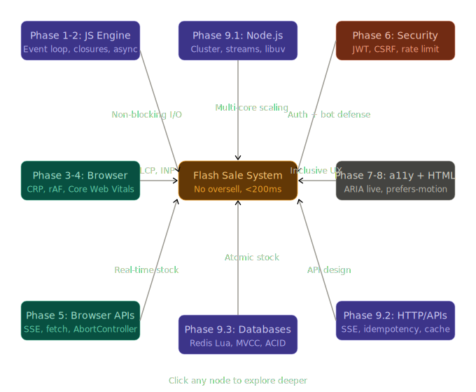

# 🎓 Capstone — Synthesis & System Design

> Bạn đã hoàn thành toàn bộ roadmap từ Phase 1 đến Phase 9. Buổi này không dạy concept mới — nó **kết nối tất cả lại** thành một bức tranh duy nhất qua bài toán system design thực tế.

---

## Bài toán: Thiết kế hệ thống Flash Sale

**Yêu cầu:**

- 100,000 users đồng thời mua hàng trong 5 phút
- Chỉ có 1,000 sản phẩm — không được oversell dù 1 cái
- Latency < 200ms cho mỗi request
- Frontend phải real-time: user thấy stock giảm live

Đây không phải bài học — đây là **mirror test**: nếu bạn hiểu sâu từ Phase 1–9, bạn sẽ tự đặt ra đúng các câu hỏi.

---

## Layer 1 — Frontend & Browser (Phase 3, 4, 7, 8)

### Vấn đề đầu tiên: 100,000 concurrent users mở trang

Khi user mở trang flash sale, browser bắt đầu **Critical Rendering Path**. Bạn đã học CRP ở Phase 3 — giờ áp dụng:

```html
<!-- Sai: render-blocking scripts -->
<script src="analytics.js"></script>
<!-- block parser -->
<script src="tracking.js"></script>
<!-- block parser -->
<link
  rel="stylesheet"
  href="theme.css"
/>
<!-- block render -->

<!-- Đúng: ưu tiên LCP content -->
<link
  rel="preconnect"
  href="https://api.flashsale.com"
/>
<link
  rel="preload"
  as="image"
  href="product-hero.avif"
  fetchpriority="high"
/>
<link
  rel="stylesheet"
  href="critical.css"
/>
<!-- chỉ above-fold CSS -->

<!-- Non-critical scripts: defer hoặc module -->
<script
  defer
  src="analytics.js"
></script>
<script
  type="module"
  src="app.js"
></script>
```

**Core Web Vitals target cho flash sale:**

- LCP < 2.5s: product image phải render nhanh → preload + AVIF
- INP < 200ms: nút "Mua ngay" phải responsive → không block main thread
- CLS = 0: layout không được nhảy khi countdown timer update

### Real-time Stock Counter — Event Loop Trap

```javascript
// BUG: Naive approach block main thread
function startCountdown() {
  let stock = 1000;

  setInterval(() => {
    // Gọi API mỗi giây để check stock
    fetch('/api/stock')
      .then((r) => r.json())
      .then((data) => {
        stock = data.remaining;
        // Layout thrashing: đọc rồi ghi xen kẽ
        document.getElementById('stock').style.width =
          (stock / 1000) * 100 + '%'; // GHI
        const height = document.getElementById('bar').offsetHeight; // ĐỌC → reflow
        document.getElementById('label').textContent = stock; // GHI
      });
  }, 1000);
}

// FIX: Server-Sent Events + rAF để không thrash layout
const eventSource = new EventSource('/api/stock/stream');

eventSource.onmessage = (e) => {
  const { remaining } = JSON.parse(e.data);

  // Batch DOM writes trong rAF — Phase 3: pixel pipeline
  requestAnimationFrame(() => {
    const pct = ((remaining / 1000) * 100).toFixed(1);
    // Chỉ dùng transform + opacity → composite only, không trigger layout
    progressBar.style.transform = `scaleX(${pct / 100})`;
    stockLabel.textContent = remaining;
  });
};
```

**Tại sao SSE thay vì WebSocket?** Flash sale là one-way: server → client. SSE dùng HTTP thông thường, tự reconnect, CDN-friendly. WebSocket cần upgrade protocol, không cache được, phức tạp hơn không cần thiết.

### Virtual List cho 100,000 products kết quả tìm kiếm

Bạn đã học windowing ở Phase 4. Áp dụng khi render danh sách lớn:

```javascript
// react-window: chỉ render ~10 rows visible, không phải toàn bộ
import { FixedSizeList } from 'react-window';

function ProductList({ products }) {
  return (
    <FixedSizeList
      height={600}
      itemCount={products.length}
      itemSize={80}
      width='100%'
    >
      {({ index, style }) => (
        // style chứa transform để position item — composite only
        <div style={style}>
          <ProductCard product={products[index]} />
        </div>
      )}
    </FixedSizeList>
  );
}
// 100,000 items → chỉ ~8 DOM nodes thực sự trong DOM
```

---

## Layer 2 — JavaScript Core (Phase 1, 2)

### Closure Bug trong Flash Sale Timer

```javascript
// BUG: stale closure — bạn đã học ở Phase 2.3
function setupFlashSale(endTime) {
  let secondsLeft = Math.floor((endTime - Date.now()) / 1000);

  for (var i = 0; i < 3; i++) {
    // var: function scoped
    setTimeout(() => {
      // BUG: i luôn là 3 khi callback chạy
      // Tất cả 3 callbacks share cùng 'i' binding
      console.log(`Timer ${i}: ${secondsLeft}s`); // "Timer 3", "Timer 3", "Timer 3"
    }, i * 1000);
  }
}

// FIX 1: let (block scoped — mỗi iteration có binding riêng)
for (let i = 0; i < 3; i++) {
  setTimeout(() => console.log(`Timer ${i}`), i * 1000);
}

// FIX 2: Thực tế dùng async/await với AbortController
async function runCountdown(endTime, signal) {
  while (!signal.aborted) {
    const secondsLeft = Math.floor((endTime - Date.now()) / 1000);

    if (secondsLeft <= 0) {
      dispatchEvent(new CustomEvent('sale-ended'));
      break;
    }

    updateTimer(secondsLeft);
    await new Promise((resolve) => setTimeout(resolve, 1000));
  }
}

const controller = new AbortController();
runCountdown(saleEndTime, controller.signal);

// Cleanup khi user navigate away
window.addEventListener('pagehide', () => controller.abort());
```

### Memory Leak trong Long-running Flash Sale Page

```javascript
// BUG: Event listeners tích lũy, không cleanup
// Phase 2.10: Error handling + memory
class ProductCard extends HTMLElement {
  connectedCallback() {
    // Mỗi lần card mount, add listener
    document.addEventListener('stock-update', this.handleUpdate);
    // BUG: Nếu card unmount + remount nhiều lần (virtual scroll)
    // listeners tích lũy → memory leak + duplicate handlers
  }

  handleUpdate = (e) => {
    if (e.detail.productId === this.productId) {
      this.updateStock(e.detail.remaining);
    }
  };

  disconnectedCallback() {
    // FIX: cleanup khi element removed
    document.removeEventListener('stock-update', this.handleUpdate);
  }
}

// BETTER FIX: Event delegation (Phase 3.3)
// Một listener ở document level thay vì N listeners
document.addEventListener('stock-update', (e) => {
  const card = document.querySelector(
    `[data-product-id="${e.detail.productId}"]`,
  );
  card?.querySelector('.stock-count').textContent = e.detail.remaining;
});
// Dù 1000 cards visible → chỉ 1 event listener
```

---

## Layer 3 — Node.js Server (Phase 9.1, 9.2)

### Architecture: Tại sao cần tách Purchase Service riêng

```
                    ┌─────────────────────────────────────────────┐
                    │              Load Balancer (nginx)           │
                    └──────────────────┬──────────────────────────┘
                                       │
              ┌────────────────────────┼────────────────────────┐
              │                        │                        │
   ┌──────────▼──────────┐  ┌──────────▼──────────┐  ┌────────▼────────────┐
   │   Product Service   │  │   Purchase Service   │  │   Stream Service    │
   │   (read-heavy)      │  │   (write-critical)   │  │   (SSE for stock)   │
   │   10 instances      │  │   3 instances        │  │   5 instances       │
   │   Node.js cluster   │  │   Node.js cluster    │  │   Node.js cluster   │
   └─────────────────────┘  └─────────────────────┘  └─────────────────────┘
```

**Purchase Service — Critical Path:**

```javascript
// Node.js Cluster (Phase 9.1): dùng tất cả cores
const cluster = require('cluster');
const os = require('os');

if (cluster.isPrimary) {
  for (let i = 0; i < os.cpus().length; i++) cluster.fork();
  cluster.on('exit', (w) => {
    if (!w.exitedAfterDisconnect) cluster.fork();
  });
} else {
  const app = require('./purchase-app');
  app.listen(3001);
}
```

```javascript
// purchase-app.js — HTTP handler
const express = require('express');
const app = express();

// Rate limiting per user (Phase 9.2)
const purchaseRateLimiter = new SlidingWindowRateLimiter(redis);

app.post(
  '/purchase',
  authenticateToken, // Phase 9.2: JWT verify
  async (req, res) => {
    // Rate limit: 1 purchase attempt per user per 5s
    const allowed = await purchaseRateLimiter.isAllowed(
      `purchase:${req.user.id}`,
      1,
      5000,
    );
    if (!allowed) return res.status(429).json({ error: 'Too fast' });

    try {
      const result = await purchaseService.attempt(
        req.user.id,
        req.body.productId,
        req.body.quantity,
      );
      res.json(result);
    } catch (err) {
      if (err.code === 'OUT_OF_STOCK') {
        return res.status(409).json({ error: 'Out of stock' });
      }
      throw err;
    }
  },
);
```

---

## Layer 4 — The Core Problem: Preventing Oversell (Phase 9.3)

Đây là điểm giao của mọi thứ đã học. **1,000 sản phẩm, 100,000 requests đồng thời — không được bán quá 1,000.**

### Approach 1: Database-level Locking (Naive)

```sql
-- KHÔNG dùng cho high traffic
BEGIN;
SELECT stock FROM products WHERE id = $1 FOR UPDATE; -- lock row
-- Nếu 1000 concurrent requests: 999 requests chờ → timeout cascade
UPDATE products SET stock = stock - 1 WHERE id = $1 AND stock > 0;
COMMIT;
```

Vấn đề: 100,000 requests tranh nhau 1 row lock → queue tắc nghẽn, latency tăng từ ms lên seconds.

### Approach 2: Redis Atomic Decrement (Production)

```javascript
// Phase 9.3: Redis atomic operations
// DECR là atomic trong Redis — thread-safe, no race condition

const purchaseService = {
  async attempt(userId, productId, quantity) {
    const stockKey = `stock:${productId}`;

    // Lua script: atomic check + decrement
    // Nếu stock >= quantity → decrement và return new stock
    // Nếu không đủ → return -1
    const script = `
      local stock = tonumber(redis.call('GET', KEYS[1]))
      if stock == nil then return -2 end  -- key không tồn tại
      if stock < tonumber(ARGV[1]) then return -1 end  -- insufficient
      return redis.call('DECRBY', KEYS[1], ARGV[1])  -- decrement + return new value
    `;

    const newStock = await redis.eval(script, 1, stockKey, quantity);

    if (newStock === -2) throw new Error('Product not found');
    if (newStock === -1) {
      const err = new Error('Out of stock');
      err.code = 'OUT_OF_STOCK';
      throw err;
    }

    // Stock reserved in Redis — now write to DB asynchronously
    // Tại sao async? DB write chậm hơn Redis, không cần user chờ
    setImmediate(() => {
      this.persistPurchase(userId, productId, quantity, newStock).catch(
        (err) => {
          // Rollback Redis nếu DB fail
          redis.incrby(stockKey, quantity);
          logger.error('Purchase persist failed, rolling back', { err });
        },
      );
    });

    // Broadcast stock update tới SSE clients (Phase 9.2: pub/sub)
    redis.publish(
      'stock-updates',
      JSON.stringify({ productId, remaining: newStock }),
    );

    return { success: true, remaining: newStock };
  },

  async persistPurchase(userId, productId, quantity, stockSnapshot) {
    // Phase 9.3: Transaction cho data consistency
    await db.transaction(async (trx) => {
      await trx.orders.create({
        userId,
        productId,
        quantity,
        status: 'pending',
      });
      await trx.products.update(
        { id: productId },
        {
          // Idempotent: set absolute value, không increment
          // Tránh double-apply nếu retry
          stock: stockSnapshot,
        },
      );
    });
  },
};
```

### Tại sao Lua Script trong Redis?

```
Không dùng Lua:
  1. GET stock        → 1000
  2. (context switch: 1000 requests thấy stock = 1000)
  3. DECRBY 1        → 999 (nhưng 1000 requests đều decrement!)
  → Race condition → stock về âm

Dùng Lua Script:
  Redis chạy Lua scripts single-threaded, không interrupt
  GET + DECRBY là 1 atomic operation
  → Không thể có race condition
  → 1000 requests execute tuần tự trong Redis
  → Redis đủ nhanh: ~1M operations/second
```

---

## Layer 5 — Stream Service: SSE cho Real-time Stock

```javascript
// stream-service: broadcast stock updates tới clients
// Phase 9.1: Streams + Event Loop

const redis = require('ioredis');
const subscriber = new redis(); // dedicated connection cho subscribe

// Lưu active SSE connections
const clients = new Map(); // productId → Set of response objects

app.get('/api/stock/stream', (req, res) => {
  const { productId } = req.query;

  // SSE headers
  res.writeHead(200, {
    'Content-Type': 'text/event-stream',
    'Cache-Control': 'no-cache',
    Connection: 'keep-alive',
    'X-Accel-Buffering': 'no', // tắt nginx buffering
  });

  // Send initial stock
  redis.get(`stock:${productId}`).then((stock) => {
    res.write(`data: ${JSON.stringify({ remaining: parseInt(stock) })}\n\n`);
  });

  // Register client
  if (!clients.has(productId)) clients.set(productId, new Set());
  clients.get(productId).add(res);

  // Cleanup khi client disconnect
  req.on('close', () => {
    clients.get(productId)?.delete(res);
    // Phase 9.1: Streams — destroy để cleanup
  });
});

// Subscribe tới Redis pub/sub
subscriber.subscribe('stock-updates');
subscriber.on('message', (channel, message) => {
  const { productId, remaining } = JSON.parse(message);
  const data = `data: ${JSON.stringify({ remaining })}\n\n`;

  // Broadcast tới tất cả clients interested in this product
  clients.get(productId)?.forEach((res) => {
    res.write(data);
  });
});
```

**Scaling concern:** Mỗi SSE connection là một persistent HTTP connection. 100,000 users = 100,000 open connections. Node.js handle được (event loop, không tốn thread per connection), nhưng cần tune OS:

```bash
# Increase file descriptor limit
ulimit -n 1000000

# /etc/sysctl.conf
net.core.somaxconn = 65535
net.ipv4.tcp_max_syn_backlog = 65535
```

---

## Layer 6 — Security (Phase 6)

### Flash Sale là mục tiêu tấn công hấp dẫn

```javascript
// Attack vectors cần defend:

// 1. Bot attacks — mua hàng bằng script
//    Fix: Rate limiting (Phase 9.2) + CAPTCHA tại purchase endpoint

// 2. JWT manipulation — thay đổi payload để giả làm user khác
//    Fix: Verify signature (Phase 9.2) — KHÔNG decode mà không verify
const payload = jwt.verify(token, SECRET); // ✅ verify signature
// KHÔNG: const payload = JSON.parse(atob(token.split('.')[1])); ❌

// 3. CSRF — fake purchase request từ evil site
//    Fix: SameSite=Strict cookie + CSRF token
res.cookie('session', token, {
  httpOnly: true, // JS không đọc được
  secure: true, // HTTPS only
  sameSite: 'strict', // không gửi cross-site
});

// 4. Replay attack — capture purchase request, send lại
//    Fix: Idempotency key
app.post('/purchase', async (req, res) => {
  const idempotencyKey = req.headers['idempotency-key'];
  if (!idempotencyKey)
    return res.status(400).json({ error: 'Missing idempotency key' });

  // Check nếu request này đã được processed
  const exists = await redis.set(
    `idempotency:${idempotencyKey}`,
    'processing',
    'EX',
    86400, // 24h
    'NX', // only set if not exists
  );

  if (!exists) {
    // Đã processed, return cached result
    const cached = await redis.get(`idempotency-result:${idempotencyKey}`);
    return res.json(JSON.parse(cached));
  }

  // Process purchase...
  const result = await purchaseService.attempt(/*...*/);

  // Cache result
  await redis.set(
    `idempotency-result:${idempotencyKey}`,
    JSON.stringify(result),
    'EX',
    86400,
  );

  res.json(result);
});
```

---

## Layer 7 — Performance Engineering (Phase 4)

### Đo lường — Không đoán mò

```javascript
// Phase 4.1: Performance API trong production

// Server-side: measure từng layer
app.use((req, res, next) => {
  const start = performance.now();

  res.on('finish', () => {
    const duration = performance.now() - start;

    metrics.histogram('http.request.duration', duration, {
      path: req.route?.path,
      method: req.method,
      status: res.statusCode,
    });

    // INP tracking: request > 200ms là problem
    if (duration > 200) {
      logger.warn('Slow request', {
        path: req.path,
        duration,
        userId: req.user?.id,
      });
    }
  });

  next();
});

// Client-side: PerformanceObserver cho Core Web Vitals
const observer = new PerformanceObserver((list) => {
  for (const entry of list.getEntries()) {
    if (entry.entryType === 'largest-contentful-paint') {
      analytics.track('lcp', { value: entry.startTime });
    }
    if (entry.entryType === 'layout-shift') {
      analytics.track('cls', { value: entry.value });
    }
  }
});

observer.observe({ entryTypes: ['largest-contentful-paint', 'layout-shift'] });
```

### Bundle Splitting cho Flash Sale Page

```javascript
// Phase 4.2: Code splitting — chỉ load những gì cần

// Route-based splitting với dynamic import
const FlashSale = lazy(() => import('./FlashSale'));
const Checkout = lazy(() => import('./Checkout')); // load khi cần

// Component-level splitting cho heavy components
const PaymentForm = lazy(
  () => import('./PaymentForm'), // Stripe SDK (~80KB) chỉ load khi mở checkout
);

// Preload khi user hover "Mua ngay" — anticipate next action
button.addEventListener('mouseenter', () => {
  import('./Checkout'); // preload trước khi click
});
```

---

## Tổng kết: Knowledge Map

Đây là cách tất cả phase kết nối trong bài toán flash sale:



---

## Câu hỏi ôn tập — Tổng hợp

---

### Câu 1: Trong flash sale system, tại sao dùng Redis Lua script thay vì chỉ dùng `WATCH/MULTI/EXEC` (optimistic locking)?

**Đáp án:**

`WATCH/MULTI/EXEC` là **optimistic locking**: transaction retry nếu watched key thay đổi.

```
WATCH stock:product1
value = GET stock:product1
MULTI
  DECRBY stock:product1 1
EXEC  -- fail nếu stock:product1 đã thay đổi kể từ WATCH
```

Với 100,000 concurrent requests, hầu hết transactions sẽ fail và phải retry — tạo **retry storm**. Mỗi retry: `WATCH` + `GET` + `MULTI` + `EXEC` = 4 round trips × số lần retry.

**Lua script** là **pessimistic locking tại Redis level** — nhưng không thật sự "lock" vì Redis single-threaded. Script chạy atomically nghĩa là không có request nào khác có thể chen vào giữa `GET` và `DECRBY`. Không cần retry vì không có conflict — mỗi request execute đúng một lần, tuần tự.

```
Lua: [GET → check → DECRBY] là 1 atomic unit
WATCH/MULTI: [GET] ... [MULTI → DECRBY → EXEC] — window cho conflict
```

Với high contention, Lua tốt hơn đáng kể vì eliminates retry loop hoàn toàn. Toàn bộ 100,000 requests execute theo thứ tự trong Redis (single-threaded), không request nào bị "wasted".

---

### Câu 2: Điều gì xảy ra với memory và event loop nếu Stream Service có 100,000 SSE connections đang mở, và làm thế nào Node.js xử lý được điều này mà không spawn 100,000 threads?

**Đáp án:**

Node.js dùng **libuv + epoll/kqueue** (OS-level I/O multiplexing) thay vì thread-per-connection.

Khi SSE connection mở, libuv đăng ký file descriptor (socket) với OS event notification system (epoll trên Linux). OS theo dõi tất cả sockets, chỉ notify Node.js khi có event (data ready, connection closed, v.v.). Node.js không cần "chờ" trên từng connection.

```
100,000 SSE connections:
  Thread count: 1 main thread + 4 thread pool = 5 threads total
  Memory: mỗi connection ~(res object + headers + buffer) ≈ 8KB
  Total: 100,000 × 8KB ≈ 800MB RAM — manageable

So sánh với thread-per-connection (Java Tomcat truyền thống):
  100,000 threads × 512KB stack = 50GB RAM → không thể
```

Khi Redis publish stock update, Node.js nhận message qua subscriber connection, iterate qua `clients` Map và gọi `res.write()` cho mỗi SSE client. Tất cả trong một event loop tick — không cần thread. `res.write()` không blocking vì Node.js dùng kernel buffers, actual I/O xảy ra asynchronously.

**Bottleneck thật sự** không phải thread mà là **CPU** khi iterate 100,000 clients trong 1 tick — nếu mỗi stock update broadcast tới 100,000 clients, event loop bị block trong thời gian đó. Fix: chia nhỏ broadcast thành batches dùng `setImmediate` để yield giữa chừng.

---

### Câu 3: Thiết kế một test để verify hệ thống không oversell khi 10,000 concurrent purchase requests đến cùng lúc. Cần test những gì và tại sao?

**Đáp án:**

Đây là test phức tạp vì cần verify **correctness under concurrency** — không phải chỉ performance.

```javascript
// Test framework: k6, artillery, hoặc custom với worker_threads
// Phase 9.1: worker_threads cho true parallelism trong test

const { Worker, isMainThread, parentPort } = require('worker_threads');

if (isMainThread) {
  // Setup: seed 100 units của product
  await redis.set('stock:test-product', 100);
  await db.products.update({ id: 'test-product' }, { stock: 100 });

  const NUM_WORKERS = 10;
  const REQUESTS_PER_WORKER = 1000; // 10,000 total

  // Spawn workers để simulate concurrent requests
  const results = await Promise.all(
    Array.from(
      { length: NUM_WORKERS },
      () =>
        new Promise((resolve) => {
          const worker = new Worker(__filename, {
            workerData: {
              requests: REQUESTS_PER_WORKER,
              productId: 'test-product',
            },
          });
          worker.on('message', resolve);
        }),
    ),
  );

  // Aggregate results
  const totalSuccess = results.reduce((sum, r) => sum + r.success, 0);
  const totalFail = results.reduce((sum, r) => sum + r.fail, 0);

  // Assertions:
  // 1. Không bao giờ bán hơn 100 units
  const finalStock = parseInt(await redis.get('stock:test-product'));
  console.assert(finalStock >= 0, `FAIL: Stock went negative: ${finalStock}`);
  console.assert(
    totalSuccess === 100,
    `FAIL: Sold ${totalSuccess} != 100 units`,
  );
  console.assert(
    totalSuccess + totalFail === 10000,
    'All requests accounted for',
  );

  // 2. DB và Redis consistent
  const dbProduct = await db.products.findById('test-product');
  console.assert(dbProduct.stock === finalStock, 'FAIL: Redis/DB inconsistent');

  // 3. Idempotency: duplicate requests không tạo duplicate purchases
  const orders = await db.orders.count({ productId: 'test-product' });
  console.assert(
    orders === 100,
    `FAIL: ${orders} orders created, expected 100`,
  );

  console.log(
    `✅ Sold exactly ${totalSuccess}/100, rejected ${totalFail}/9900`,
  );
}
```

**Những gì cần verify:**

Correctness — stock không âm, số lượng sold chính xác là 100, không hơn không kém. Performance — p99 latency dưới ngưỡng. Consistency — Redis và DB đồng bộ sau test. Idempotency — với idempotency key, request lặp lại không tạo đơn hàng thứ 2. Rollback — nếu DB write fail sau khi Redis decrement, stock được hoàn trả.

Test này phải chạy thường xuyên trong CI, không chỉ một lần — concurrency bugs hay xuất hiện intermittently.

---
